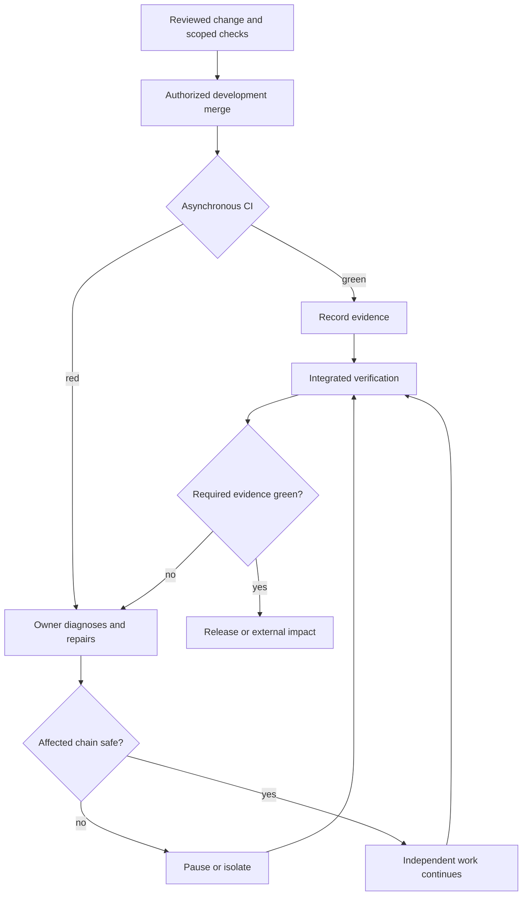

## 3つの判断を分ける

**CI greenはリリース・デプロイ・公開の不変条件であっても、開発マージの不変条件とは限りません。** これには明示的なプロジェクト方針、期限のある修復、可視のCI、失敗の担当、保護された外部影響の境界が必要です。その方針が適用されなければ、マージ前greenが既定です。

| 問い | 意味 |
| --- | --- |
| 実行 | このSHAで確認を走らせるか |
| マージ時の強制 | この開発マージの前にgreenを必須とするか |
| 外部影響時の強制 | リリース・デプロイ・公開・実データ移行前にgreenを必須とするか |

許可済みの開発マージが同期的に待たなくても、T1は正式な統合検証の証拠です。[実行ティア](../decision-guide/execution-tiers.mdx)は場所・時期、[ライフサイクル](../decision-guide/test-lifecycle.mdx)は保持を扱い、どちらだけでもマージ時の強制は決まりません。

## green前にマージできる条件

判断軸はAIの正しさへの信頼ではなく、**影響範囲 × 可逆性 × 修復費用**です。以下のすべてを満たす必要があります。

- 対象は開発・統合状態であり、取り消せない外部影響の境界ではない。
- マージが実ユーザー状態への公開・デプロイ・移行を直接発生させないか、別の保護境界がその影響を防ぐ。
- CIは引き続き走り、速度のためにassertionを弱めたり確認を省略したり結果を隠したりしない。
- pending・red・cancelled・skipped・deferredを正直に報告する。
- 各redに担当・保存した証拠・具体的な診断と修正またはrevertの行動・期限のある確認点がある。「後で直す」だけでは不足する。
- 依存作業を停止・隔離でき、修復・revert費用が許容範囲にある。
- 統合したリリース候補に必要な証拠を含め、選んだ外部影響境界を正式なgreenゲートが保護する。

既存の保護・承認要件は維持し、このガイドはbypass権限を与えません。今日のチェックが不都合だから例外にするのではなく、採用前に方針と強制境界を宣言します。

## 続行と停止の条件

独立作業を続けられるのは、**すべて**が成立するときです。失敗が理解され局所化されている、次の作業が依存しない、担当と確認点のある具体的修復が追跡されている。

**いずれか**が成立すれば影響する依存チェーンを停止します。原因不明・横断的、compiler・build・runtimeの基盤が壊れている、後続作業が失敗箇所に依存する、続行で原因追跡が難しくなる、security・データ消失・移行・公開・本番の危険がある。診断・修復・必要な検証を済ませてから再開します。影響しない作業も独立性の理由を明示して続けます。

修復の確認期限を過ぎたら、影響する統合を止めるかrevert・隔離します。担当のないredが繰り返される状態は失敗の常態化であり、この運用の成立条件を失っています。

## 非同期CIのライフサイクル

既存のPR・Issue・manager記録にrun URL、tested SHA、job・leg、状態、担当、次の行動を記録します。マージ済みは統合済みであり、検証済みではありません。[ルール7](../decision-guide/required-behavior.mdx)によりマージ後もredの担当は残り、[ゲートオペレーターの手順](../test-integrity/deflaking-recipe.mdx)による上限つき診断・証拠保全・retry成功の正確な報告も続きます。

取消・後続runへの置換は成功ではありません。古いSHAのgreenは証拠ですが、新しい統合headの自動的な証明ではありません。まとめた検証は可能でも、未解決alertは捨てません。[変更範囲に応じた検証](./change-scoped-verification.mdx)は関連入力の同等性が成立する場合に使います。全体完了時にはalertを整理し統合状態を検証し、リリースでは宣言した候補の証拠を要求します。

## ブランチと具体例

専用の蓄積ブランチを一時的にredとし、main・releaseを保護する構成も可能です。[リリースラウンド](./release-rounds-branch-strategy.mdx)はその一例です。main自体を高速統合に使えるのは、mainが本番・リリースを意味せず、別の公開・デプロイ境界が保護されている場合だけです。安全性を決めるのはブランチ名ではなく、接続された外部影響です。

| 状況 | 判断 |
| --- | --- |
| リリース前のライブラリ・framework、CI pending | 方針に沿うレビュー済み開発マージは可能。後のredを修正し、npm公開前は完全なリリースゲートを要求 |
| mainから自動デプロイする本番Webアプリ | デプロイを別途分離・保護しない限りgreen前マージは不適切 |
| 実データ・schema移行 | 開発が許容的でも外部影響前の厳しい検証境界を維持 |
| 理解済みの局所的失敗 | 追跡された修復と続行の3条件があれば独立作業を続行可能 |
| 原因不明のcompiler・build失敗 | 影響する依存チェーンを止め、先に診断 |

### 具体的な出典：zudo-front-builder

2026-10-06に確認した[zudo-front-builderのCLAUDE.md](https://github.com/Takazudo/zudo-front-builder/blob/main/CLAUDE.md)の「Development strategy: integrate first, use CI to find regressions」は、managerに統合・CI triageを割り当て、CI実行中のレビュー済み開発マージを認め、不明・基盤の失敗で影響チェーンを止め、最終統合検証とpackage公開ゲートを維持しています。プロジェクト固有の実例であり、普遍的な許可でも、この文書repoへ取り込む運用方針でもありません。

## AIによる費用変化と実際のコスト

実装・レビュー品質の向上は失敗確率を下げ得ます。エージェントによる診断・修復は回復費用を下げ得ます。この運用のより強い根拠は後者です。どちらもAI生成コードのテストを減らしてよい根拠にはなりません。

開発のクリティカルパスからCI待ちを外すことと、CI実行時間・請求を減らすことは別です。20分の非同期jobはマージ待ちをほぼゼロにしても20 runner-minutesを消費します。同じスイートの高速化は[CIゲート最適化](./ci-gate-optimization.mdx)、費用と保証の実測判断は[AIスイート監査](./ai-suite-audit.mdx)を参照してください。
