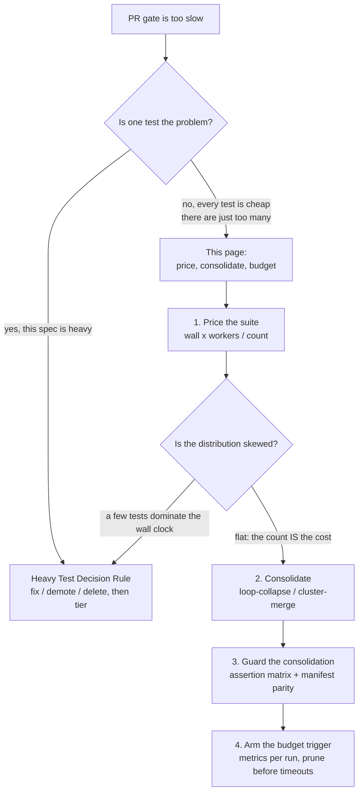

## テスト単位のルールが名指しできない失敗モード

[重いテストの判断ルール](./heavy-test-decision.mdx)が答えるのは、**1つの**テストについての問いです：このスペックは重すぎるので、修正するか、降格するか、削除する — そして生き残ったならティアを与える。あのページのルールはすべてテスト単位であり、そしてそのすべてを、実行コストがまったく引き合わないスイートの中のすべてのテストが満たしてしまうことがあります。

実測されたケース：PRゲートは43〜63分にまで膨らみ、その中の1つのe2eステップが46分をかけて**566個のCIセーフなテスト**を実行していました。そのうち1つとして重いものはありません。ピクセルを読むものはなく、本物のキーボードを要求するものもなく、約60秒のしきい値に近づくものもなく、flakyなものもありません。566個すべてを機械的な分類ルールにかければ、566個すべてが**タグなし**として返ってきます — それも正しく。それでもゲートは溺れています。

これがギャップです。「新しいe2eテストは、ルールがタグを強制しない限りタグなしのCIセーフである」はテスト単位のデフォルトとして正しく、そしてスイートレベルの対抗錘（カウンターウェイト）を持っていません。テスト単位のルールは*スイートがもう大きすぎる*とは決して言いません。どの時点においても、個々のテストに落ち度がないからです。566個の正しい判断が積み上がって、1つの間違ったスイートになります。

| テスト単位の問い | 総量の問い |
|---|---|
| *この*テストはゲートには重すぎるか？ | ゲートは*あと1つ*安いテストを支払えるか？ |
| 分類ルールとタグが答える | 単価とスイート予算が答える |
| 判定：修正・降格・削除・ティア割り当て | 判定：値付け・統合・刈り込み・ティア移動 |
| 外れ値に対して発火する | 積み上がりに対して発火する |

この2つのページは競合ではなく補完です。外れ値にはテスト単位のルールを適用し、外れ値が1つもなくなったあとに残るものにこのページを適用してください。



## 議論を始める前に、すべてのテストに値札を付ける

単位が「1つのテスト」であるかぎり、スイートの規模をめぐる議論はどこにも行き着きません。テストは安い、という点では全員の意見が一致するからです。単位に価格を与えれば、議論は算術になります：

```
unit cost (worker-seconds per test) = wall-clock seconds x workers / test count
```

実測されたケースを値付けすると：

```
46 min                  -> 2,760 wall-clock seconds
2,760 s x 2 workers     -> 5,520 worker-seconds
5,520 / 566 tests       -> ~9.8 worker-seconds per test
```

この数値を持ち運び可能にしているのは、実時間（wall-clock）秒ではなくワーカー秒であることです。実時間はそれを生んだマシンの並列度を黙って畳み込んでしまうので、テストが1つも変わらなくても誰かが `workers` を調整すれば「テストあたりの実時間」は変わってしまいます。ワーカー秒はスイートが実際に要求する仕事量そのものであり、ワーカー数で割れば任意のランナー形状での実時間に戻せます。

価格があれば、スイートに関するあらゆる判断を、ゲートが実際に支払っている通貨で見積もれます：

- **30テストを含むスペックファイルの追加**は約294ワーカー秒 — 2ワーカーなら実時間で約2.5分です。これはレビュアーがアサーションの価値と天秤にかけられる数字です。
- **566 → 約370の計画**は196テストを取り除きます：約1,920ワーカー秒、2ワーカーなら約16分の実時間の回収です。この計画は「e2eスイートを整理しよう」ではなく、16分という明細行になります。
- **12テストを1つに畳む統合**は、11テストぶんのテスト単位オーバーヘッドを取り除きます — 約108ワーカー秒です。その統合を安全にやり切るのに1時間かかり、スイートが予算にまったく近づいていないなら、価格は「やらなくていい」と告げています。

<Warning>

**単価は平均であり、分布が偏っているとき平均は何の値段でもありません。** 最も遅い5%のスペックが実時間の半分を占めているなら、約9.8ワーカー秒はスイート内のどのテストも記述していません：安いテストをいくら削ってもゲートは動かず、本当の答えは尾（テール）に対してテスト単位のページを適用することです。

価格を信じる前に分布の形を確認してください。PlaywrightのJSONレポーターはテストごとの実行時間を持っています。それをソートして上位10%を見てください。まず尾を刈り込むか別ティアへ移し、残ったものから単価を導き直します。「*数*こそがコストである」というこのページの結論を許すのは、おおむねフラットな分布だけです。

</Warning>

## 統合（consolidation）：ブランチ0にはない4つ目の出口

ブランチ0が提供する出口は修正・降格・削除の3つです。3つとも「あるテストが存在してよいか」という単体の判定であり、そして3つともここでは間違った道具です。総量オーバーフローにおいては、アサーションは個々には何も問題がないからです。統合は4つ目の出口であり、降格でも削除でもありません：**どのアサーションも下のレベルへ移らず、どのアサーションも取り除かれません。** 縮むのは、N回支払われていたテスト単位のオーバーヘッド — フィクスチャのセットアップ、ナビゲーション、ワーカーのスケジューリング、テストごとのレポーティング — です。

この区別こそが、統合を広く適用しても安全にしている理由であり、同時に、不用意に適用すると危険になる理由でもあります。統合はカバレッジを保つと約束する唯一の出口なので、削除に対して行うような監査を誰もやらないのです。以下の2つのパターンは機械的です。その約束を誠実に保つのは、さらに下の[アサーションマトリクスのゲート](#アサーションマトリクスのゲート：マトリクスが先、削除は後)です。

### ループ畳み込み：`for` ループを `test()` の内側へ動かす

見分けるサインは `test()` を*囲む*ループ — コレクションの要素ごとに1つのテストを鋳造しているスペックファイルです。畳み込みは、そのループを単一のテストの内側へ移し、すべてのアサーションを保持します：

```ts
// Before: the loop is AROUND test() -- N tests, N fixture setups
for (const pattern of PATTERNS) {
  test(`renders ${pattern.id}`, async ({ page }) => {
    await page.goto(`/preview/${pattern.id}`);
    await expect(page.locator("canvas")).toBeVisible();
  });
}

// After: the loop is INSIDE test() -- 1 test, 1 fixture setup, same assertions
test("renders every registered pattern", async ({ page }) => {
  test.setTimeout(PATTERNS.length * 4_000);
  for (const pattern of PATTERNS) {
    await page.goto(`/preview/${pattern.id}`);
    await expect(page.locator("canvas"), pattern.id).toBeVisible();
  }
});
```

`expect` の第2引数に注目してください。N個のテストタイトルを1つに畳み込むと、失敗レポートが持つ唯一の識別子が消し飛びます — 「renders every registered pattern が失敗しました」は何も名指ししていません。畳み込まれたループ内のすべてのアサーションは反復キーを携えていなければならず、さもなければ節約分は最初にredになった日にデバッグ時間として支払うことになります。

### クラスタマージ：フィクスチャの歩行は1回、残りは `expect.soft`

もう1つのサインは、*同じ*セットアップをそれぞれやり直しているN個の単一アサーションテストです。ここではコレクションは暗黙的です — それらのテストが兄弟であるのは、フィクスチャの歩行を共有しているという理由だけです：

```ts
// Before: three tests, three identical navigations
test("header shows the project name", async ({ page }) => {
  await page.goto("/editor");
  await expect(page.getByRole("banner")).toContainText("zudo");
});
test("save button starts enabled", async ({ page }) => {
  await page.goto("/editor");
  await expect(page.getByRole("button", { name: "Save" })).toBeEnabled();
});
test("status line starts ready", async ({ page }) => {
  await page.goto("/editor");
  await expect(page.getByRole("status")).toHaveText("Ready");
});

// After: one navigation, three soft assertions -- all three still report
test("editor chrome is correct on load", async ({ page }) => {
  await page.goto("/editor");
  await expect.soft(page.getByRole("banner")).toContainText("zudo");
  await expect.soft(page.getByRole("button", { name: "Save" })).toBeEnabled();
  await expect.soft(page.getByRole("status")).toHaveText("Ready");
});
```

`expect.soft` は文体の好みではありません — マージで情報を失わせないための要です。ハードな `expect` は最初の失敗でテストを打ち切るので、3つのテストをハードアサーションのままマージすると、独立した3つの失敗レポートが1つになります：3つとも壊すと、ランはバナーについてだけ教え、あなたはそれを直し、次のランがボタンについて教える。ソフトアサーションはマージされたテストを最後まで走らせ、見つけた失敗をすべて報告させます — それこそが、分かれていた3つのテストが提供していた情報です。

### メカニズム：タイムアウトとフレークのコスト

どちらのパターンも仕事をN個のテストから1つへ移すため、単一のテストを想定して選ばれた2つのデフォルトが正しくなくなります。

**タイムアウトはコレクションから導出して明示的に設定する。** マージされたテストは、テストが1反復ぶんだった頃に選ばれたテスト単位のタイムアウトを引き継ぎます。新しい値は、より大きな数値をハードコードするのではなく反復数から導出してください — 上の `test.setTimeout(PATTERNS.length * 4_000)` です。200パターンでは潤沢だった固定値が、500では壁になるからです。500反復のうち400反復目でタイムアウトしたマージ済みテストは、401〜500反復目について何もアサートしておらず、レポートに出るのは「未実行の100契約」ではなく「1件のタイムアウト」だけです。

**リトライはいまや全体を再実行する。** マージ前は、flakyなテストのリトライコストは1テストぶんの実行時間でした。マージ後はループ全体ぶんです。1%の確率でflakyになるマージ済みテストは、そうなるたびにマージ後の実行時間を丸ごと請求し、クラスタ全体の結果を道連れにします。順序が重要です：統合するのは、flakeがすでに修正済みのスイートです。統合はflakyなスイートを安くする手段ではありません — flakyさをより高価にするので、それは[まずflakeを直す](../test-integrity/deflaking-recipe.mdx)ことの論拠になります。

<Warning>

**統合は爆心半径を粗くします。** 1つのredが「このクラスタの中の何かが壊れた」を意味するようになるため、クラスタの名前は読む価値のあるものでなければなりません。クラスタは意味的にまとまりを保ってください — ロード時のエディタクロム、登録済みの全パターン — そうすれば名前はどこを見ればよいかを指し示し続けます。コストだけを理由に、たまたまファイル内で隣り合っていたスペックを束ねたクラスタは、失敗名が何も意味しないテストを生み、次の保守担当者がそれを再び分割することになります。

</Warning>

## レジストリ駆動の統合：3つのカウンターウェイト

ループ畳み込みの最大形はレジストリ駆動です：N個のテンプレートコピーされたファイルの代わりに、1つのハーネスがレジストリを反復し、エントリごとに契約をアサートします。最も大きな数字が出るのもここであり、そして「レジストリをループすればいい」という助言が、その変更を安全にしている制約を黙って省いてしまう場所でもあります。

証拠はあるパターン生成プロジェクトのTest Dietから来ています。2つのテンプレートファミリだけで**728ファイル／118,571 LOC**を占めていました：

| ファミリ | ファイル数 | LOC | 結果 |
|---|---|---|---|
| `*-smoke.test.ts` | 208 | 22,602 | レジストリチャンクが1,684/1,684のパターンパリティを維持 |
| `*-animated.test.ts` | 520 | 95,969 | レジストリハーネスが掃き出した520契約すべてを維持 |

最終的なパターン掃き出しは**79ファイルに13,428テスト、最大観測ヒープ241 MB**でした（検証時のロックファイル：Vitest `3.2.4`、Playwright `1.59.1`）。形をよく読んでください：728ファイルが79ファイルになった一方で、テスト数は数千のままです。レジストリ統合が畳むのは**ファイルとファイル単位のオーバーヘッド**であって、契約ではありません — もしあなたの統合が契約数まで畳んでいるなら、それは削除であり、読むべきは下の[アサーションマトリクスのゲート](#アサーションマトリクスのゲート：マトリクスが先、削除は後)です。

その掃き出しを安全にした制約は3つあります。

### カウンターウェイト1：ファイル数とヒープは自由変数ではなく予算である

1つの巨大なレジストリファイルは、Vitestのシャードの末尾（tail）を変え、偶然のファイル分割が守ってくれていたOOMリスクを再び呼び戻します。`--shard` は、1つのワーカープロセスが新しいプロセスへ切り替わるまでに読み込むテストファイル数を制限することでプロセスあたりのメモリを制限します。520ファイルを1つに畳めば、シャーディングというレバーには分割する対象が残りません。

したがってチャンク数は、それ自体の予算を持つ設計パラメータです：観測ピーク241 MBにおける79ファイル、実行時間の予算と同じように記録しアサートされるべき値です。そしてその上限は買えません — 大きなランナーはヒープ上限を上げるだけで、上昇の傾きは変えません。それが[CIランナーのサイジングのルール2](../ci-operations/ci-runner-sizing.mdx)です。チャンクごとのサイズ／ヒープ予算を明示的に決めてください。さもなければ、次に増える20個のレジストリエントリは、そのとき都合のよかったファイルに着地します。

### カウンターウェイト2：統合後、変更ファイルレーンは無料ではない

`--only-changed`（Playwright）と `--changed`（Vitest）は、importグラフを通してテストを選択します。レジストリをimportするテストは推移的にほぼすべてをimportするため、*どこかの*ソースやレジストリの編集が入るたびに選択されるようになります。数百のファイルを1つのimporterへ移しても高速レーンは無料になりません — プロダクトに触れるあらゆるPRで、高速レーンが統合済みスイート全体を実行するようになるだけです。

これは3つのうち最も見落とされやすいカウンターウェイトです。統合を測った数字の中に現れないからです。フルスイートの実行時間は下がり、全員が喜び、そして無関係なPRのたびに変更ファイルレーンが静かに遅くなっていきます。このレーンには、統合の時点で決めて書き留めておく意図的なルールが必要です：レジストリハーネスを変更ファイルレーンから除外してフルレーンに所有させるか、あるいはハーネスに専用の予算を与えてそれを守らせるか、のどちらかです。

### カウンターウェイト3：マニフェストパリティ — チャンク単位のアサーションは、まだ実行されるチャンクしか証明しない

3つの中で最も鋭いものです。レジストリハーネスは通常、チャンクごとに「*この*チャンクに割り当てられたすべてのパターンが契約を持つ」ことをアサートします。そのアサーションはチャンクファイルの中に住んでいます。チャンクファイルを丸ごと削除すれば、アサーションも一緒に去ります：スイートはgreen、そのチャンクのパターンは無防備、そしてどこも失敗しません。

守りとなるのは、チャンク集合そのものをアサートする独立した**マニフェスト**テストです — チャンクファイルの存在、チャンク名、そして割り当ての和集合がレジストリをちょうど覆うこと（重複なし、欠落なし）。それはチャンクの隣に置かれ、チャンクが丸ごと消えたときに失敗できる、スイート内で唯一の存在です：

```ts
// manifest.test.ts -- the guard that survives a deleted chunk file
import { existsSync } from "node:fs";

test("every registry entry is assigned to exactly one existing chunk", () => {
  const assigned = CHUNKS.flatMap((chunk) => chunk.patternIds);
  expect(new Set(assigned).size, "duplicate assignments").toBe(assigned.length);
  expect([...assigned].sort()).toEqual([...REGISTRY.keys()].sort());
  for (const chunk of CHUNKS) {
    expect(existsSync(chunk.file), `missing chunk file: ${chunk.name}`).toBe(true);
  }
});
```

これは `b4push` とCIのあいだの[ガードマニフェストのパリティチェック](../ci-operations/scheduled-re-exam.mdx)とまったく同じ形の契約であり、欠けていると同じ理由で破綻します：まだ存在するエントリについてしか語れないインベントリは、削除に気づくことが決してできません。

## アサーションマトリクスのゲート：マトリクスが先、削除は後

レジストリ統合は削除で終わります — テンプレートコピーされたファイルが消えるのです。そして、その削除を安全に*感じさせている*ものこそ、それが安全だと*証明しない*ものです：**レジストリ**を再現するハーネスは、**アサーション**を再現している証拠ではありません。

実例は明快です。520ファイルのanimatedファミリは、すでにレジストリを反復していた既存の2つのGLSL confirmファイルで置き換えられるように見えました。それらのファイルは**レジストリの先例であって、アサーションの代替ではありませんでした**。テンプレートファミリはさらに、granularityのセマンティクス、正確なphase uniform、`u_timeSec` が*存在しない*こと、`u_modActive` のゲート、LFOの整数レート、アニメーションのメタデータ、パフォーマンスフィールドまでを検査していたのです。汎用のレジストリハーネスは、レジストリ上の存在は完全に維持したまま、これらのアサーションファミリを1つ残らず静かに落としていたでしょう。

ゲートの手順は次のとおりです：

1. **すべてのアサーションとすべてのバリアントクラスを列挙する。** animatedファミリのアサーション形状クラスはファイルあたり7/12/13/14/15/16/17/19/20アサーションで、合計520ファイルでした。バリアント数は総数と同じくらい重要です：9つの異なる形状を持つファミリは、1つのファイル名パターンを着た9つの契約であり、最大の形状が他のスーパーセットであるとは限りません。
2. **すべての行に処遇（disposition）を割り当てる。** 各アサーションは、置き換え先ハーネスの*名指しされた*場所に着地するか、理由付きで落とした（dropped-with-reason）行として記録されるかのどちらかです。第3の選択肢はなく、「ハーネスが全体としてカバーしている」は着地点ではありません。
3. **先例との重なりを明示的に判断する。** 既存のファイルがすでにそのファミリをカバーしているように見えるときは、見た目の類似を継承するのではなく、そのファイルが何をアサートし何をアサートしていないかを言明してください。2つのconfirmファイルが折り畳まれたのは、それらのより厳しい80パターンのフォアグラウンド／決定性アサーションに、それぞれ名指しされた着地点ができてからでした。
4. **何かを削除する前にマニフェストガードを追加する** — カウンターウェイト3のとおり。さもなければ、掃き出しの後に起きる最初の偶発的なチャンク削除は無音です。
5. **差分（delta）を受け入れ記録として残す**：テスト数、ファイル数、ピークヒープ、変更ファイルレーンへの影響。この掃き出しの記録は、728 → 79ファイル、13,428テスト、ピークヒープ241 MB、520契約すべてを維持、落としたアサーションはゼロ、でした。

<Danger>

**これは「パターンテストを統合しておいて」と頼まれたエージェントが飛ばすステップです。** ハーネスは満足感のある成果物です — 賢く、短く、95,969行を数百行に変え、そしてgreenになります。実際の仕事はマトリクスのほうであり、greenなランはそれを何ひとつ要求しません：統合されたスイートがパスすることが証明するのは、ハーネスが走ることであって、削除されたファイルがアサートしていたことをアサートしている、ではありません。

gitの履歴が残っていても、その削除は取り消せないものとして扱ってください。落とされたアサーションファミリを、誰も読まないdiffから導き直す人はいません。マトリクスが先、削除は後 — そしてマトリクスはPRの中の書かれた成果物であって、説明文の中の主張ではありません。

</Danger>

## 予算ドリフトのトリガー

誰も測らない予算はただの好みです。仕組みには2つの半分があり、どちらか一方だけでは機能しません。

**すべてのランで数字を出力する。** テスト数*と*ステップ実行時間の両方を、ランのステップサマリーに送り込んでください。両方である理由は、実行時間だけでは「スイートが増えた」と「その日はランナーが遅かった」を区別できず、テスト数だけではその増加がいくらのコストなのかがわからないからです。メモリ上限が最初に噛みつく制約であるVitestレーンでは、ピークヒープも加えます：

```yaml
- name: Record suite budget
  if: always()
  run: |
    tests=$(jq '[.stats.expected, .stats.unexpected, .stats.flaky, .stats.skipped] | add' results.json)
    {
      echo "| metric | value |"
      echo "|---|---|"
      echo "| e2e tests | ${tests} |"
      echo "| step seconds | ${SECONDS} |"
    } >> "$GITHUB_STEP_SUMMARY"
```

`SECONDS` は `run:` ブロックごとのシェルでゼロから始まるため、ジョブではなくこのステップを測ります。ログ行ではなくステップサマリーに置くことに意味があるのは、ドリフトが傾向だからです：すべてのPRページ上で2つの数字が見えていれば、誰も分析を走らせなくても、ゆるやかな上昇が読み取れるようになります。

**ルールを、対処の順序込みで書き留める。** 予算を超えたら、刈り込みか統合が発火します — *決して*タイムアウトの引き上げが先ではありません。タイムアウトの引き上げは「最初にやってはいけない」と明示的に名指しする必要があります。それが手軽で、無音で、しかも効いてしまうからです：スイートの規模の問題を、恒久的により高価なゲートへと変換し、さらに悪いことに、誰かに刈り込みを促したはずの唯一のシグナルを取り除いてしまいます。急いでいる開発者にとっても、CIをgreenにしろと頼まれたエージェントにとっても、それがデフォルトの一手です。

予算を超えたときは、次の順序で：

1. **刈り込む** — 最も高価なスペックに[ブランチ0](./heavy-test-decision.mdx)を適用します。より低いレベルに属するものは降格し、何も捕まえたことがなくクリティカルジャーニーも守っていないものは削除します。
2. **統合する** — 生き残ったものを、上記のガード付きでループ畳み込みとクラスタマージにかけます。
3. **ティアを移す** — 本当に重い、あるいは環境依存のスペックを[実行ティア](./execution-tiers.mdx)に従ってT1の外へ出します。
4. **実行をチューニングする** — workers、シャーディング、ランナーの形状。これが修正手段の最後に来るのは、仕事量を減らさずに実時間を買う行為であり、そして増え続けているのは仕事量のほうだからです。
5. **予算を改定する** — 上の4つが実際に適用されたあとに限り、そして新しい数値を明記した記録付きの決定としてのみ。タイムアウトの引き上げによって改定された予算は、改定された予算ではありません。放棄された予算です。

このドリフトが基準にする数値は、[実行ティア](./execution-tiers.mdx)にあるT1の約10分というゲート予算です。数値そのものは何でも構いません — 存在していて、すべてのランが自分の実測値をその隣に印字しているかぎりは。

<Tip>

予算の牙はしきい値ではなくトリガーです。どのランも自分自身と比較しない、ドキュメントに書かれただけの数値は、ドキュメントです。ランが自分の実測値の隣に印字する数値はゲートです — そしてそれこそが、「最近e2eスイートが遅い気がする」を、日付と価格の付いた実行可能な明細行に変えるものです。

</Tip>

## 次に読むページ

- [重いテストの判断ルール](./heavy-test-decision.mdx) — テスト単位の半身：修正・降格・削除と、ティアを割り当てるタグ分類
- [実行ティア](./execution-tiers.mdx) — T1の約10分予算がどこから来るのか、そしてT1のオーバーフローがT2分割を正当化するのはいつか
- [CIランナーのサイジング](../ci-operations/ci-runner-sizing.mdx) — 大きなランナーがCPU飢餓は直すのに、メモリ律速のスイートは決して直さない理由
- [定期再試験とナイトエグザム](../ci-operations/scheduled-re-exam.mdx) — このページのマニフェストガードが写し取っているガードマニフェストのパリティ契約
- [Vitestパターン](../tool-patterns/vitest-patterns.mdx) — 統合対象となるレーンのプロジェクト単位のタイムアウト予算とワーカー数の上限
- [フレイク根本原因カタログ & デフレイキングレシピ](../test-integrity/deflaking-recipe.mdx) — 統合がflakeのコストを増幅する前に、flakeを直しておく
