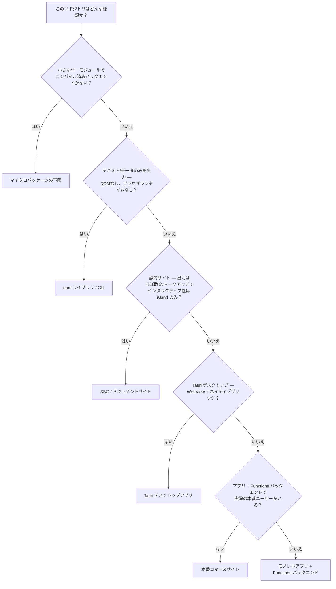

## 第2のジャーニー

このガイドの残りの部分は、ある1つの問いにうまく答えます：**何が変わったか → どのレベルか？** 変更を加えたら、[クイック判断表](./quick-decision.mdx)がその変更のリグレッションを捕捉できる最も低いレベルを教えてくれます。これが「変更ごと」のジャーニーです。

これまで暗黙のままにしてきた第2のジャーニーがあります：**このリポジトリにはどんなスイートが必要か？** 「この差分にはどのレベルか」ではなく、「この形状のリポジトリがそもそも持つべきテストの、完全で最小のセットは何か」です。実際のリポジトリ群は今日、これを手書きの `TESTING.md` で答えています — あるリポジトリは[実行ティア](./execution-tiers.mdx)をそのまま引用し、別のリポジトリはレベル×ティアのフレームワークを `CLAUDE.md` に埋め込み、3つ目はすべてのレベルをマッピングして意図的な逸脱を記録しています。どれも同じ答えをゼロから再導出しています。

このページはそのジャーニーを一級市民にします。リポジトリを少数の**アーキタイプ**に分類し、それぞれに具体的で判断可能な開始スイートを与えます。まっさらなリポジトリに降り立ったエージェントは、そのアーキタイプを選び、それ以上の判断を要さずに実際のテストスイートを生み出せます。

<Note>

このページはリポジトリに**どのテストが存在すべきか**を決めます。これは他所で定義された2つの軸の上に立っています：[テストレベル](../testing-levels/index.mdx)（テストが何を見られるか）と[実行ティア](./execution-tiers.mdx)（どこで・いつ実行されるか）。以下の L/T 表記に馴染みがなければ、先にそれらを読んでください。

</Note>

## このページの使い方

1. 下のマッチャーから**アーキタイプを選ぶ** — 最初に一致したものが勝ち。
2. その**最小スイートを採用する** — 記載されたレベルとティアそのまま。それ以上足さない。
3. **指定された最初のテストを書く。** どのアーキタイプも、出発点となる具体的なテストを1つ挙げています。
4. **スキップと書かれたものはスキップする** — そして*なぜ*かを読み、習慣で再追加しないように。
5. **エスカレーショントリガーを見張る。** 次の層は、その固有のトリガーが発火したときにだけ足す — 決して先回りしない。

アーキタイプは全体像の半分にすぎません。もう半分は**プロジェクトの成熟度**です。リリース前のプロジェクトは最も重いティアを先送りします — [プロジェクトに必要なティアはどれか](./execution-tiers.mdx)と、そのリリース前 T3 先送りの注記を参照してください。以下のスイートは成熟時の形を表しています。オプトインのティアは、プロジェクトが実際にいる段階に合わせてスケールさせてください。

## アーキタイプを選ぶ

上から順に答え、最初に一致したアーキタイプを取ります。



アーキタイプは**排他的ではなく加算的**です：本番コマースサイトはモノレポアプリのアーキタイプにリリース成熟度で層を足したものであり、island が増えた SSG はその island だけにアプリアーキタイプの L2/L4 ツールを借ります。最も狭く一致するものを選び、トリガーが発火したときにだけ層を足してください。

## 一覧

| アーキタイプ | コアゲート | ティア | ブラウザ層 |
|---|---|---|---|
| マイクロパッケージの下限 | typecheck + 少数の L1 ユニット | T0–T1 | なし |
| npm ライブラリ / CLI | L1 + L3 ゴールデンフィクスチャ + pack/publish チェック | T0–T1 | なし |
| SSG / ドキュメントサイト | L3 ビルド + HTML-validate + リンクチェック | T0–T1 | island のみ |
| モノレポアプリ + Functions バックエンド | L1 + API コントラクト + `@smoke` L4 | T0–T2 | PR ごとに `@smoke` サブセット |
| Tauri デスクトップアプリ | L1/L2 モック IPC + コアクレートユニット | T0–T1 + T3 + T4 | WebKit ファースト、スケジュール実行 |
| 本番コマースサイト | モノレポ + 環境別コントラクト + サイト健全性 | T0–T3 | フル E2E、スケジュールスイープ |

## アーキタイプ: SSG / ドキュメントサイト

*根拠：ドキュメントサイト、静的マーケティングサイト、このリポジトリ自身。*

出力はほぼ散文とマークアップです。危険な失敗はロジックのバグではなく — 壊れるビルド、不正な HTML、腐るリンクです。スイートはまさにそれらを狙います。

**最小スイート。** [レベル3（ビルド出力）](../testing-levels/level-3-build-output.mdx)がコアです。PR ごと（**T1**）に：ビルドが成功し、出力された HTML が妥当で、内部リンクが解決すること。ローカル（**T0**）では：typecheck とビルド。[レベル2（DOM テスト）](../testing-levels/level-2-dom-tests.mdx)は**インタラクティブな island にだけ**足し、散文ページには足しません。サイト全体のクロール / 網羅的なリンクチェックは、PR ごとにブロックするのではなく `main` で走らせます。

**最初に書くテスト。** T1 に組み込む3コマンドのコアゲート：

```sh
# The SSG core gate — runs in T1 on every PR
pnpm build                                # must succeed
pnpm exec html-validate "dist/**/*.html"  # emitted HTML is valid
pnpm exec linkinator ./dist --silent      # internal links resolve
```

ビルドそのものが歴史的に壊れる箇所なら、期待するページが `dist` に存在することを確認するレベル3のアサーションで裏打ちします — [SSG 出力検証](../testing-levels/level-3-build-output.mdx)を参照。

**スキップ — その理由。**

- **散文ページの L4 E2E** — 静的ページに駆動すべきユーザーフローはない。ビルド成功と妥当な HTML で、壊れうるものはすでにカバーされる。
- **コンテンツの L5 ビジュアルリグレッション** — 散文のリフローはスクリーンショットゲートに値するリグレッションではない。L5 はデザイン上重要な特定サーフェスがあればそこに取っておく。
- **非インタラクティブなコンテンツのコンポーネントテスト** — レンダリングされた見出しにアサートすべき振る舞いはない。

**エスカレーショントリガー。** サイトが**インタラクティブな island** を得たとき — 検索ボックス、タブ、クライアントルーター、ビュートランジション。その island のロジックに L2 DOM テストを足し、L4 へのエスカレーションは**実ブラウザのプリミティブ（ハイドレーション、フォーカス、スクロール、ナビゲーション）が必要な場合にだけ**行う。island は特に[ハイドレーションのミスネスト変種](./common-failure-pattern.mdx)のリスクがあり、これは L4 より下のすべてのレベルが通過してしまう — island を出すなら、そのハイドレーション待ち付き L4 テストが最初に足すべきもの。

## アーキタイプ: npm ライブラリ / CLI

*根拠：フォーマッター、コードジェネレーター、小さな公開ユーティリティ。*

パッケージはテキストかデータを出力します。正しさは入力 → 出力として完全に表現でき、スイートはユニットテストとゴールデンフィクスチャ — そして決定的に、**公開される tarball** が実際にインストールされ動くことのチェックです。ブラウザ層はまったくありません。

**最小スイート。** 純粋なロジックには[レベル1（ユニット）](../testing-levels/level-1-unit-tests.mdx)、公開 API には[レベル3（ゴールデンフィクスチャ）](../testing-levels/level-3-build-output.mdx) — コミット済みのフィクスチャでツールを走らせ、コミット済みの期待出力と比較。**pack/publish パイプラインのチェック**を足す：出荷される成果物はソースツリーではない。すべて **T0–T1**；下記のトリガーが発火しない限り T2–T4 はなし。

**最初に書くテスト。** 公開エントリポイントに対するゴールデンフィクスチャテスト：

```ts
// tests/format.test.ts — golden fixture over the public API
import { describe, it, expect } from "vitest";
import { readFileSync } from "fs";
import { format } from "../src/index";

it("matches the committed golden output", () => {
  const input = readFileSync("tests/fixtures/sample.in.md", "utf-8");
  const expected = readFileSync("tests/fixtures/sample.out.md", "utf-8");
  expect(format(input)).toBe(expected);
});
```

フォーマッターや任意の冪等な変換なら、冪等性チェック（`format(format(x)) === format(x)`）を足す — [MDX フォーマッターのコントラクトテスト](../testing-levels/level-3-build-output.mdx)を参照。

**スキップ — その理由。**

- **L2 / L4 / L5 / L6 のすべて** — DOM も CSS もブラウザもない。それらのレベルはどれも、このパッケージが持たないレンダリングサーフェスを必要とする。
- **重い E2E ハーネス** — CLI の「エンドツーエンド」はフィクスチャ上でバイナリを走らせることであり、それはすでにゴールデンフィクスチャテスト。

**エスカレーショントリガー。**

- **プラットフォーム固有のバイナリや実行ビットを出荷する** → publish 時の pack 検証を足す；素のユニットスイートが見られない3つの失敗モードは[Publishing-Pipeline 検証](../real-world-patterns/publishing-pipeline.mdx)にある。
- **複数のリポジトリから pin 留めで消費される** → 破壊的な publish を消費者が踏む前に捕らえるスケジュール済みレジストリドリフトネット（**T3**）を足す — [スケジュール再試験](../real-world-patterns/scheduled-re-exam.mdx)を参照。
- **ブラウザランタイムを出力する**（クライアントルーター、island、ビュートランジションを出荷するジェネレーター） → もはや単なるライブラリではない。テストの表面は*出力される成果物*に従う：ランタイムを L2 DOM テストでカバーする、[CLI の形をしたジェネレーターの注記](./execution-tiers.mdx)のとおり。

## アーキタイプ: モノレポアプリ + Functions バックエンド

*根拠：Functions/サーバーレスバックエンドを持つ Web アプリ、認証サービス。*

2つのコードベースが1つのリポジトリを共有します：フロントエンドと Functions バックエンド。PR ごとに重要な破損は**コントラクトの破損** — フロントエンドが依存する形がその下で変わること — であって、クリック可能な全サーフェスではありません。スイートはコントラクトテストを前倒しし、PR ごとには薄いクリティカルパス E2E だけを残します。

**最小スイート。** フロントエンドとバックエンド両方のロジックに[レベル1（ユニット）](../testing-levels/level-1-unit-tests.mdx)。ローカルランタイム（Miniflare かモックしたバインディング）に対する、環境でパラメータ化された **API コントラクトスイート**。**クリティカルパス E2E サブセット** — `@smoke` タグ付き — を PR ごとに、フル E2E スイートは `main` に取っておく。ティアは **T0 + T1**（ユニット + コントラクト + `@smoke` E2E）、T1 があふれたら **T2** へ。

**最初に書くテスト。** 最も重要な単一エンドポイント — ログイン、checkout-create、フロントエンドが機能できない何か — のコントラクトテスト：

```ts
// tests/api/login.contract.test.ts — the shape the frontend depends on
import { describe, it, expect } from "vitest";

it("POST /api/login returns a session token", async () => {
  const res = await SELF.fetch("http://x/api/login", {
    method: "POST",
    body: JSON.stringify({ email: "a@b.c", password: "pw" }),
  });
  expect(res.status).toBe(200);
  expect(await res.json()).toMatchObject({ token: expect.any(String) });
});
```

ランタイムではなくバインディングをモックする — セットアップのパターンは[バックエンド & Node.js テスト](../real-world-patterns/backend-testing.mdx)にある。

**スキップ — その理由。**

- **PR ごとのフル E2E** — PR ごとのブラウザ層は `@smoke` サブセットに留める；フルマトリクスは `main` か T2 に属する。PR ごとのクリック可能な全網羅は、コントラクトテストがすでに提供するカバレッジのために T1 の約10分予算を吹き飛ばす。
- **L5 ビジュアルリグレッション** — 本当にデザイン上重要なサーフェスがない限り。アプリ UI のほとんどは、ピクセルではなく振る舞いで検証される。

**エスカレーショントリガー。**

- **T1 が約10分の予算を超える** → フル E2E スイートを **T2** に分割、[5つのティア](./execution-tiers.mdx)のとおり。
- **バックエンドが実際の外部環境に依存する**（ドリフトするステージング/本番サービス） → 環境別のコントラクトテストとスケジュール再試験を足す — これが次のアーキタイプ。

## アーキタイプ: Tauri デスクトップアプリ

*根拠：Tauri v2 デスクトップアプリ — ドキュメントビューア、エディタ、リソースブラウザ。*

WebView フロントエンドが IPC ブリッジ越しにネイティブの Rust バックエンドと会話します。スイートのほとんどは、そのブリッジを**モックすることで** CI セーフに走ります；本当に実プラットフォームを要する薄いスライスだけがスケジュールレーンに押し出されます。WebKit/macOS の振る舞いを CI のブラウザビルドで信用することが、このアーキタイプが避ける罠です。

**最小スイート。** **バックエンドブリッジモック**（モック IPC）に対するフロントエンド L1/L2 ロジック — ブラウザモードの dev で走り、**T1** で CI セーフのまま。バックエンドロジックのための**コアクレートの Rust ユニットテスト**。本番エンジンに合わせた WebView の **WebKit ファースト E2E**。実デスクトップシェルの**手動ネイティブスモーク**。ティアは **T0 + T1**（モック IPC + コアクレートユニット） + **T3**（スケジュール WebKit/macOS） + **T4**（ローカルヘビーレーン）。

**最初に書くテスト。** バックエンドブリッジモックアダプターに対するフロントエンドテスト — ネイティブ呼び出しをスタブした UI ロジック：

```ts
// tests/toolbar.test.ts — UI logic against the mocked native bridge
import { describe, it, expect, vi } from "vitest";
import { render, screen } from "@testing-library/react";

vi.mock("@tauri-apps/api/core", () => ({
  invoke: vi.fn(async () => ({ path: "/tmp/opened.txt" })),
}));

it("shows the opened file path from the bridge", async () => {
  render(<Toolbar />);
  await screen.findByText("/tmp/opened.txt");
});
```

コアクレートとバックエンドブリッジモックのパターンは[Tauri アプリテスト](../real-world-patterns/tauri-testing.mdx)にある。

**スキップ — その理由。**

- **CI で実ネイティブシェルを駆動する** — CI はデスクトップアプリを信頼できる形でホストできない；モックしたブリッジがそれなしでフロントエンドロジックをカバーする。
- **プラットフォーム依存の E2E を必須 PR チェックにする** — 実キーボード配送やネイティブ WebView の振る舞いは CI のブラウザビルドでは信用できないので、そこでの緑は何も証明せず、赤は誤った理由でブロックする。

**エスカレーショントリガー。** ある振る舞いが**実 WebKit/macOS でのみ信頼できる** — キーボードショートカット、ネイティブ WebView の癖、OS レベルのイベント配送。それを `@interactive` / `@macos-only` とタグ付けし、オンデマンドディスパッチ付きの **T3 スケジュール macOS ジョブ**に移し、モック IPC 層は T1 に残す。これは重いテストルールの[プラットフォーム非対応](./heavy-test-decision.mdx)の分岐。

## アーキタイプ: 本番コマースサイト

*根拠：実ユーザーと収益がかかった本番ストアフロント。*

これは**リリース成熟度におけるモノレポアプリのアーキタイプ** — 上記すべてに加え、実ユーザーを持つサイトが正当化する常設インフラです。加算的な上限であり、下位アーキタイプから何も削られません。

**最小スイート。** 「モノレポアプリ + Functions バックエンド」アーキタイプのすべて、**加えて**：環境別コントラクトテスト（同じスイートを、ステージング*と*本番の両方に対して走らせる）、サイト健全性スイープ（ライブサイト横断のリンクチェック + クリティカルページの可用性）、cron 上のスケジュール再試験。ティアは **T0 + T1 + T2 + T3**。

**最初に書くテスト。** モノレポアーキタイプのコントラクトテストから始め、1つのスイートがローカル・ステージング・本番に対して走るよう環境で選択できるようにする：

```ts
// tests/e2e/config.ts — one suite, environment-selected target
const BASE = process.env.TARGET_URL ?? "http://localhost:8788";
export const url = (path: string) => new URL(path, BASE).toString();
```

本番を変更するものはすべて、明示的な破壊的テストガードの背後に置く — [HTTP API テスト](../real-world-patterns/backend-testing.mdx)の環境ベース URL 切り替えと破壊的テストガードのパターンを参照。

**スキップ — その理由。**

- **下位アーキタイプからは何も** — ここは層が積み上がる場所であって、薄くする場所ではない。
- **検証成果物のサイレントな昇格** — ここでも、一度きりの証明スペックが恒久的なゲートに漂着してはならない。昇格は明示的でレビューされたステップのまま；[必須テスト行動](./required-behavior.mdx)のルール6を参照。

**エスカレーショントリガー。** このアーキタイプ*こそ*がエスカレーションの行き先 — （モノレポアーキタイプから）それを**採用する**トリガーは**カットオーバー / 実ユーザーを伴うリリース**であり、それが常設の **T3** コストを正当化する。リリース前は逆を走らせる：T3 をローカル試験レーンに先送りし（[プロジェクトに必要なティアはどれか](./execution-tiers.mdx)参照）、カットオーバーでスケジュールティアを採用する。

## アーキタイプ: マイクロパッケージの下限

*根拠：「もう十分」と言えるほど小さな単一目的パッケージ。*

小さな1モジュール、1つの仕事。これほど小さなパッケージでは、正直な最小スイートは本当に小さく — それ以上足すのは無駄です。このアーキタイプは**止める明示的な許可**を与えるために存在します。

**最小スイート。** typecheck（**T0**）と**一握りの L1 ユニットテスト**（**T1**）。それが完全なスイート。フィクスチャコーパスも、publish パイプライン検証も、カバレッジ閾値もなし。

**最初に書くテスト。** 単一の公開関数に対するユニットテスト1つ — 多くのマイクロパッケージでは、それがスイート全体：

```ts
// index.test.ts — the entire suite for a micro-package
import { expect, test } from "vitest";
import { slugify } from "./index";

test("slugifies a title", () => {
  expect(slugify("Hello World!")).toBe("hello-world");
});
```

**スキップ — その理由。**

- **それ以外すべて** — ゴールデンフィクスチャコーパス、pack/publish ゲート、あらゆるブラウザ層、カバレッジのバー。これほど小さなモジュールでは、そのどれも、これまで捕らえうるどんなバグよりも構築と保守のコストが高くつく。

<Tip>

マイクロパッケージの罠はテスト不足ではなく — **5行のモジュールが決して正当化しないテストインフラを作り込みすぎること**です。パッケージ全体が1画面に収まるなら、テストスイート全体は一握りの `expect` に収まります。そこで止めるのは近道ではなく、正しいエンジニアリング判断です。

</Tip>

**エスカレーショントリガー。** パッケージが**2つ目の責務を得る**、**コンパイル済み/ネイティブバックエンド**を得る、または**複数リポジトリから pin 留めで消費される**ようになる。いずれもそれを「npm ライブラリ / CLI」アーキタイプに昇格させる — その時点で、それ以前ではなく、ゴールデンフィクスチャと pack/publish チェックを足す。

## 逸脱は構わない — 書き留めてあれば

アーキタイプは開始スイートであって、拘束衣ではありません。リポジトリには逸脱する理由があるでしょう — 異常にステートフルな island を1つ持つドキュメントサイト、避けられない結合テストを持つライブラリ。**逸脱は、書き留めてあれば構いません。** ポートフォリオのあるリポジトリは、使うすべてのレベルをマッピングし、意図的な逸脱をそれぞれ根拠付きで記録しています；その「文書化された逸脱」の実践こそが、逸脱を事故ではなく判断に留めます。

具体的な成果物は、次を満たすリポジトリローカルの `TESTING.md` です：

1. **アーキタイプを明記する** — 「これは SSG / ドキュメントサイトである」 — 読者が出発点のベースラインを知れるように。
2. **デルタを列挙する** — 実際のスイートがアーキタイプの最小スイートと異なるすべての箇所と、その理由。

アーキタイプとデルタを名指しする `TESTING.md` は、このページを一度きりの判断から耐久性のある記録へと変えます：次のエージェントはベースラインをアーキタイプで読み、ローカルの実情をデルタリストで読み、どちらもスイートをゼロから再導出せずに済みます。

## 関連ページ

- [クイック判断表](./quick-decision.mdx) — もう1つのジャーニー：何が変わったか → どのレベルか。
- [実行ティア](./execution-tiers.mdx) — T0–T4 の定義と、上記すべてのスイートがスケールするプロジェクト成熟度の次元。
- [重いテストの判断ルール](./heavy-test-decision.mdx) — アーキタイプのエスカレーショントリガーが発火したら、単一のテストがどうティアを獲得するか。
- [必須テスト行動](./required-behavior.mdx) — 上記スイートを統制するエージェントルール。検証成果物の昇格を含む。
