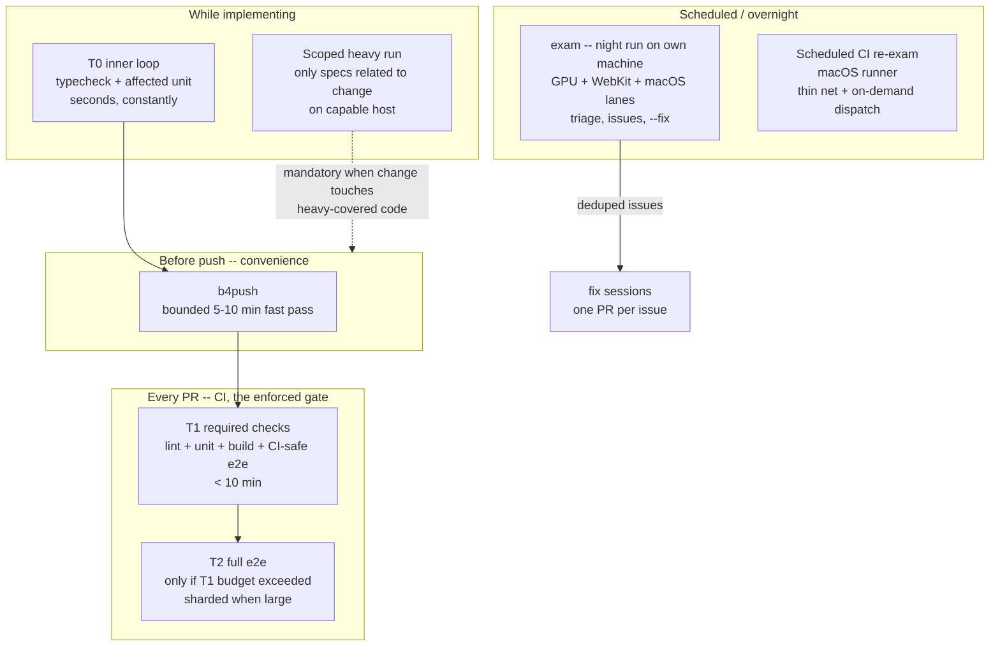

## 第2の軸

このガイドの大部分は[6つのテストレベル](../testing-levels/index.mdx)を中心に構成されています。テストレベルが答えるのは「**テストは何を見ることができるか？**」という問いです。ユニットテストは純粋なロジックを見て、E2Eテストは実際のブラウザを見ます。しかしレベルは、別の問いについては何も語りません：「**テストはどこで・いつ実行されるのか？**」

この問いには独自の軸があります。それが**実行ティア**です。

- **レベル** = テストが何を見られるか（ロジック、DOM、ビルド出力、ブラウザ、ピクセル）
- **ティア** = どこで・いつ実行されるか（インナーループ、PR CI、スケジュール、ローカルヘビーレーン）

すべてのテストは両方の軸上に位置を持ちます。ピクセルレベルのL5スペックは、ランナーがレンダリングできるなら毎PRで実行できますし、実GPUが必要なら夜間スケジュールで実行することもできます。素朴なL1ユニットテストは、ほぼ常にインナーループとPRゲートに住みます。

この2つの軸を分けて考えることで、よくあるエスカレーションの間違いが解消されます。E2Eテストが「PR CIには重すぎる」と感じられたとき、それはより低いレベルで書き直す理由にはなりません。**「重すぎる」はティアの問題であって、レベルの問題ではありません。** レベルはアサーションが何を見る必要があるかで決まり、ティアはコスト・ハードウェア・タイミングで選びます。特定のテストが本当に重すぎる場合は、[重いテストの判断ルール](./heavy-test-decision.mdx)を適用してください -- このルールはまず「そのテストはそのレベルに存在すべきか」を問い、その後にはじめてティア間の移動を検討します。

## 検証 vs リグレッション

テストのティアはそのテストの「仕事」から導かれます。そして仕事はちょうど2種類しかありません。この2つの混同が、肥大化したCIパイプラインの大半の根本原因です。

- **検証アーティファクト**は、一度きりの「**やったことの証明**」です。変更が着地した時点で動いたことを示すために存在します。手動でも、L5のスクリーンショットでも、L6のAI判定でも構いません -- 二度と実行されないので、決定論性は要求されません。これは**どのゲートにも属しません**。
- **リグレッションゲート**は、繰り返し実行可能で決定論的な「**すべてがまだ動いていることの証明**」です。誰でも実行でき、毎回同じ判定を返し、記録（ペーパートレイル）の残るティア -- 必須チェック、CI実行ログ、スケジュールジョブの結果 -- に住んでいなければなりません。

テストは検証からリグレッションへ**明示的に「昇格」します -- デフォルトで昇格することは決してありません**。危険なのは暗黙の昇格です。一度きりの証明スクリプトがテストディレクトリに置かれ、ランナーがそれを拾い、誰も払うと決めていない恒久的なコストになります。昇格は3つの要素を持つ意思決定です：テストの決定論性を確認し、ティアを割り当て、そのティアの時間予算と照らして重さを評価します。

昇格まわりの強制可能なエージェント向けルール -- 検証スペックにはタグを付けてすべてのゲートから除外する、エージェントは自分の検証テストを自分で昇格させない -- は[必須テスト行動](./required-behavior.mdx)にあります。

## 5つのティア

| ティア | 名前 | デフォルト？ | 定義 |
|------|------|----------|------|
| T0 | インナーループ | デフォルト | typecheck、lint、単一/影響範囲のユニットテスト；数秒；エージェントが常時実行するもの；リトライ0 |
| T1 | PRゲート | デフォルト | required status checks：lint + typecheck + unit + build + CIセーフなe2e；目標 < 10分；**正式なゲート**；e2eのリトライは1–2回、初回リトライでtrace記録 |
| T2 | フルE2E分離 | オプトイン | T1が時間予算を超えたときのみ；PR上でrequiredのまま維持するのが望ましい；シャーディングの前にworkersチューニング（シャードは~100+テストかつ30分超のときのみ） |
| T3 | スケジュール再試験 | オプトイン | 重い、環境/プラットフォームに縛られた、または外部依存のドリフトを追うテストをスケジュール実行；ランナーはトリガーに応じて選ぶ -- 重い/プラットフォーム依存には十分な能力のあるハードウェア（Apple siliconのホステッドmacOS；セルフホステッドランナーはエスカレーション時のみ）、外部依存のドリフトにはT1と同じ素のubuntu；`workflow_dispatch`でマージ前のオンデマンド実行；失敗時は重複排除されたissue起票；隔離された`@flaky`テストがallowed-to-failで走る場所でもある |
| T4 | ローカルヘビーレーン | オプトイン | 本当にCIで実行不可能なレーンのみ；上限つきの高速プッシュ前パス（`b4push`、5–10分）とオプトインのプラットフォーム限定ヘビー実行（`exam`）に分割；利便性であって強制ではない |

### T0 + T1: デフォルト

T0とT1は、正当化の必要なく、すべてのプロジェクトが持ちます。T0はフィードバック速度です -- エージェントが実装中に常時実行するもの。T1は**正式なゲート**です：PRはrequired checksがグリーンになればマージ可能であり、required checksの外にあるものはマージをブロックしません。T1より上のすべては、T1に取って代わるためではなく、T1に仕えるために存在します。

#### ゲートを宣言ではなく強制にする

T1を「正式なゲート」と呼べるのは、マージとプッシュを実際にブロックする強制レイヤーが存在する場合だけです。この戦略ドキュメントの中だけに存在するゲートは、規約であって制御ではありません：赤いチェックのあるPRはマージ可能なままで、`main`への直接プッシュもブロックされないままです。強制レイヤーが存在することを検証してください -- 思い込みではなく、APIコール1つで：

```sh
gh api repos/{owner}/{repo}/rulesets                      # [] means no rulesets
gh api repos/{owner}/{repo}/branches/main/protection      # 404 means no branch protection
```

両方とも空で返ってくるなら、「正式なゲート」は紳士協定にすぎません。デフォルトブランチにブランチルールセットを設定して直しましょう（ルールセットが現行のメカニズムで、クラシックなブランチ保護はレガシーなものです）：pull requestとrequired status checksを必須にします。

**ルールセットを追加するときの3つの落とし穴チェックリスト：**

1. **required status checksは直接プッシュもブロックする。** `main`に直接プッシュされたコミットは、プッシュ時点で完了したチェックを持たないため拒否されます -- これは、バージョンバンプのコミットを`main`に直接プッシュするリリース自動化を壊します。明示的な`bypass_actors`エントリを設定し、その後**実際のテストプッシュでバイパスを検証**してください（本物のリリース経路を通したno-opコミット）。
2. **パスフィルタされたチェックをrequiredにしてはいけない。** `on.pull_request.paths:`を持つワークフローは、マッチしないPRでは決して走らないため、そのPRは「Expected -- waiting for status」で永遠に待ち続け、決してマージできません。requiredにできるのは常に走るチェックだけです。パスフィルタされたチェックはnon-requiredのままにします（それでもルール7により、その赤は作者にとってブロッキングです）。
3. **正確なcheck-run名を最近マージされたPRから列挙する -- 推測しない。** required checksは正確なcheck-run名（ジョブ名、またはその`name:`オーバーライド -- ワークフロー名ではない）で一致します。推測やタイポした名前は、落とし穴2とまったく同じように「Expected」でハングします。推測せず、本物の名前を取得してください：

```sh
gh pr view <recent-merged-PR> --json statusCheckRollup --jq '.statusCheckRollup[].name' | sort -u
```

`gh api -X POST repos/{owner}/{repo}/rulesets --input ruleset.json` でルールセットを作成します：

```json
{
  "name": "main gate",
  "target": "branch",
  "enforcement": "active",
  "conditions": { "ref_name": { "include": ["~DEFAULT_BRANCH"], "exclude": [] } },
  "rules": [
    { "type": "pull_request",
      "parameters": { "required_approving_review_count": 0,
        "dismiss_stale_reviews_on_push": false,
        "require_code_owner_review": false,
        "require_last_push_approval": false,
        "required_review_thread_resolution": false } },
    { "type": "required_status_checks",
      "parameters": {
        "required_status_checks": [ { "context": "health" } ],
        "strict_required_status_checks_policy": false } }
  ],
  "bypass_actors": [
    { "actor_id": 5, "actor_type": "RepositoryRole", "bypass_mode": "always" }
  ]
}
```

正確な`context`の値は落とし穴3から得られ、`bypass_actors`エントリは落とし穴1のテストプッシュが検証するものです。

ルール7（「赤いチェックは作者をブロックする」）とルールセットは補完し合うレイヤーであり、互いの代替ではありません。規約レイヤーはPRを作成したエージェントを統制し、強制レイヤーはマージボタンや直接プッシュを含む、それ以外のすべての人・すべてのものを統制します。規約レイヤーしかない戦略にはゲートがありません -- ルール7については[必須テスト行動](./required-behavior.mdx)を参照してください。

### T2: フルE2E分離 -- T1があふれたときのみ

トリガーは具体的です：T1が約10分の予算を超えたとき。それでも、分離したe2eスイートはPR上でrequiredのまま維持するのが望ましいです。シャーディングに手を伸ばす前に、ランナーのワーカー数をチューニングしてください -- シャードはおおよそ100以上のテスト**かつ**30分超のランタイムになってからです。

### T3: スケジュール再試験 -- CIランナーが毎PRでは判定できないテストのために

T3のトリガーは1つではなく3つあります：重いテスト、PRランナーが提供できない環境やプラットフォームに縛られたテスト、そして**リポジトリとは独立して動く外部依存**を見張るスイートです -- pin留めして消費している公開パッケージについて、PRゲートのlockfile固定インストールは、そのlockfileが生成されて以降レジストリで何が変わったかを決して見ることができません。ランナーは固定のデフォルトではなく、トリガーに従います。重い、またはプラットフォームに縛られたテストには十分な能力のあるハードウェアが必要です：Apple silicon上のホステッドmacOSを優先し、セルフホステッドランナーは出発点ではなくエスカレーションです。外部依存のドリフトネットにはそのどれも要りません -- T1と同じ素の`ubuntu`ランナー上で実行すべきです。トリガーがレジストリのドリフトであって、プラットフォームの能力不足ではないからです。`workflow_dispatch`トリガーにより、リスクのある変更をマージする前に同じジョブをオンデマンドで実行できます。失敗はPRをブロックする代わりに重複排除されたissueを起票し、隔離された`@flaky`テストはここでallowed-to-failとして走ります。外部依存のドリフトネットのパターンを含む具体的な実装は[スケジュール再試験と夜間試験](../real-world-patterns/scheduled-re-exam.mdx)に記載されています。

### T4: ローカルヘビーレーン -- 利便性であって強制ではない

T4は、本当にCIで実行不可能なレーンのためだけに存在します。上限つきの高速プッシュ前パス（`b4push`、5–10分）と、オプトインでプラットフォーム限定のヘビー実行（`exam`）に分かれます。ローカルのものは何であれ -- 人間にもAIエージェントにも -- バイパスできるため、T4は利便性のレイヤーであり、T1やT3の代替には決してなりません。

## 実行サーフェス



この図は、テストが実行されうる4つのサーフェスを示しています。PRの列だけが**強制される**ゲートです。実装中とプッシュ前のサーフェスはフィードバックループであり、スケジュールされたサーフェスは、CIランナーがPRごとには判定できないものに対するセーフティネットです。点線のエッジに注目してください：ヘビーレーンのテストでしかカバーされていないコードに変更が触れた場合、プッシュ前に能力のあるホスト上でのスコープを絞ったヘビー実行が必須です -- エージェントはT0/T1だけを根拠に作業完了を宣言してはいけません。

## マルチフィクスチャE2EでT0を「数秒」にする

図のT0の列には「seconds（数秒）」と書かれています。すでにビルド済みのサイトが1つだけの場合、それは達成可能です。しかし、フィクスチャが**N個の自己完結したサイト**で構成されている場合 -- それぞれにビルドステップと専用のプレビューサーバーが必要 -- デフォルトの構成ではそれは不可能です。

### ギャップ

`playwright.config.ts` の `webServer` にN個のエントリが列挙されている場合、1つのスペックが実行される前に毎回次のことが行われます：

1. N個のフィクスチャサイトをすべてビルドする。
2. N個のプレビューサーバーをすべて起動し、それぞれが準備完了になるまで待つ。

インナーループは数秒ではなく数分になります。さらに悪いことに、N個のサーバーを並行して起動するとポートレースのリスクが乗算されます：`EADDRINUSE` の衝突とサーバー間のスタートタイムのずれが断続的なテスト失敗として現れ、フレーキーなテストのように見えますが、実際にはトポロジーの問題です。正しい修正はこのポートレースの表面をリトライで隔離するのではなく、設計で除去することです -- フレーキーネスがトポロジー見直しのシグナルである場合については、[重いテストの判断ルール](./heavy-test-decision.mdx)も参照してください。

アプリケーションポートを区別するだけでは、この表面を閉じきれません。各devサーバーインスタンスは、アプリケーションポートとは無関係な共有デフォルトポート上に、補助ソケット（devtoolsのインスペクター、HMRのWebSocket、メトリクスエンドポイントなど）を開くことがあります。症状・診断・修正方法については、[隠れた補助ソケットのポートレース](../real-world-patterns/playwright-patterns.mdx#隠れた補助ソケットのポートレース)を参照してください。

### メカニズム1：env varでビルド・`webServer`・specを1つのフィクスチャに絞る

`FIXTURE=<name>` という単一のenv varを導入し、ビルドステップ、`webServer`配列、**そしてspecの集合**を対象フィクスチャだけに絞ります。サーバーだけを絞るのでは不十分です：`FIXTURE=site-a` がsite-aのサーバーだけを起動しても、Playwrightが依然としてsite-bとsite-cのspecを収集すれば、それらのspecは起動されていないサーバーに対して走って失敗します。同じenv varで`projects`配列も絞り、対象フィクスチャのspecだけが収集されるようにします。こうするとインナーループは1つのサイトをビルドし、1つのサーバーを起動し、1つのフィクスチャのspecを走らせるだけ -- N方向のスタッガーもポートレースもありません。CI（env varが未設定）では引き続きN個すべてをビルド・サーブ・テストします。

```ts
// playwright.config.ts
import { defineConfig } from "@playwright/test";

const target = process.env.FIXTURE; // e.g. "site-a"

const fixtures = [
  { name: "site-a", port: 4001 },
  { name: "site-b", port: 4002 },
  { name: "site-c", port: 4003 },
];

// One fixture when FIXTURE is set, all N otherwise (CI).
const selected = target ? fixtures.filter((f) => f.name === target) : fixtures;

export default defineConfig({
  // Boot only the selected fixtures' preview servers...
  webServer: selected.map((f) => ({
    command: `pnpm build:${f.name} && pnpm preview:${f.name}`,
    url: `http://localhost:${f.port}`,
    name: f.name,
  })),
  // ...and collect only their specs. Without this, FIXTURE=site-a still runs
  // site-b / site-c specs against servers that were never booted.
  projects: selected.map((f) => ({
    name: f.name,
    testMatch: `**/${f.name}/**/*.spec.ts`,
    use: { baseURL: `http://localhost:${f.port}` },
  })),
});
```

開発時は `FIXTURE=site-a pnpm test` — 1回のビルド、1つのサーバー、site-aのspecだけ、数秒でフィードバック。

### メカニズム2：変更がなければリビルドをスキップする

フィクスチャが1つに絞られていても、インナーループの呼び出しのたびにビルドステップが実行されます。フレッシュネスハッシュにより、不要なリビルドを排除できます。

**ハッシュの算出方法：** フィクスチャ自身のコンテンツファイル**と共有ビルド入力（設定ファイル、ツール類、共有ソースコード）**をすべて含めて算出します。共有入力のセットはgitで追跡されているファイルのワーキングツリーの内容から導出します -- これにより、共有の設定ファイルや依存関係が変わった場合でも、ハッシュが正しくバストされます。

**処理の流れ：**

```sh
# scripts/build-if-changed.sh
FIXTURE_DIR="fixtures/$FIXTURE"
HASH_FILE=".build-cache/$FIXTURE.hash"

# hash fixture content + all shared inputs (git-tracked, working-tree content)
NEW_HASH=$(git ls-files --error-unmatch -- "$FIXTURE_DIR" shared/ | sort | xargs sha256sum | sha256sum | cut -d' ' -f1)

if [ "$FORCE_REBUILD" = "1" ] || [ ! -f "$HASH_FILE" ] || [ "$(cat "$HASH_FILE")" != "$NEW_HASH" ]; then
  pnpm build:fixture "$FIXTURE"
  echo "$NEW_HASH" > "$HASH_FILE"
fi
```

`FORCE_REBUILD=1` は、ハッシュが検知できない変更のためのエスケープハッチです：コミットされていないツール状態、環境の変化、外部依存のアップデートなど。

### 何が得られるか

`EADDRINUSE` やスタートタイムのずれが生み出すポートレースの表面は、感じられるフレーキーネスの**原因**であって、隔離すべき症状ではありません。スコープ＋ハッシュによりトポロジーレベルで除去できます。ビルドとサーブの構成における複数サーバーの `webServer` パターンの具体的な内容は、[Playwright Patterns](../real-world-patterns/playwright-patterns.mdx) のProduction Build Verificationセクションを参照してください。

## リトライ予算

| 場所 | リトライ予算 |
|-------|--------------|
| ローカル（T0、T4） | 0 |
| CI（T1–T3） | 1–2回、初回リトライでtrace記録 |

リトライを健全に保つルールは2つです：

- **リトライで通ったことは、成功ではなくトリアージのシグナルです。** そのテストは自分が非決定論的であると告げています。記録し、修正を予定してください。
- **2回を超えるリトライはにおいます。** その時点で、非決定性を修正する代わりに計算資源で支払っている状態です。

## 移行ルール

<Warning>

テストがローカルヘビーレーンを離れてよいのは、移行先のT2/T3がターゲットハードウェア上でそのテストを少なくとも一度グリーンで実行した**後だけ**です。**ローカルゲートを先に削ってはいけません。**

</Warning>

順序が重要です：先にローカルゲートを削り、その後でCI側の移行先がそのテストを実行できないと判明した場合、そのテストはもうどこでも実行されません -- カバレッジが静かに消滅します。

## プロジェクトに必要なティアはどれか

下の表は類型別のマッピングです。ただし類型は答えの半分にすぎません -- もう1つの次元は**プロジェクトの成熟度**です。

| プロジェクトの類型 | ティア |
|-------------------|-------|
| 小さなCLI / ライブラリ | T0–T1のみ |
| 静的ドキュメントサイト | T0–T1 |
| クライアントランタイムを出力するSSG / ビルドツール | T0–T1、加えて出力されたランタイム向けのL2 DOMテスト；L4–L5のためのT3/T4はブラウザ駆動スイートが存在してからのみ |
| canvas/GPUヘビーなWebアプリ | T0–T3 + T4 |
| Tauriデスクトップアプリ | T0–T1 + T3 + T4 |

ツールは、**ジェネレーター側ではCLIの形をしていて、出力するランタイム側ではWebの形をしている**ことがあります -- ブラウザランタイム（クライアントルーター、アイランド、View Transitions）も出荷するRustコードジェネレーター（CLIと同様にT0–T1）です。テスト面は、CLIだけでなく**出力されたアーティファクト**に従います：ランタイムの振る舞いは今のところL2 DOMテストでカバーされ、L4–L5の懸念はブラウザ駆動スイートが実際に追加されるまでは潜在的なまま留まります -- 追加されてはじめて重いティアが適用されます。

<Note>

ほとんどのプロジェクトはT0+T1で止まります。オプトインのティアは特定のトリガー条件のために存在するのであって、夢のインフラとして用意するものではありません -- **使わないティアの足場を組まないでください。**

</Note>

### リリース前 / WIP：T3は先送り可能

まだユーザーにリリースしていないプロジェクトでは、**T3（スケジュール型リッチCI）は先送りできます**。T3を早期に立ち上げることはコスト面で合理的ではありません。誰もまだ使っていないプロジェクトのために、ホステッドmacOSのActionsミニッツやセルフホステッドGPUランナーに実費を払うのは早計です。また、プロダクトの表面が日々変化する中で `cron exam.yml` + `file-exam-issue.sh` のインフラを維持するのも、それなりのコストがかかります。

暫定的なヘビーレーンのセーフティネットは**T4（ローカルexamレーン）**です。能力のあるマシン上でヘビーなスペックをローカル実行し、夜間の `exam` ランでリグレッションが積み重なる前に表面化させます。

**T3を導入するのはカットオーバー（リリース）時または後**にしてください。プロジェクトにユーザーが生まれ、そのリグレッションが恒常的なインフラコストを正当化できるようになってからです。

<Warning>

T3の先送りはリリースまでの時限措置です -- 恒久的な取り決めではありません。人間の記憶に頼るローカルレーンはいつか必ず破綻します。ローカル限定のヘビーレーンが恒久的なセーフティネットになり得ない理由は、[スケジュール再試験と夜間試験](../real-world-patterns/scheduled-re-exam.mdx)を参照してください。

</Warning>

## 3つのケース

### ケースA: T1より上を必要としなかったCLI

あるmarkdownフォーマッターCLIは、リグレッション面全体を数秒で走る共有フィクスチャコーパスに収めているため、T0+T1ですべてをカバーできます。このゲートはTypeScriptからRustへの全面書き換えを可能にするほど強力でした：毎PRで走るコーパスが、実装を下から差し替えていく間の振る舞いの等価性を検証したのです。T2–T4の足場が組まれることは一度もありませんでした。そこに置くべき重いものが何もなかったからです。

### ケースB: どのPRランナーも判定できないピクセルスペック

あるcanvas/GPUヘビーなパターン生成Webアプリには、ソフトウェアレンダリングのCIランナー上では失敗するピクセルレベルのスペックがあります。これは環境の能力不足であって、遅さではありません -- そして降格は役に立ちません。コンポーネントテストも同じGPUなしの環境で実行されるからです。これらのスペックはローカルヘビーレーン（T4）と、能力のあるハードウェア上のスケジュール再試験（T3）に住み、実GPUを必要としないすべてはT1が守ります。

### ケースC: 実macOSでしか信頼できないキーボードスペック

あるTauriテキストエディタアプリには、実WebKit/macOS上でしか信頼できないキーボードショートカットのe2eスペックがあります。フロントエンドはモックIPCのテストをT1に置き、プラットフォームに縛られたスペックはスケジュールされたmacOSジョブ（T3）＋オンデマンドのdispatchで実行し、加えて能力のあるマシン上のローカルヘビーレーン（T4）でも走らせます。

## 関連ページ

- [重いテストの判断ルール](./heavy-test-decision.mdx) -- テストごとの手順：「なぜ重いのか」を問うて、降格・削除・ティア割り当てを決める
- [スケジュール再試験と夜間試験](../real-world-patterns/scheduled-re-exam.mdx) -- T3/T4の具体的な実装パターン
- [必須テスト行動](./required-behavior.mdx) -- 昇格やアンチゲーミングを含む、強制可能なエージェント向けルール
