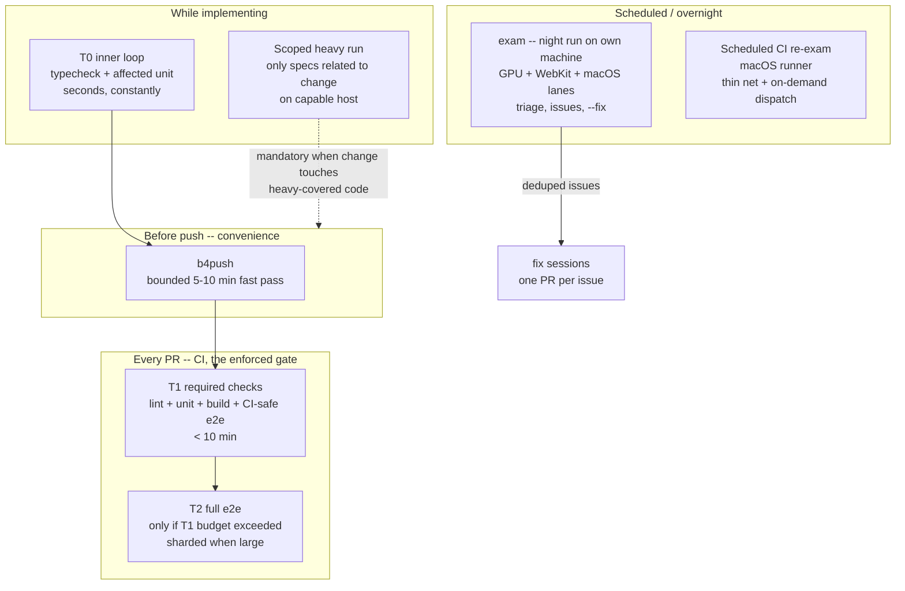

## 第2の軸

このガイドの大部分は[6つのテストレベル](../testing-levels/index.mdx)を中心に構成されています。テストレベルが答えるのは「**テストは何を見ることができるか？**」という問いです。ユニットテストは純粋なロジックを見て、E2Eテストは実際のブラウザを見ます。しかしレベルは、別の問いについては何も語りません：「**テストはどこで・いつ実行されるのか？**」

この問いには独自の軸があります。それが**実行ティア**です。

- **レベル** = テストが何を見られるか（ロジック、DOM、ビルド出力、ブラウザ、ピクセル）
- **ティア** = どこで・いつ実行されるか（インナーループ、PR CI、スケジュール、ローカルヘビーレーン）

すべてのテストは両方の軸上に位置を持ちます。ピクセルレベルのL5スペックは、ランナーがレンダリングできるなら毎PRで実行できますし、実GPUが必要なら夜間スケジュールで実行することもできます。素朴なL1ユニットテストは、ほぼ常にインナーループとPRゲートに住みます。

この2つの軸を分けて考えることで、よくあるエスカレーションの間違いが解消されます。E2Eテストが「PR CIには重すぎる」と感じられたとき、それはより低いレベルで書き直す理由にはなりません。**「重すぎる」はティアの問題であって、レベルの問題ではありません。** レベルはアサーションが何を見る必要があるかで決まり、ティアはコスト・ハードウェア・タイミングで選びます。特定のテストが本当に重すぎる場合は、[重いテストの判断ルール](./heavy-test-decision.mdx)を適用してください -- このルールはまず「そのテストはそのレベルに存在すべきか」を問い、その後にはじめてティア間の移動を検討します。

## 検証 vs リグレッション

テストのティアはそのテストの「仕事」から導かれます。そして仕事はちょうど2種類しかありません。この2つの混同が、肥大化したCIパイプラインの大半の根本原因です。

- **検証アーティファクト**は、一度きりの「**やったことの証明**」です。変更が着地した時点で動いたことを示すために存在します。手動でも、L5のスクリーンショットでも、L6のAI判定でも構いません -- 二度と実行されないので、決定論性は要求されません。これは**どのゲートにも属しません**。
- **リグレッションゲート**は、繰り返し実行可能で決定論的な「**すべてがまだ動いていることの証明**」です。誰でも実行でき、毎回同じ判定を返し、記録（ペーパートレイル）の残るティア -- 必須チェック、CI実行ログ、スケジュールジョブの結果 -- に住んでいなければなりません。

テストは検証からリグレッションへ**明示的に「昇格」します -- デフォルトで昇格することは決してありません**。危険なのは暗黙の昇格です。一度きりの証明スクリプトがテストディレクトリに置かれ、ランナーがそれを拾い、誰も払うと決めていない恒久的なコストになります。昇格は3つの要素を持つ意思決定です：テストの決定論性を確認し、ティアを割り当て、そのティアの時間予算と照らして重さを評価します。

昇格まわりの強制可能なエージェント向けルール -- 検証スペックにはタグを付けてすべてのゲートから除外する、エージェントは自分の検証テストを自分で昇格させない -- は[必須テスト行動](./required-behavior.mdx)にあります。

### 暗黙の昇格はタグ体系の下で起きる

上の昇格ルールが対象にしているのは、`@verification` タグを持つスペックです -- 誰かがそのタグを外そうと提案した時点で発火します。**そもそもタグ体系に入らなかったスペックは、このルールからは見えません。** タグがなければ提案もなく、意思決定も起こりません。そのスペックはただ、毎PRで、永久に実行され続けます。

実際の漏れが起きるのはここで、しかもタグ付けよりさらに上流です。エージェントがバグ修正を依頼され、修正が効いたことを証明するスペックを書き、それをタグなしのままゲートのスペックディレクトリに置く -- ルールを回避しようとしたのではなく、書いている時点ではそれがただのテストにしか見えないからです。実測されたあるケースでは、そのスペックは1日限りのUIレビュー用チェックリストでした。ある日の午後に入れた微調整が正しく見えることを確認する、それだけが仕事のスペックです。それが3か月にわたり、すべての作者のすべてのPRに課金し続け、初日に決着していた問いに答え直していました。

#### タグの棚卸し：コストゼロの検証セットこそが手がかり

タグ別の棚卸しとコストの棚卸しは同時に行ってください。どちらか一方の数字だけを見ると、いずれも健全に見えるからです：

```sh
pnpm exec playwright test --grep "@verification" --list | tail -1        # tagged, excluded from gates
pnpm exec playwright test --grep-invert "@verification" --list | tail -1 # what the gate actually runs
```

実測されたケースが返してきたのは、**タグ付きの `@verification` テスト30件、CI秒数0** でした -- ルールの規定どおり、すべてのゲートから正しく除外されています -- その一方で、本物の検証アーティファクトはタグなしのままゲートの内側に居座り、満額のコストを払っていました。

この組み合わせは、健全性のお墨付きではなく、証拠として読んでください。タグ付き検証セットがゲート時間のほぼ0%しか占めていないということは、そのタグが「もともと除外するつもりだったスペック」にしか付いていないということです。本当にこのルールを必要としていたスペックには、タグが付かなかったのです。**`@verification` テストのコストがゼロなら、検証アーティファクトはタグなしの側を探してください。**

#### 命名の臭い：修正名や日付が付いたスペック

タグなしの検証アーティファクトは、アサーションを読んでも見つけにくいものです。アサーションは本物で、しかもパスするからです。しかし**名前**からは簡単に見つかります。検証スペックは「何を証明したか」で名付けられ、リグレッションゲートは「何を守るか」で名付けられるからです：

- **`bugfix-*-verification`、`fix-*.spec.ts`、`issue-1234.spec.ts`** -- 欠陥にちなんだ名前。バグの名前が付くのは、そのバグを潰した証明だけです。
- **`*-tweak-2.spec.ts`、`*-round-3.spec.ts`** -- 反復回数はワークフローの副産物です。プロダクトの中に「tweak 2」という名前のものは存在しません。
- **日付入りの名前（`ui-check-2026-03-14.spec.ts`）** -- 日付は、そのスペックが「ある瞬間」についてのものだと語っています。そして瞬間は繰り返されません。
- **チェックリスト型のタイトル** -- `test('everything on the settings page looks right')` の中に無関係なアサーションが15個入っていれば、それはレビュー用チェックリストをランナーに書き写したものです。

どれも単体では決定的な証拠ではありません。ただし、そのスペックに「一度も答えずに済んできた昇格の問い」に答えさせるには十分です。

#### 一度の大掃除ではなく、定期的な棚卸しとして回す

3つの列 -- タグ、名前、コスト -- を突き合わせ、その交差部分を昇格の意思決定に通します：

```sh
# 1. the gate's spec set: what runs when nothing is excluded by tag
pnpm exec playwright test --grep-invert "@verification" --list --reporter=json \
  | jq -r '.. | .file? // empty' | sort -u > gate-specs.txt

# 2. of those, the names that smell like verification artifacts
grep -E '(bugfix|verification|issue-[0-9]+|tweak-[0-9]|round-[0-9]|[0-9]{4}-[0-9]{2}-[0-9]{2})' gate-specs.txt

# 3. price each suspect: its test count x the suite's per-test unit cost
pnpm exec playwright test --list <suspect.spec.ts> | tail -1
```

列3は、[スイート全体の予算](./aggregate-suite-budget.mdx#議論を始める前に、すべてのテストに値札を付ける)で導出した単価を使って、この棚卸しをレビュアーが天秤にかけられる数字に変えます：テスト12件の容疑者は、1テストあたり約9.8ワーカー秒なら約118ワーカー秒 -- ワーカー2本なら実時間で約1分 -- を、毎PRで永久に消費し続けます。

列2が返したファイルはすべて、**明示的に**昇格の意思決定を通します -- 通常の昇格とまったく同じ3つの要素を、事後に適用するだけです：決定論的か、どのティアに属するか、そのティアの予算に収まるか。3つすべてに答えられないスペックは、ゲートに居場所がありません。`@verification` タグを付けて外すか、担っていた証明がすでに用済みなら、そのまま削除してください。

これは大掃除ではなく、定期的な棚卸しとして回してください。エージェントによるバグ修正のたびに候補が再生産されるため、一度掃除したスイートがきれいなのは、次の修正が着地するまでのあいだだけです。これらを作成時点で捕まえるレビュアー側のチェックは、[ルール6の強制チェック](./required-behavior.mdx#4つの実行ルール-ルール6-—-検証テストは自己昇格しない)にあります。

## 5つのティア

| ティア | 名前 | デフォルト？ | 定義 |
|------|------|----------|------|
| T0 | インナーループ | デフォルト | typecheck、lint、単一/影響範囲のユニットテスト；数秒；エージェントが常時実行するもの；リトライ0 |
| T1 | PRゲート | デフォルト | required status checks：lint + typecheck + unit + build + CIセーフなe2e；目標 < 10分；**正式なゲート**；e2eのリトライは1–2回、初回リトライでtrace記録**とそれを残すアップロードステップ** |
| T2 | フルE2E分離 | オプトイン | T1が時間予算を超えたときのみ；PR上でrequiredのまま維持するのが望ましい；シャーディングの前にworkersチューニング（シャードは~100+テストかつ30分超のときのみ） |
| T3 | スケジュール再試験 | オプトイン | 重い、環境/プラットフォームに縛られた、または外部依存のドリフトを追うテストをスケジュール実行；ランナーはトリガーに応じて選ぶ -- 重い/プラットフォーム依存には十分な能力のあるハードウェア（Apple siliconのホステッドmacOS；セルフホステッドランナーはエスカレーション時のみ）、外部依存のドリフトにはT1と同じ素のubuntu；`workflow_dispatch`でマージ前のオンデマンド実行；失敗時は重複排除されたissue起票；隔離された`@flaky`テストがallowed-to-failで走る場所でもある |
| T4 | ローカルヘビーレーン | オプトイン | 本当にCIで実行不可能なレーンのみ；上限つきの高速プッシュ前パス（`b4push`、5–10分）とオプトインのプラットフォーム限定ヘビー実行（`exam`）に分割；利便性であって強制ではない |

<Note>

**公開時だけ走るゲートには、そもそもティアがありません。** `npm publish`のときにしか発火しないライフサイクルフック -- `prepack`、`prepublishOnly` -- は、この5つすべての外側にあります：リリースとリリースのあいだ、それを運動させるものは何もないため、気づかれないまま腐り、最初の本当の実行が、取り消しの効かないリリースの内側で起こります。答えは6つ目のティアを作ることではなく、フックの中身を名前付きスクリプトに抽出してPRジョブからも呼ぶことで、この5つのどれかを与えることです -- [公開時だけ走るゲートはどのティアも実行しないレーン](../ci-operations/publishing-pipeline.mdx#公開時だけ走るゲートはどのティアも実行しないレーン)を参照してください。

</Note>

### T0 + T1: デフォルト

T0とT1は、正当化の必要なく、すべてのプロジェクトが持ちます。T0はフィードバック速度です -- エージェントが実装中に常時実行するもの。T1は**正式なゲート**です：PRはrequired checksがグリーンになればマージ可能であり、required checksの外にあるものはマージをブロックしません。T1より上のすべては、T1に取って代わるためではなく、T1に仕えるために存在します。

#### ゲートを宣言ではなく強制にする

T1を「正式なゲート」と呼べるのは、マージとプッシュを実際にブロックする強制レイヤーが存在する場合だけです。この戦略ドキュメントの中だけに存在するゲートは、規約であって制御ではありません：赤いチェックのあるPRはマージ可能なままで、`main`への直接プッシュもブロックされないままです。強制レイヤーが存在することを検証してください -- 思い込みではなく、APIコール1つで：

```sh
gh api repos/{owner}/{repo}/rulesets                      # [] means no rulesets
gh api repos/{owner}/{repo}/branches/main/protection      # 404 means no branch protection
```

両方とも空で返ってくるなら、「正式なゲート」は紳士協定にすぎません。デフォルトブランチにブランチルールセットを設定して直しましょう（ルールセットが現行のメカニズムで、クラシックなブランチ保護はレガシーなものです）：pull requestとrequired status checksを必須にします。

**ルールセットを追加するときの3つの落とし穴チェックリスト：**

1. **required status checksは直接プッシュもブロックする。** `main`に直接プッシュされたコミットは、プッシュ時点で完了したチェックを持たないため拒否されます -- これは、バージョンバンプのコミットを`main`に直接プッシュするリリース自動化を壊します。明示的な`bypass_actors`エントリを設定し、その後**実際のテストプッシュでバイパスを検証**してください（本物のリリース経路を通したno-opコミット）。
2. **パスフィルタされたチェックをrequiredにしてはいけない。** `on.pull_request.paths:`を持つワークフローは、マッチしないPRでは決して走らないため、そのPRは「Expected -- waiting for status」で永遠に待ち続け、決してマージできません。requiredにできるのは常に走るチェックだけです。パスフィルタされたチェックはnon-requiredのままにします（それでもルール7により、その赤は作者にとってブロッキングです）。
3. **正確なcheck-run名を最近マージされたPRから列挙する -- 推測しない。** required checksは正確なcheck-run名（ジョブ名、またはその`name:`オーバーライド -- ワークフロー名ではない）で一致します。推測やタイポした名前は、落とし穴2とまったく同じように「Expected」でハングします。推測せず、本物の名前を取得してください：

```sh
gh pr view <recent-merged-PR> --json statusCheckRollup --jq '.statusCheckRollup[].name' | sort -u
```

`gh api -X POST repos/{owner}/{repo}/rulesets --input ruleset.json` でルールセットを作成します：

```json
{
  "name": "main gate",
  "target": "branch",
  "enforcement": "active",
  "conditions": { "ref_name": { "include": ["~DEFAULT_BRANCH"], "exclude": [] } },
  "rules": [
    { "type": "pull_request",
      "parameters": { "required_approving_review_count": 0,
        "dismiss_stale_reviews_on_push": false,
        "require_code_owner_review": false,
        "require_last_push_approval": false,
        "required_review_thread_resolution": false } },
    { "type": "required_status_checks",
      "parameters": {
        "required_status_checks": [ { "context": "health" } ],
        "strict_required_status_checks_policy": false } }
  ],
  "bypass_actors": [
    { "actor_id": 5, "actor_type": "RepositoryRole", "bypass_mode": "always" }
  ]
}
```

正確な`context`の値は落とし穴3から得られ、`bypass_actors`エントリは落とし穴1のテストプッシュが検証するものです。

ルール7（「赤いチェックは作者をブロックする」）とルールセットは補完し合うレイヤーであり、互いの代替ではありません。規約レイヤーはPRを作成したエージェントを統制し、強制レイヤーはマージボタンや直接プッシュを含む、それ以外のすべての人・すべてのものを統制します。規約レイヤーしかない戦略にはゲートがありません -- ルール7については[必須テスト行動](./required-behavior.mdx)を参照してください。

#### 記録したトレースは、アップロードしなければ証拠にならない

上のT1の行には「e2eのリトライは1–2回、初回リトライでtrace記録」とあります。これはメカニズムの半分です。`trace: 'on-first-retry'` はトレースをCIランナーのディスクへ書きますが、そのランナーはジョブが終わると破棄されます -- つまりアップロードステップが無ければ、このティアは捨てるためだけに証拠を記録するコストを払っていることになります。そうなっているあいだ、見た目には何もおかしくありません：ゲートは本物の失敗できちんと赤くなり、空なのはアーティファクトの一覧だけです。

計測値：あるPRゲートは `trace: 'retain-on-failure'` と `screenshot: 'only-on-failure'` を何か月も動かしながら、ワークフローのどこにもアップロードステップを持っていませんでした。のちのフレーク調査は、CIがすでに捕捉して捨てていた失敗を再現するためにスイートを再実行し、**92回のテスト実行という再構築コスト**を支払いました。

だからリテンションは、どこか別の運用チェックリストではなく、ティアの定義そのものに属します。T1は次の3つがすべて成り立つまで完成していません：

1. **失敗の証拠がアップロードされ、`if: failure() || cancelled()` でゲートされている。** タイムアウト上限で殺されたラン、あるいは `concurrency` グループでキャンセルされたランこそ、そのトレースが欲しいケースであり、素の `failure()` はそれを取りこぼします。
2. **アップロード先のパスは、実際にどれかのレポーターが書くパスである。** PlaywrightのCIでのデフォルトレポーターは `dot` で、`playwright-report/` というディレクトリをそもそも作りません。そのパスをアップロードしても何もアップロードされず、それでもステップは成功します。アップロードステップに `if-no-files-found: error` を設定して防いでください -- [アップロードを `failure() || cancelled()` でゲートする](../tool-patterns/playwright-patterns.mdx#トレースを記録しても残したことにはならない-アップロードを-failure-cancelled-でゲートする)を参照。
3. **ジョブがPlaywrightを2回以上起動するなら、起動ごとに専用の `--output` を与える。** Playwrightは毎回のランの開始時に `outputDir` を空にするため、2つ目のレーンが1つ目のレーンのトレースを、アップロードステップより前に削除します。

メカニズム、生ディレクトリではなくレポートをアップロードする根拠となる計測されたストレージの数字、そして3点目のためのワークフローガードは、[トレースを記録しても残したことにはならない](../tool-patterns/playwright-patterns.mdx#トレースを記録しても残したことにはならない)にあります。

### T2: フルE2E分離 -- T1があふれたときのみ

トリガーは具体的です：T1が約10分の予算を超えたとき。それでも、分離したe2eスイートはPR上でrequiredのまま維持するのが望ましいです。シャーディングに手を伸ばす前に、ランナーのワーカー数をチューニングしてください -- シャードはおおよそ100以上のテスト**かつ**30分超のランタイムになってからです。ワーカーのチューニング・シャーディング・ランナー自体のサイジングの間のトレードオフは、[CIランナーのサイジング](../ci-operations/ci-runner-sizing.mdx)にまとめられています。

### T3: スケジュール再試験 -- CIランナーが毎PRでは判定できないテストのために

T3のトリガーは1つではなく3つあります：重いテスト、PRランナーが提供できない環境やプラットフォームに縛られたテスト、そして**リポジトリとは独立して動く外部依存**を見張るスイートです -- pin留めして消費している公開パッケージについて、PRゲートのlockfile固定インストールは、そのlockfileが生成されて以降レジストリで何が変わったかを決して見ることができません。ランナーは固定のデフォルトではなく、トリガーに従います。重い、またはプラットフォームに縛られたテストには十分な能力のあるハードウェアが必要です：Apple silicon上のホステッドmacOSを優先し、セルフホステッドランナーは出発点ではなくエスカレーションです -- その選択を支えるランナーの形状・料金・サイジングのルールは[CIランナーのサイジング](../ci-operations/ci-runner-sizing.mdx)を参照してください。外部依存のドリフトネットにはそのどれも要りません -- T1と同じ素の`ubuntu`ランナー上で実行すべきです。トリガーがレジストリのドリフトであって、プラットフォームの能力不足ではないからです。`workflow_dispatch`トリガーにより、リスクのある変更をマージする前に同じジョブをオンデマンドで実行できます。失敗はPRをブロックする代わりに重複排除されたissueを起票し、隔離された`@flaky`テストはここでallowed-to-failとして走ります。外部依存のドリフトネットのパターンを含む具体的な実装は[スケジュール再試験と夜間試験](../ci-operations/scheduled-re-exam.mdx)に記載されています。T2/T3のレーンをすべてのPRで走らせるのではなくベースブランチでゲートするかどうかは、それ自体が別のブランチトポロジーの決定であり、[リリースラウンド: develop→main ブランチ戦略](../ci-operations/release-rounds-branch-strategy.mdx)で扱われています。

### T4: ローカルヘビーレーン -- 利便性であって強制ではない

T4は、本当にCIで実行不可能なレーンのためだけに存在します。上限つきの高速プッシュ前パス（`b4push`、5–10分）と、オプトインでプラットフォーム限定のヘビー実行（`exam`）に分かれます。ローカルのものは何であれ -- 人間にもAIエージェントにも -- バイパスできるため、T4は利便性のレイヤーであり、T1やT3の代替には決してなりません。

<Warning>

**ローカルの実測時間はノイズの多いシグナルです -- それでゲートしてはいけません。** 開発マシンは共有され、負荷が変動する環境です：バックグラウンドの処理や、*同じマシン上で並行して動く他のエージェントセッション*が、1回の実行時間を50%以上ふくらませることは日常的に起きます -- 約10分のレーンが約15分かかっても、それはレーン自体について何も語りません。T4/ローカルレーンの合否は**完走 + 構造的な有界性**です -- 全フェーズが通り、レーンが変更/影響範囲にスコープされ、ヘビーな全量スイープが除外されている -- 分単位の正確な数値ではありません。

「5–10分」は、レーンの**構造**（何を含め何を除外するか、変更スコープになっているか）に対するソフトな設計目標として扱い、*完走して有界に収まるかどうか*で検証します。数値そのものをどうしても検証しなければならない場合は、静かで代表的なベースラインで測定するか、比較可能なCI実行可能レーンが存在する場合に限りCIの管理されたランナーで測定します（T4レーン自体は定義上CIでは実行不可能です）。レーンを再構成するのは、超過が負荷起因ではなく**構造的**である場合だけです。

**エージェントのアンチパターン：** 負荷のかかったマシンでローカルレーンを1回だけ計測し、目標超過を見て、受け入れ基準を「バグっている」と宣言し、再設計を発動する。これは負荷ノイズを追いかけることに実労力を費やします。これはデフレーキングのルール -- 固定の締め切りではなく、本物の完了シグナルを待つ -- のローカル計測版です。[デフレーキングのレシピ](../test-integrity/deflaking-recipe.mdx)を参照してください。

**この警告のより強い形：ローカルの数値を*得るため*に何時間も費やしてもいけません。** 上のルールは、ローカルの実測時間はゲートに使えるほど信頼できないと述べています。高い授業料を払って学んだ帰結は、そもそもその数値はマシン時間を投じて取得する価値がない、ということです。あるエージェントは計画の受け入れ基準をローカルの全量スイート・ベースラインに紐づけ、6シャード中4シャードで約3時間を費やしながら使える数値を得られませんでした -- 同じ問いに答えるCI計測は、同じエージェントが1時間前にマージ済みだったにもかかわらず。

</Warning>

### 実測時間がどうしても必要な場合

計測を、それが実際に必要とするものによって分割します：

| 計測対象 | 実行場所 | 理由 |
|---|---|---|
| 全量スイート/シャード単位の実測時間、ピークヒープ | **CI** | 均一なコンテナ、毎回同じ環境。`GITHUB_STEP_SUMMARY`に出力し、そこで予算と比較する。 |
| ファイル単位の所要時間 | **どちらでも** | 各ファイルの区間は短く、比較目的で読むため、全量スイートの合計に比べて負荷の影響がはるかに小さい。さらにJSONレポーターのスイート単位のタイミングは、隣接ファイルの失敗の影響を受けない。 |
| 安価なA/B比較（バンドル版 vs ソース配信版の依存レーン、パスあたりの固定コスト） | **ローカル** | 数分で済み、軽度の負荷競合下でも比較は内部的に一貫している。 |

<Warning>

**共有マシンを占有する前に確認を取ること。** 開発者のマシンを何時間も飽和させるスイート実行は、実装上の細部ではなく、そのマシンの所有者に属するリソース判断です -- 特に他のリポジトリや他のエージェントセッションがそれを共有している場合は。3時間目の後ではなく、最初のコマンドの前に確認してください。

</Warning>

残るローカル計測を生き延びさせる4つの実践：

- **経過時間を信じる前にログを読むこと。** サンドボックス環境は、通常のファイルの読み取りを拒否することがあります（`node_modules/...`やOSの一時パスに対する`EPERM: operation not permitted`）。ランナーはこれを未処理エラーとして報告し、シャードは非ゼロで終了し、ラッパーがリトライし、そのリトライ時間が黙って経過時間に加算されます。観測されたある実行では、**単一シャード内で71の異なるパスにわたり101件のEPERM**が記録されました。素のリトライで必ず解消するため、ログをgrepしない限り見えません。バイアスの向きに注意してください：環境起因のリトライは*現行*構成の時間をふくらませ、提案されている変更を有利に見せます。仮説と一致する計測誤差は、計測しないことより悪いのです。
- **やり直すよりサルベージすること。** 中断された実行の`--reporter=json --outputFile=`レポートは残り、実測時間の合計が汚染されていてもファイル単位の所要時間は信頼できます。上記のケースでは、完了済みシャードのサルベージがそのセッションで最も価値ある発見を生み、2つの計画上の主張を反証しました。
- **2回の全量実行の差分ではなく、定数を直接測ること。** ある計画は、パスあたりの起動オーバーヘッドとワーカー数のどちらにコストが帰属するかを切り分けるため、全量スイートを3回実行しようとしました。起動定数は約2分で測れます：ごく小さなテストファイル1つを1回、続いて同じものを6回連続で計測する -- その差はパスあたりのコスト（起動時間と、無視できる程度のテスト本体）の5倍です。スイートの実行時間が混ざらない分、2回の全量実行を差分するより変数の切り分けとして*より優れています*。
- **ワーカーより先にドライバーを落とし、あらゆるkillをパスでスコープすること。** ワーカーだけを落とすと、PID 1に再ペアレントされたバックグラウンドのリトライループが残り、単にシャードを再実行します。症状は、あるシャードが`exit=143`（自分自身が送ったSIGTERM）を試行回数の増加とともに記録し、こちらが停止したと思った後も実行が続くことです。そして汎用的なツール名で`pkill`しないこと -- `pkill -9 -f "vitest"`は同じマシン上の他リポジトリの実行にもマッチします。パスでスコープしてください。

## 実行サーフェス


```mermaid
flowchart TD
  subgraph IMPL[While implementing]
    T0[T0 inner loop<br/>typecheck + affected unit<br/>seconds, constantly]
    SCOPED[Scoped heavy run<br/>only specs related to change<br/>on capable host]
  end
  subgraph PUSH[Before push -- convenience]
    B4[b4push<br/>bounded 5-10 min fast pass]
  end
  subgraph PR[Every PR -- CI, the enforced gate]
    T1[T1 required checks<br/>lint + unit + build + CI-safe e2e<br/>&lt; 10 min]
    T2[T2 full e2e<br/>only if T1 budget exceeded<br/>sharded when large]
  end
  subgraph NIGHT[Scheduled / overnight]
    EXAM[exam -- night run on own machine<br/>GPU + WebKit + macOS lanes<br/>triage, issues, --fix]
    BACKSTOP[Scheduled CI re-exam<br/>macOS runner<br/>thin net + on-demand dispatch]
  end
  T0 --> B4 --> T1 --> T2
  SCOPED -.mandatory when change touches<br/>heavy-covered code.-> PUSH
  EXAM -- deduped issues --> FIX[fix sessions<br/>one PR per issue]
```

この図は、テストが実行されうる4つのサーフェスを示しています。PRの列だけが**強制される**ゲートです。実装中とプッシュ前のサーフェスはフィードバックループであり、スケジュールされたサーフェスは、CIランナーがPRごとには判定できないものに対するセーフティネットです。点線のエッジに注目してください：ヘビーレーンのテストでしかカバーされていないコードに変更が触れた場合、プッシュ前に能力のあるホスト上でのスコープを絞ったヘビー実行が必須です -- エージェントはT0/T1だけを根拠に作業完了を宣言してはいけません。

## マルチフィクスチャE2EでT0を「数秒」にする

図のT0の列には「seconds（数秒）」と書かれています。すでにビルド済みのサイトが1つだけの場合、それは達成可能です。しかし、フィクスチャが**N個の自己完結したサイト**で構成されている場合 -- それぞれにビルドステップと専用のプレビューサーバーが必要 -- デフォルトの構成ではそれは不可能です。

### ギャップ

`playwright.config.ts` の `webServer` にN個のエントリが列挙されている場合、1つのスペックが実行される前に毎回次のことが行われます：

1. N個のフィクスチャサイトをすべてビルドする。
2. N個のプレビューサーバーをすべて起動し、それぞれが準備完了になるまで待つ。

インナーループは数秒ではなく数分になります。さらに悪いことに、N個のサーバーを並行して起動するとポートレースのリスクが乗算されます：`EADDRINUSE` の衝突とサーバー間のスタートタイムのずれが断続的なテスト失敗として現れ、フレーキーなテストのように見えますが、実際にはトポロジーの問題です。正しい修正はこのポートレースの表面をリトライで隔離するのではなく、設計で除去することです -- フレーキーネスがトポロジー見直しのシグナルである場合については、[重いテストの判断ルール](./heavy-test-decision.mdx)も参照してください。

アプリケーションポートを区別するだけでは、この表面を閉じきれません。各devサーバーインスタンスは、アプリケーションポートとは無関係な共有デフォルトポート上に、補助ソケット（devtoolsのインスペクター、HMRのWebSocket、メトリクスエンドポイントなど）を開くことがあります。症状・診断・修正方法については、[隠れた補助ソケットのポートレース](../tool-patterns/playwright-patterns.mdx#隠れた補助ソケットのポートレース)を参照してください。

### メカニズム1：env varでビルド・`webServer`・specを1つのフィクスチャに絞る

`FIXTURE=<name>` という単一のenv varを導入し、ビルドステップ、`webServer`配列、**そしてspecの集合**を対象フィクスチャだけに絞ります。サーバーだけを絞るのでは不十分です：`FIXTURE=site-a` がsite-aのサーバーだけを起動しても、Playwrightが依然としてsite-bとsite-cのspecを収集すれば、それらのspecは起動されていないサーバーに対して走って失敗します。同じenv varで`projects`配列も絞り、対象フィクスチャのspecだけが収集されるようにします。こうするとインナーループは1つのサイトをビルドし、1つのサーバーを起動し、1つのフィクスチャのspecを走らせるだけ -- N方向のスタッガーもポートレースもありません。CI（env varが未設定）では引き続きN個すべてをビルド・サーブ・テストします。

```ts
// playwright.config.ts
import { defineConfig } from "@playwright/test";

const target = process.env.FIXTURE; // e.g. "site-a"

const fixtures = [
  { name: "site-a", port: 4001 },
  { name: "site-b", port: 4002 },
  { name: "site-c", port: 4003 },
];

// One fixture when FIXTURE is set, all N otherwise (CI).
const selected = target ? fixtures.filter((f) => f.name === target) : fixtures;

export default defineConfig({
  // Boot only the selected fixtures' preview servers...
  webServer: selected.map((f) => ({
    command: `pnpm build:${f.name} && pnpm preview:${f.name}`,
    url: `http://localhost:${f.port}`,
    name: f.name,
  })),
  // ...and collect only their specs. Without this, FIXTURE=site-a still runs
  // site-b / site-c specs against servers that were never booted.
  projects: selected.map((f) => ({
    name: f.name,
    testMatch: `**/${f.name}/**/*.spec.ts`,
    use: { baseURL: `http://localhost:${f.port}` },
  })),
});
```

開発時は `FIXTURE=site-a pnpm test` — 1回のビルド、1つのサーバー、site-aのspecだけ、数秒でフィードバック。

### メカニズム2：変更がなければリビルドをスキップする

フィクスチャが1つに絞られていても、インナーループの呼び出しのたびにビルドステップが実行されます。フレッシュネスハッシュにより、不要なリビルドを排除できます。

**ハッシュの算出方法：** フィクスチャ自身のコンテンツファイル、**共有ビルド入力（設定ファイル、ツール類、共有ソースコード）**、そして**lockfileとランナー設定**（`pnpm-lock.yaml`、`playwright.config.ts` -- 依存関係とランナーの挙動の変化をワーキングツリー上で可視化する2つのファイル）をすべて含めて算出します。共有入力のセットはgitで追跡されているファイルのワーキングツリーの内容から導出します。lockfileに現れる依存関係の変更は、確実にハッシュをバストします：`pnpm-lock.yaml` はインストール済み依存関係のバージョンが変わるたびに変化し、そのlockfile自体がハッシュ対象の入力のひとつだからです。

**処理の流れ：**

```sh
# scripts/build-if-changed.sh
FIXTURE_DIR="fixtures/$FIXTURE"
HASH_FILE=".build-cache/$FIXTURE.hash"

# hash fixture content + all shared inputs (git-tracked, working-tree content)
# -z / xargs -0 keep filenames with spaces intact and avoid deleted-file breakage
NEW_HASH=$(git ls-files -z -- "$FIXTURE_DIR" shared/ pnpm-lock.yaml playwright.config.ts | sort -z | xargs -0 sha256sum | sha256sum | cut -d' ' -f1)

mkdir -p "$(dirname "$HASH_FILE")"

if [ "$FORCE_REBUILD" = "1" ] || [ ! -f "$HASH_FILE" ] || [ "$(cat "$HASH_FILE")" != "$NEW_HASH" ]; then
  pnpm build:fixture "$FIXTURE"
  echo "$NEW_HASH" > "$HASH_FILE"
fi
```

`FORCE_REBUILD=1` は、ハッシュが検知できない変更のためのエスケープハッチです：コミットされていないツール状態、環境の変化、外部依存のアップデートなど。

上のハッシュが意図的に含めていない入力がひとつあります。ビルド自身の出力です。この省略には知っておくべき代償があります：ソースだけから導出したキーは、並行する書き手がマーカーの保証対象である成果物を切り詰めたり削除したりしたあとでも一致してしまいます。したがって、ビルドディレクトリへ書き込みうるプロセスが複数存在する場合、キーは成果物自身のバイト列もハッシュしなければなりません -- [書き手が複数いるビルド成果物は共有された可変状態](../testing-levels/level-3-build-output.mdx#書き手が複数いるビルド成果物は共有された可変状態)を参照してください。

### 何が得られるか

`EADDRINUSE` やスタートタイムのずれが生み出すポートレースの表面は、感じられるフレーキーネスの**原因**であって、隔離すべき症状ではありません。スコープ＋ハッシュによりトポロジーレベルで除去できます。ビルドとサーブの構成における複数サーバーの `webServer` パターンの具体的な内容は、[Playwright Patterns](../tool-patterns/playwright-patterns.mdx) のProduction Build Verificationセクションを参照してください。

## リトライ予算

| 場所 | リトライ予算 |
|-------|--------------|
| ローカル（T0、T4） | 0 |
| CI（T1–T3） | 1–2回、初回リトライでtrace記録 |

リトライを健全に保つルールは2つです：

- **リトライで通ったことは、成功ではなくトリアージのシグナルです。** そのテストは自分が非決定論的であると告げています。記録し、修正を予定してください。
- **2回を超えるリトライはにおいます。** その時点で、非決定性を修正する代わりに計算資源で支払っている状態です。

この予算が支配するのは、スイート自身の自動的なテストごとのリトライです。マージゲートでのオペレーター起点の*ワークフロー再実行*は別のメカニズムで、より厳しい独立した上限を持ちます — [ゲートオペレーターのプレイブック](../test-integrity/deflaking-recipe.mdx#自分のものではない赤いci-—-ゲートオペレーターのプレイブック)を参照してください。

プレーンな `cargo test` では、この予算は実装不可能です — 組み込みのハーネスにはリトライの仕組みがまったくありません。Rustスイートが `retries`・pass-on-retryのテレメトリ・テストごとのタイムアウトをどう得るかは、[nextestへの移行レシピ](../tool-patterns/cargo-nextest-migration.mdx)を参照してください。

## 移行ルール

<Warning>

テストがローカルヘビーレーンを離れてよいのは、移行先のT2/T3がターゲットハードウェア上でそのテストを少なくとも一度グリーンで実行した**後だけ**です。**ローカルゲートを先に削ってはいけません。**

</Warning>

順序が重要です：先にローカルゲートを削り、その後でCI側の移行先がそのテストを実行できないと判明した場合、そのテストはもうどこでも実行されません -- カバレッジが静かに消滅します。

## プロジェクトに必要なティアはどれか

下の表は類型別のマッピングです。ただし類型は答えの半分にすぎません -- もう1つの次元は**プロジェクトの成熟度**です。

| プロジェクトの類型 | ティア |
|-------------------|-------|
| 小さなCLI / ライブラリ | T0–T1のみ |
| 静的ドキュメントサイト | T0–T1 |
| クライアントランタイムを出力するSSG / ビルドツール | T0–T1、加えて出力されたランタイム向けのL2 DOMテスト；L4–L5のためのT3/T4はブラウザ駆動スイートが存在してからのみ |
| canvas/GPUヘビーなWebアプリ | T0–T3 + T4 |
| Tauriデスクトップアプリ | T0–T1 + T3 + T4 |

ツールは、**ジェネレーター側ではCLIの形をしていて、出力するランタイム側ではWebの形をしている**ことがあります -- ブラウザランタイム（クライアントルーター、アイランド、View Transitions）も出荷するRustコードジェネレーター（CLIと同様にT0–T1）です。テスト面は、CLIだけでなく**出力されたアーティファクト**に従います：ランタイムの振る舞いは今のところL2 DOMテストでカバーされ、L4–L5の懸念はブラウザ駆動スイートが実際に追加されるまでは潜在的なまま留まります -- 追加されてはじめて重いティアが適用されます。

<Note>

ほとんどのプロジェクトはT0+T1で止まります。オプトインのティアは特定のトリガー条件のために存在するのであって、夢のインフラとして用意するものではありません -- **使わないティアの足場を組まないでください。**

</Note>

### リリース前 / WIP：T3は先送り可能

まだユーザーにリリースしていないプロジェクトでは、**T3（スケジュール型リッチCI）は先送りできます**。T3を早期に立ち上げることはコスト面で合理的ではありません。誰もまだ使っていないプロジェクトのために、ホステッドmacOSのActionsミニッツやセルフホステッドGPUランナーに実費を払うのは早計です。また、プロダクトの表面が日々変化する中で `cron exam.yml` + `file-exam-issue.sh` のインフラを維持するのも、それなりのコストがかかります。

暫定的なヘビーレーンのセーフティネットは**T4（ローカルexamレーン）**です。能力のあるマシン上でヘビーなスペックをローカル実行し、夜間の `exam` ランでリグレッションが積み重なる前に表面化させます。

**T3を導入するのはカットオーバー（リリース）時または後**にしてください。プロジェクトにユーザーが生まれ、そのリグレッションが恒常的なインフラコストを正当化できるようになってからです。

<Warning>

T3の先送りはリリースまでの時限措置です -- 恒久的な取り決めではありません。人間の記憶に頼るローカルレーンはいつか必ず破綻します。ローカル限定のヘビーレーンが恒久的なセーフティネットになり得ない理由は、[スケジュール再試験と夜間試験](../ci-operations/scheduled-re-exam.mdx)を参照してください。

</Warning>

## 3つのケース

### ケースA: T1より上を必要としなかったCLI

あるmarkdownフォーマッターCLIは、リグレッション面全体を数秒で走る共有フィクスチャコーパスに収めているため、T0+T1ですべてをカバーできます。このゲートはTypeScriptからRustへの全面書き換えを可能にするほど強力でした：毎PRで走るコーパスが、実装を下から差し替えていく間の振る舞いの等価性を検証したのです。T2–T4の足場が組まれることは一度もありませんでした。そこに置くべき重いものが何もなかったからです。

### ケースB: どのPRランナーも判定できないピクセルスペック

あるcanvas/GPUヘビーなパターン生成Webアプリには、ソフトウェアレンダリングのCIランナー上では失敗するピクセルレベルのスペックがあります。これは環境の能力不足であって、遅さではありません -- そして降格は役に立ちません。コンポーネントテストも同じGPUなしの環境で実行されるからです。これらのスペックはローカルヘビーレーン（T4）と、能力のあるハードウェア上のスケジュール再試験（T3）に住み、実GPUを必要としないすべてはT1が守ります。

### ケースC: 実macOSでしか信頼できないキーボードスペック

あるTauriテキストエディタアプリには、実WebKit/macOS上でしか信頼できないキーボードショートカットのe2eスペックがあります。フロントエンドはモックIPCのテストをT1に置き、プラットフォームに縛られたスペックはスケジュールされたmacOSジョブ（T3）＋オンデマンドのdispatchで実行し、加えて能力のあるマシン上のローカルヘビーレーン（T4）でも走らせます。

## 関連ページ

- [重いテストの判断ルール](./heavy-test-decision.mdx) -- テストごとの手順：「なぜ重いのか」を問うて、降格・削除・ティア割り当てを決める
- [スケジュール再試験と夜間試験](../ci-operations/scheduled-re-exam.mdx) -- T3/T4の具体的な実装パターン
- [CIランナーのサイジング](../ci-operations/ci-runner-sizing.mdx) -- このページが前提とするT2/T3のハードウェア選択を支える、ランナーの形状・料金・サイジングルール
- [リリースラウンド: develop→main ブランチ戦略](../ci-operations/release-rounds-branch-strategy.mdx) -- T2/T3の重いレーンをすべてのPRではなくベースブランチでゲートする
- [必須テスト行動](./required-behavior.mdx) -- 昇格やアンチゲーミングを含む、強制可能なエージェント向けルール
