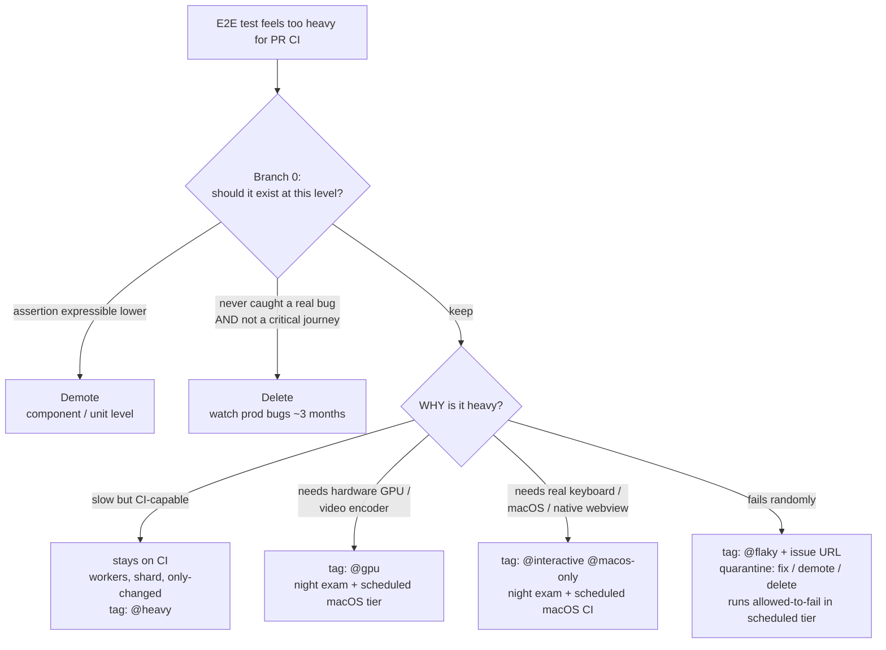

## このページが答える問い

E2Eテストを持つプロジェクトは、遅かれ早かれ同じ瞬間にぶつかります：テストには価値がありそうなのに、PRゲートに置くには遅すぎる、ハードウェアに依存しすぎている、あるいは不安定すぎる。直感的に浮かぶ問いは「ではこのテストは他のどこで実行すればいいのか？」ですが、それは*2番目*の問いです。テストがどこで・いつ実行されるかはティアの問題であり、[実行ティア](./execution-tiers.mdx)が答えます。*最初*の問いは、そのテストにそもそもティアを与える価値があるのかどうかです。

すべての重いテストは、次の3つの出口のいずれかからこのページを出ていきます：

- **修正（fix）** — テストを残し、*なぜ*重いのかを分類して、対応するティアを割り当てる（テストがflakyな場合は [フレイク根本原因カタログ & デフレイキングレシピ](../real-world-patterns/deflaking-recipe.mdx) を参照）
- **降格（demote）** — より低いテストレベルでアサーションを書き直す
- **削除（delete）** — テストを削除して、何が起こるかを観察する

<Warning>
**重いテストの「置き場所」を見つけるだけの戦略は、死ぬべきテストを忠実に保存してしまいます。** 判断ルールに降格と削除の分岐がなければ、遅い・冗長な・価値のないテストがすべてスケジュール実行ティアへ持ち越され、実コストを払いながら永遠に走り続けます。ブランチ0は、そうしたテストを最初にふるい落とすために存在します。
</Warning>

## ブランチ0：ティアを割り当てる前に

重いテストを「重さの種類」で分類する前に、次の2つの問いを順番に確認します。

### (a) アサーションはより低いレベルで表現できるか？

テストが実際にアサートしている内容がコンポーネントテストやユニットテストで表現できるなら、**降格してください**。「算出された合計が42に等しい」で終わる90秒のブラウザフローは、E2Eの衣装を着たユニットテストです。降格すればアサーションはより速く、より決定論的で、より安価になります — 意味は何も失われません。

### (b) 一度も本物のリグレッションを捕まえたことがなく、かつクリティカルなユーザージャーニーでもないか？

両方に当てはまるなら**削除し**、その後およそ3か月、本番のバグ発生率を観察してください。そのテストが捕まえたはずのバグが何も出てこなければ、それはただの重りでした。逆に何かが出てきたなら、本当に重要なアサーションが何かを正確に学べたということであり、それに対してより良く、より安価なテストを書けます。

ブランチ0を生き残ったテストだけがティアを得ます。

## 判断フロー



## 「なぜ重いのか」で分類する

「重すぎる」はひとつの状態ではありません。テストがPR CIには重すぎると感じられる理由は4つあり、それぞれ異なる対処を要求します。これらを混同すると、ローカル専用（＝バイパス可能）になったテスト、苛立ちから削除されたテスト、PRに残れたはずなのにスケジュール送りになったテストができあがります。

### 1. 遅いがCIで実行可能

テストはCIランナー上で問題なく動く — ただ時間がかかるだけ。このカテゴリは**CIに留まります**：

- まずテストランナーの**workers**をチューニングする。並列化が最も安価な改善です
- ランナーをまたぐ**シャーディング**は、およそ100テスト*かつ*実行時間30分を超えてから
- `--only-changed` は取りこぼしのあるPR用プレフィルタとして使い、スケジュール実行のフルランで補完する

タグ：`@heavy`。このカテゴリを決してローカル専用にしないでください — 遅いというだけでは、強制されるゲートを離れる理由になりません。

### 2. 環境的に実行不能

テストがCIランナーにないハードウェアを必要とするケースです：本物のGPU、ハードウェアビデオエンコーダ。標準的なCIランナーのソフトウェアレンダリングは異なるピクセルを生成するため、ピクセルレベルのアサーションはプロダクトの問題ではなく環境の問題で失敗します。ケースB — ピクセルレベルの仕様がソフトウェアレンダリングのCIランナーで失敗する、canvas／GPUヘビーなパターン生成Webアプリ — が典型例です。

対処は、**実行可能なハードウェア上のスケジュール実行ティア（T3）**、加えてローカルヘビーレーンです。

<Note>
**ここでは降格は役に立ちません。** コンポーネントテストはE2Eテストと同じGPUなし環境で実行されます — アサーションのレベルを下げて書き直しても、実行されるハードウェアは何も変わりません。通常は最も安価な出口である低レベルへの書き直しが、構造的に使えない唯一のカテゴリです。
</Note>

### 3. プラットフォーム的に実行不能

テストが特定のプラットフォーム上でしか信頼できないケースです：OSによる本物のキーボードイベント配送、ネイティブwebview、macOS固有の挙動。ケースC — キーボードショートカットのe2e仕様が本物のWebKit／macOS上でしか信頼できないTauri製テキストエディタアプリ — が典型例です。

対処はひとつの巨大な重量級スイートではなく、**レイヤ分割**です：

1. **モックIPCのフロントエンドテスト** — モックしたネイティブブリッジに対してwebviewのUIロジックをテストする。CIセーフで、PRゲートに残る
2. **ネイティブ側のモックランタイムテスト** — モックランタイムに対してネイティブレイヤのロジックをテストする。これもCIセーフ
3. **薄いネイティブ統合レイヤ** — 本当に実プラットフォームを必要とする少数の仕様。`@interactive` ／ `@macos-only` でタグ付けし、T3のスケジュール実行macOSジョブとして実行する。マージ前のエスカレーションにはオンデマンドの `workflow_dispatch` を使う

スイートの保護力の大半はCIセーフなレイヤに移り、スケジュール実行されるのは薄い残りの部分だけです。そのスケジュールジョブの組み立て方は[定期再試験とナイトエグザム](../real-world-patterns/scheduled-re-exam.mdx)を参照してください。

### 4. flaky — そもそも重さのカテゴリではない

ランダムに失敗するテストは重いのではありません — 壊れているのです。flakyさは「リトライが必要だ、パイプラインを遅くする」といった理由で重さとして誤分類され、スケジュール実行ティアへ送られがちですが、そこでは可視性がさらに下がったままflakyであり続けます。flakyなテストの行き先は、下の隔離パイプラインです — 新しい住処ではなく、期限付きで。

## タグ分類

分類の結果はテスト自体にタグとして記録します。これにより、ティアへのマッピングは機械的になり、grepで探せる状態が保たれます：

| タグ | 意味 | ティア |
|---|---|---|
| （タグなし） | CIセーフ。すべての新しいe2eテストのデフォルト | T1/T2 |
| `@smoke` | クリティカルジャーニーのサブセット（任意） | T1 |
| `@heavy` | 遅いがCIで実行可能 | T2/T3 |
| `@gpu` | ハードウェアGPU／ビデオエンコーダが必要 | T3 + ローカルヘビーレーン |
| `@interactive` | 本物のキーボード／ショートカットエンジンが必要 | T3（macOS）+ ローカルヘビーレーン（macOS） |
| `@macos-only` | 実macOS上でのみ信頼できる | T3（macOS） |
| `@flaky` | 隔離中。インラインのissue URL必須 | T3 失敗許容 |
| `@verification` | 一回限りの証明アーティファクト | ゲートなし |

`@verification` は一回限りの証明アーティファクト — 変更が一度うまくいったことを証明するために書かれた、永久に守り続けるためのものではない仕様 — を示します。これはどのゲートにも属しません。検証（verification）からリグレッションへの昇格がどう行われるべきかは[テスト時の必須行動](./required-behavior.mdx)を参照してください。

## 新しいテストの機械的分類ルール

*新しい*テストの分類に判断力を要求してはいけません。最初にマッチしたルールを適用します：

1. ピクセルを読む、またはGPUタイミングに依存する → `@gpu`
2. OSによる本物のキーボードイベント配送が必要 → `@interactive`
3. 実行時間が約60秒超、または数分におよぶフロー → `@heavy`
4. それ以外 → **タグなし**

最も重要なのはデフォルトです：**新しいe2eテストは、上のルールがタグを強制しない限り、タグなしのCIセーフです。** エージェント（や開発者）は「自分のテストはどの特別なティアに値するか？」から始めてはいけません — 「自分のテストはPRゲートで実行される」から始め、ルールが発火したときだけタグを付けます。

## `@flaky` の隔離パイプライン

隔離（quarantine）は出口のあるパイプラインであり、駐車場ではありません：

**Step 0 of quarantine：** そのテストがあるホスト上で一度でもパスしたことを確認する（pass-by-skipはカウントしない）。パスできないなら、それは **broken, not flaky** です — 即座に修正か削除を行い、隔離には入れません。

パイプラインに入る前に、任意のCIホスト上でそのアサーションが一度でも本当の意味でグリーンになった実績があることを確認してください。pass-by-skip（スキップによるパス）はカウントしません — Playwrightはスキップを `✓` ではなく `-` で報告するため、両者の違いを注意深く確認してください。一度も本物のグリーンを出したことがないテストはflakyではなく、壊れているのです。隔離に送り込んでも、プロダクトカバレッジを停止するだけで回復の見込みがありません。このステップはブランチ0（テストにそもそもティアを与える価値があるかを問う）とは別のものです：Step 0 of quarantineは「このテストはどこかでパスできるのか？」を問います。`test.skip` の前提条件に関する注意事項は [Playwrightパターン](../real-world-patterns/playwright-patterns.mdx) を参照してください — 「常に成立するはず」の前提条件はハードなアサーションにすべきであり、条件付きスキップにすると永続的な空のグリーン（vacuous green）に静かに劣化することがあります。

1. **タグ付けには証跡が必須です。** `@flaky` は、すぐ隣にインラインのissue URLがあるときだけ有効です：

   ```ts
   // quarantined: https://github.com/your-org/your-app/issues/123
   test("drag preview follows cursor @flaky", async ({ page }) => {
     // ...
   });
   ```

2. **厳格なゲートからは除外されます。** 隔離されたテストがPRをブロックしてはいけません — さもなければ隔離の意味がありません。
3. **それでも実行されます — スケジュール実行ティアで、失敗許容（allowed-to-fail）として。** どこでも実行されない `@flaky` タグは墓場です：結果が収集されなくなり、テストは静かに腐っていきます。T3で失敗許容として実行し続けることで、新鮮な失敗データがトラッキングissueへ流れ込み続けます。
4. **修正・降格・削除 — 期限付きで。** 出口はブランチ0と同じ3つです。期限までに誰も修正しなかったなら、それは修正する価値がなかったということです：降格するか、削除してください。**修正**パスについては [フレイク根本原因カタログ & デフレイキングレシピ](../real-world-patterns/deflaking-recipe.mdx) を参照してください — E2Eフレイクの5つの原因と、それぞれを排除するための機械的なステップが記載されています。

<Tip>
リトライしたときだけパスするテストも、このパイプラインの対象です — pass-on-retryはトリアージのシグナルであって、成功ではありません。
</Tip>

<Note>
**Rust/cargoのflakeを隔離する — 同じパイプライン、テストタイトルのgrepは不要。** 上のパイプラインはPlaywrightの `@flaky`-タイトル部分文字列の慣習で説明していますが、3つの仕組み自体は言語に依存しません。Rust/cargoプロジェクトでは、`#[ignore]` がこの3つをそのまま提供します：

```rust
// quarantined: https://github.com/your-org/your-app/issues/123
#[test]
#[ignore = "flaky: https://github.com/your-org/your-app/issues/123"]
fn drag_preview_follows_cursor() {
    // ...
}
```

- **証跡。** `#[ignore = "..."]` の理由文字列が、必須のインラインissue URLをテストのすぐ隣に保ちます — `@flaky`-タイトル部分文字列の慣習に対応するcargoの仕組みです。
- **厳格なゲートからの除外。** `cargo test` はデフォルトで `#[ignore]` のテストをスキップするため、隔離されたflakeはゲートをブロックしなくなります — `--grep-invert "@flaky"` に対応します。
- **それでもどこかで、失敗許容として実行される。** `cargo test -- --ignored` は無視（ignore）されたセットを実行し、`cargo test -- --include-ignored` はすべてを実行します。どちらかをT3の失敗許容ジョブとしてスケジュールすれば、新鮮な失敗データがトラッキングissueへ流れ込み続けます。注意：`--ignored` は*すべての* `#[ignore]` テストにマッチするため、スイートが遅いテストや手動テストにも `#[ignore]` を使っている場合は、名前フィルタ（例：命名規則を決めて `cargo test flaky_ -- --ignored`）で実行範囲を絞り、無関係な無視テストがflakeのシグナルを汚染しないようにしてください — `#[ignore]` は、flake専用の `@flaky` タイトル部分文字列よりも広いマーカーです。
</Note>

<Warning>
**隔離はテストカバレッジだけでなく、プロダクトカバレッジを停止します。** テストが隔離されている間、そのテストが守っていた振る舞いは無防備な状態になります — その振る舞いのリグレッションは、テストが修正されるまで検知されません。隔離の修正は2つの検証として扱ってください：まずテストの機械的な動作が正しいことを確認し、次にプロダクトの振る舞い自体が依然として成立していることを確認します。修正したflakeがすぐに*別の理由*で失敗し始めたなら、それはパイプラインが正しく機能しているということであり、修正が失敗したわけではありません。

具体例：ドラッグ＆ドロップの仕様テストが、Playwright-WebKitがネイティブHTML5ドロップを確実にコミットしないという機械的なflakeで隔離されていました。その間、アサートしていた振る舞いは静かに壊れており、リファクタリングでその機能のバックエンドが削除されたリグレッションが数日間気づかれないまま出荷されていました。
</Warning>

## 次に読むページ

- [実行ティア](./execution-tiers.mdx) — T0〜T4の定義と、プロジェクトがそれぞれをいつ採用すべきか
- [定期再試験とナイトエグザム](../real-world-patterns/scheduled-re-exam.mdx) — スケジュール実行ティア（T3）の実際の組み立て方：cron、macOSランナー、重複排除されたissue起票、オンデマンドディスパッチ
- [テスト時の必須行動](./required-behavior.mdx) — エージェント向けルール：リンクされたオープンissueなしに `@flaky` を付けない、検証用仕様の昇格は明示的なステップとして行う、など
