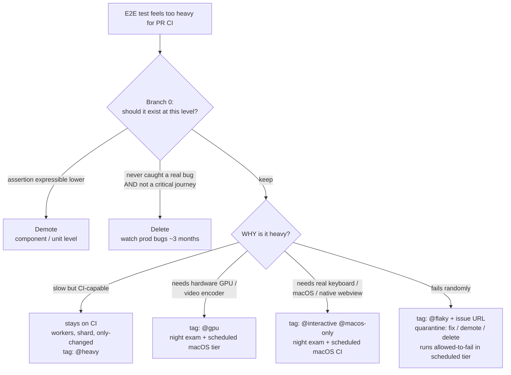

## このページが答える問い

E2Eテストを持つプロジェクトは、遅かれ早かれ同じ瞬間にぶつかります：テストには価値がありそうなのに、PRゲートに置くには遅すぎる、ハードウェアに依存しすぎている、あるいは不安定すぎる。直感的に浮かぶ問いは「ではこのテストは他のどこで実行すればいいのか？」ですが、それは*2番目*の問いです。テストがどこで・いつ実行されるかはティアの問題であり、[実行ティア](./execution-tiers.mdx)が答えます。*最初*の問いは、そのテストにそもそもティアを与える価値があるのかどうかです。

すべての重いテストは、次の3つの出口のいずれかからこのページを出ていきます：

- **修正（fix）** — テストを残し、*なぜ*重いのかを分類して、対応するティアを割り当てる（テストがflakyな場合は [フレイク根本原因カタログ & デフレイキングレシピ](../real-world-patterns/deflaking-recipe.mdx) を参照）
- **降格（demote）** — より低いテストレベルでアサーションを書き直す
- **削除（delete）** — テストを削除して、何が起こるかを観察する

<Warning>

**重いテストの「置き場所」を見つけるだけの戦略は、死ぬべきテストを忠実に保存してしまいます。** 判断ルールに降格と削除の分岐がなければ、遅い・冗長な・価値のないテストがすべてスケジュール実行ティアへ持ち越され、実コストを払いながら永遠に走り続けます。ブランチ0は、そうしたテストを最初にふるい落とすために存在します。

</Warning>

## ブランチ0：ティアを割り当てる前に

重いテストを「重さの種類」で分類する前に、次の2つの問いを順番に確認します。

### (a) アサーションはより低いレベルで表現できるか？

テストが実際にアサートしている内容がコンポーネントテストやユニットテストで表現できるなら、**降格してください**。「算出された合計が42に等しい」で終わる90秒のブラウザフローは、E2Eの衣装を着たユニットテストです。降格すればアサーションはより速く、より決定論的で、より安価になります — 意味は何も失われません。

### (b) 一度も本物のリグレッションを捕まえたことがなく、かつクリティカルなユーザージャーニーでもないか？

「一度も本物のリグレッションを捕まえたことがない」は当て推量ではなく証拠で立証してください：CIの失敗履歴、リンクされたissue、そのスペックを名前で参照しているコミットメッセージを調べます。作成からおよそ6か月未満のスペックは、この問いにどちらの答えを出すにも十分な履歴を積んでいません — それは「捕まえたことがない」という判定ではなく、証拠不足として扱ってください。

**安全側のデフォルト：** 証拠を立証できない場合（若すぎる、あるいは参照可能な失敗履歴がない場合）、そのテストは何かを**捕まえたことがある**ものとして扱い、削除ではなく**修正（Fix）**分岐へ回してください。誤った「残す」判断が払うコストはわずかなCI時間ですが、誤った「削除」判断が払うコストは静かに失われるカバレッジです。

両方に当てはまるなら — 証拠に裏付けられた「捕まえたことがない」、**かつ**クリティカルなユーザージャーニーでもない — **削除し**、その後およそ3か月、本番のバグ発生率を観察してください。そのテストが捕まえたはずのバグが何も出てこなければ、それはただの重りでした。逆に何かが出てきたなら、本当に重要なアサーションが何かを正確に学べたということであり、それに対してより良く、より安価なテストを書けます。

ブランチ0を生き残ったテストだけがティアを得ます。

## 判断フロー



## 「なぜ重いのか」で分類する

「重すぎる」はひとつの状態ではありません。テストがPR CIには重すぎると感じられる理由は4つあり、それぞれ異なる対処を要求します。これらを混同すると、ローカル専用（＝バイパス可能）になったテスト、苛立ちから削除されたテスト、PRに残れたはずなのにスケジュール送りになったテストができあがります。

### 1. 遅いがCIで実行可能

テストはCIランナー上で問題なく動く — ただ時間がかかるだけ。このカテゴリは**CIに留まります**：

- まずテストランナーの**workers**をチューニングする。並列化が最も安価な改善です
- ランナーをまたぐ**シャーディング**は、およそ100テスト*かつ*実行時間30分を超えてから
- `--only-changed` は取りこぼしのあるPR用プレフィルタとして使い、スケジュール実行のフルランで補完する

タグ：`@heavy`。このカテゴリを決してローカル専用にしないでください — 遅いというだけでは、強制されるゲートを離れる理由になりません。workers・シャーディング・ランナー自体のサイジングの背後にあるトレードオフについては、[CIランナーのサイジング](../tools-reference/ci-runner-sizing.mdx)を参照してください。

### 2. 環境的に実行不能

テストがCIランナーにないハードウェアを必要とするケースです：本物のGPU、ハードウェアビデオエンコーダ。標準的なCIランナーのソフトウェアレンダリングは異なるピクセルを生成するため、ピクセルレベルのアサーションはプロダクトの問題ではなく環境の問題で失敗します。ケースB — ピクセルレベルの仕様がソフトウェアレンダリングのCIランナーで失敗する、canvas／GPUヘビーなパターン生成Webアプリ — が典型例です。

対処は、**実行可能なハードウェア上のスケジュール実行ティア（T3）**、加えてローカルヘビーレーンです。

<Note>

**ここでは降格は役に立ちません。** コンポーネントテストはE2Eテストと同じGPUなし環境で実行されます — アサーションのレベルを下げて書き直しても、実行されるハードウェアは何も変わりません。通常は最も安価な出口である低レベルへの書き直しが、構造的に使えない唯一のカテゴリです。

</Note>

### 3. プラットフォーム的に実行不能

テストが特定のプラットフォーム上でしか信頼できないケースです：OSによる本物のキーボードイベント配送、ネイティブwebview、macOS固有の挙動。ケースC — キーボードショートカットのe2e仕様が本物のWebKit／macOS上でしか信頼できないTauri製テキストエディタアプリ — が典型例です。

対処はひとつの巨大な重量級スイートではなく、**レイヤ分割**です：

1. **モックIPCのフロントエンドテスト** — モックしたネイティブブリッジに対してwebviewのUIロジックをテストする。CIセーフで、PRゲートに残る
2. **ネイティブ側のモックランタイムテスト** — モックランタイムに対してネイティブレイヤのロジックをテストする。これもCIセーフ
3. **薄いネイティブ統合レイヤ** — 本当に実プラットフォームを必要とする少数の仕様。`@interactive` ／ `@macos-only` でタグ付けし、T3のスケジュール実行macOSジョブとして実行する。マージ前のエスカレーションにはオンデマンドの `workflow_dispatch` を使う

スイートの保護力の大半はCIセーフなレイヤに移り、スケジュール実行されるのは薄い残りの部分だけです。そのスケジュールジョブの組み立て方は[定期再試験とナイトエグザム](../real-world-patterns/scheduled-re-exam.mdx)を参照してください。

### 4. flaky — そもそも重さのカテゴリではない

ランダムに失敗するテストは重いのではありません — 壊れているのです。flakyさは「リトライが必要だ、パイプラインを遅くする」といった理由で重さとして誤分類され、スケジュール実行ティアへ送られがちですが、そこでは可視性がさらに下がったままflakyであり続けます。flakyなテストの行き先は、下の隔離パイプラインです — 新しい住処ではなく、期限付きで。

## タグ分類

分類の結果はテスト自体にタグとして記録します。これにより、ティアへのマッピングは機械的になり、grepで探せる状態が保たれます：

| タグ | 意味 | ティア |
|---|---|---|
| （タグなし） | CIセーフ。すべての新しいe2eテストのデフォルト | T1/T2 |
| `@smoke` | クリティカルジャーニーのサブセット（任意） | T1 |
| `@heavy` | 遅いがCIで実行可能 | T2/T3 |
| `@gpu` | ハードウェアGPU／ビデオエンコーダが必要 | T3 + ローカルヘビーレーン |
| `@interactive` | 本物のキーボード／ショートカットエンジンが必要 | T3（macOS）+ ローカルヘビーレーン（macOS） |
| `@macos-only` | 実macOS上でのみ信頼できる | T3（macOS） |
| `@flaky` | 隔離中。インラインのissue URL必須 | T3 失敗許容 |
| `@verification` | 一回限りの証明アーティファクト | ゲートなし |

`@verification` は一回限りの証明アーティファクト — 変更が一度うまくいったことを証明するために書かれた、永久に守り続けるためのものではない仕様 — を示します。これはどのゲートにも属しません。検証（verification）からリグレッションへの昇格がどう行われるべきかは[テスト時の必須行動](./required-behavior.mdx)を参照してください。

`@heavy`タグの付いたテストのT2/T3レーンをすべてのPRで走らせるか、リリース境界だけで走らせるかは、タグ付けの問題ではなくブランチトポロジーの決定です — レーンをベースブランチでゲートし、その方法でコストを制御する方法については[リリースラウンド: develop→main ブランチ戦略](../real-world-patterns/release-rounds-branch-strategy.mdx)を参照してください。

## 新しいテストの機械的分類ルール

*新しい*テストの分類に判断力を要求してはいけません。最初にマッチしたルールを適用します：

1. ピクセルを読む、またはGPUタイミングに依存する → `@gpu`
2. OSによる本物のキーボードイベント配送が必要 → `@interactive`
3. 特定のOSまたはネイティブwebview上でしか信頼できない（CIのブラウザビルドでは挙動が異なる） → `@macos-only`
4. 実行時間が約60秒超、または数分におよぶフロー → `@heavy`
5. それ以外 → **タグなし**

最も重要なのはデフォルトです：**新しいe2eテストは、上のルールがタグを強制しない限り、タグなしのCIセーフです。** エージェント（や開発者）は「自分のテストはどの特別なティアに値するか？」から始めてはいけません — 「自分のテストはPRゲートで実行される」から始め、ルールが発火したときだけタグを付けます。

`@smoke` は、この分類に含まれるタグのうち唯一これらのルールでは到達できないタグです。新しいテストに対する機械的なトリガーではなく、すでにタグなしのプールからクリティカルジャーニーのサブセットを後から手作業で選び出して割り当てます。

## 同じルール、Rust構文

上のタグ分類はPlaywrightのタイトル部分文字列という慣習です。Rust/cargoプロジェクトには部分文字列マッチできるテストタイトルがありませんが、`#[ignore = "..."]` の理由文字列が同じ情報を運びます — テスト名ではなくテスト自体に付与される、機械的でgrepできる分類です。上のテーブルと行ごとに対応します：

| Playwrightタグ | Rustの `#[ignore = "..."]` 理由 | 意味 | ティア |
|---|---|---|---|
| （タグなし） | （`#[ignore]` なし） | CIセーフ。デフォルト | T1/T2 |
| `@heavy` | `heavy: <理由>` | 遅いがCIで実行可能。予算超過 | T2/T3 |
| `@gpu` ／ `@interactive` | `env-gate: <理由>` | 環境変数・認証情報・サービスがPRランナーにない | T3 + ローカルヘビーレーン |
| `@macos-only` | `#[cfg(target_os = "macos")]` | 特定のOS上でのみ信頼できる | T3（macOS） |
| `@flaky` | `flaky: <issue-url>` | 隔離中。それでもエグザムレーンで失敗許容として実行される | T3 失敗許容 |
| `@verification` | `verification: <理由>` | 一回限りの証明アーティファクト | ゲートなし |
| （Playwrightタグなし） | `pending-feature: <理由>` | まだ存在しない機能を先取りして書かれたもの | 機能が実装されるまでゲートなし |

```rust
#[test]
#[ignore = "env-gate: needs STRIPE_TEST_KEY, unavailable on PR runners"]
fn charges_a_test_card() { /* ... */ }

#[test]
#[ignore = "heavy: full fixture-corpus regen, ~4 min"]
fn regenerates_the_entire_fixture_corpus() { /* ... */ }

#[test]
#[ignore = "pending-feature: waiting on the export-to-pdf command"]
fn exports_the_document_as_pdf() { /* ... */ }
```

`env-gate:` は `@gpu` ／ `@interactive` をハードウェアを超えて一般化したものです：Rustの統合テストがGPUを必要とするより、シークレットやライブの外部サービスを必要とすることの方がはるかに多いのです。`pending-feature:` は上のテーブルにPlaywright側の対応物を持ちません — これはRust側の答えです：アサートしている機能がまだ存在しない段階でテストを書き、`main` を一度もレッドにすることなくスイート内に意図を記録しておくためのものです。

`#[ignore]` がスキップするのは実行であってコンパイルではありません — `pending-feature:` でignoreされたテストも、今日の時点でコンパイルは通らなければなりません。アサーションがまだ存在しないシンボルやAPIを必要とする場合、ignoreされているかどうかにかかわらずクレートのビルドは失敗します。今日の時点でコンパイルが通り、機能が出荷されるまでは実行時にのみ失敗するブラックボックスチェック（CLI呼び出し、HTTP呼び出し、ファイル出力）として書いてください。

### 同じ分類ルール

最初にマッチしたルールを適用します — 上の[新しいテストの機械的分類ルール](#新しいテストの機械的分類ルール)と同じ順序です：

1. 環境変数・認証情報・外部サービスがPRランナーでは用意できない → `env-gate:`
2. 特定のOSまたはネイティブツールチェーン上でのみ信頼できる → `#[cfg(target_os = "...")]`。`#[ignore]` ではない（下記参照）
3. 実行時間が予算超過 → `heavy:`
4. ランダムに失敗する。ただし下の隔離のStep 0を確認済みであること → `flaky:<issue-url>`
5. 一回限りの証明であり、恒久的なリグレッションゲートではない → `verification:`
6. コードベースにまだ存在しない機能をアサートしている → `pending-feature:`
7. それ以外 → `#[ignore]` なし。テストはすべての `cargo nextest run` で実行される

### 同じ墓場の警告

ある `#[ignore = "..."]` 理由文字列がレーンの名前を挙げているのに、それを実際に実行するジョブがない状態は、上で `@flaky` について警告したのと同じ墓場です。6つの理由のうち2つは、`@flaky` にはない形で墓場になりやすい性質を持ちます：`env-gate:` と `pending-feature:` には自然な再トリガーがありません — スケジュール実行が `flaky:` に対して発火し続けるのとは違い、「PRランナーがこれを用意できない」状態や「機能が出荷された」状態が終わったときに発火する仕組みが何もないのです。どちらも `flaky:` と同じようにトラッキングissueを必要とします。さもなければ、ignore理由が説明していた状況が終わった後も、静かに存在し続けてしまいます。

### プラットフォーム依存性はここではコンパイル時の決定であり、実行時の決定ではない

`@macos-only` ルールは「実macOS上でのみ信頼できる。T3で実行する」と言っています。Rustの対応物は別の `#[ignore]` 理由文字列ではなく `#[cfg(target_os = "macos")]` であり — こちらの方が強い境界線です。`#[ignore]` はどのバイナリにもテストをコンパイルし込んだままにし、実行時にスキップするだけなので、理由文字列によるフィルタが緩い、あるいは存在しない場合、広範な `--run-ignored` の実行は間違ったプラットフォームでもそのテストをスケジュールしてしまい得ます。`#[cfg(target_os = "macos")]` はコンパイル時にmacOS以外のバイナリからテストを取り除きます — 間違ってすら、間違ったプラットフォームで実行されることはありません。macOS専用のテストが別の何かにもゲートされている場合は、両方を組み合わせます：

```rust
#[cfg(target_os = "macos")]
#[test]
#[ignore = "env-gate: needs the macOS Keychain, unavailable on hosted Linux/Windows runners"]
fn reads_the_saved_credential_from_keychain() { /* ... */ }
```

上の各理由文字列が実際のnextest実行レーンにどう変換されるかは、[Rustスイートをcargoからnextestへ移行する](../real-world-patterns/cargo-nextest-migration.mdx#タグ分類の実行)を参照してください。

## `@flaky` の隔離パイプライン

隔離（quarantine）は出口のあるパイプラインであり、駐車場ではありません：

**Step 0 of quarantine：** そのテストがあるホスト上で一度でもパスしたことを確認する（pass-by-skipはカウントしない）。パスできないなら、それは **broken, not flaky** です — 即座に修正か削除を行い、隔離には入れません。

パイプラインに入る前に、任意のCIホスト上でそのアサーションが一度でも本当の意味でグリーンになった実績があることを確認してください。pass-by-skip（スキップによるパス）はカウントしません — Playwrightはスキップを `✓` ではなく `-` で報告するため、両者の違いを注意深く確認してください。一度も本物のグリーンを出したことがないテストはflakyではなく、壊れているのです。隔離に送り込んでも、プロダクトカバレッジを停止するだけで回復の見込みがありません。このステップはブランチ0（テストにそもそもティアを与える価値があるかを問う）とは別のものです：Step 0 of quarantineは「このテストはどこかでパスできるのか？」を問います。`test.skip` の前提条件に関する注意事項は [Playwrightパターン](../real-world-patterns/playwright-patterns.mdx) を参照してください — 「常に成立するはず」の前提条件はハードなアサーションにすべきであり、条件付きスキップにすると永続的な空のグリーン（vacuous green）に静かに劣化することがあります。

**Step 0.5 of quarantine：** 非決定性が**テスト**にあり、**プロダクト**にはないことを証明してください。変動しているのがプロダクトの側なら、そのテストはflakyではありません — **断続的に「正しく失敗している」**のであり、隔離すれば本物のバグを葬ることになります。

Step 0はこれをカバーしません：本物のプロダクトのバグをサンプリングしているテストは*実際にときどきパスする*ので、「一度でもパスしたか？」はそのまま素通りさせてしまいます。チェックは安価です — **失敗した実行でプロダクトの入力をログに出し、パスした実行のものと差分を取ってください。** 入力が同一で結果だけ違う → 本物のflakeなので先へ進む。**入力が異なる → プロダクトのバグなので、止まってプロダクトを直す。** 負荷や順序ではなく*プラットフォーム*（特定のOS、ファイルシステム、watcherバックエンド、CPUアーキテクチャ）と相関する失敗は、タイミングの臭いではなくプロダクトのバグの臭いです。完全な具体例と診断手順：[偽物: flakeが実はプロダクトのバグである場合](../real-world-patterns/deflaking-recipe.mdx#偽物-flakeが実はプロダクトのバグである場合)。

<Danger>

これは自律エージェントが飛ばすステップです。隔離パイプラインは*責任を果たしているように感じられる*ように設計されています — インラインのissue URL、マニフェストの行、スケジュール実行のallowed-to-failレーン。そのため、忠実にパイプラインに従ったエージェントほど、生きている欠陥のまわりに非の打ちどころのない証跡を作り上げてしまいます。実際にあった事例では、このパイプラインに正しく従ったエージェントが書いたissue自身が、ステップ1として `#[ignore]` を推奨していました。そこで隠されようとしていたのは、そのOSの全ユーザーに影響する、編集ごとの静かなパフォーマンス劣化でした。**パイプライン自身の周到さこそが、この失敗モードを危険にしています。ここでゲートをかけてください。**

</Danger>

1. **タグ付けには証跡が必須です。** `@flaky` は、すぐ隣にインラインのissue URLがあるときだけ有効です：

   ```ts
   // quarantined: https://github.com/your-org/your-app/issues/123
   test("drag preview follows cursor @flaky", async ({ page }) => {
     // ...
   });
   ```

2. **厳格なゲートからは除外されます。** 隔離されたテストがPRをブロックしてはいけません — さもなければ隔離の意味がありません。
3. **それでも実行されます — スケジュール実行ティアで、失敗許容（allowed-to-fail）として。** どこでも実行されない `@flaky` タグは墓場です：結果が収集されなくなり、テストは静かに腐っていきます。T3で失敗許容として実行し続けることで、新鮮な失敗データがトラッキングissueへ流れ込み続けます。GitHub Actionsでは、allowed-to-fail を `continue-on-error` **ではなく**明示的な終了コードのキャプチャで実装します（[定期再試験 § flakyテレメトリのメカニズム](../real-world-patterns/scheduled-re-exam.mdx#flakyテレメトリのメカニズム)を参照）。
4. **修正・降格・削除 — 期限付きで。** 出口はブランチ0と同じ3つです。期限までに誰も修正しなかったなら、それは修正する価値がなかったということです：降格するか、削除してください。**修正**パスについては [フレイク根本原因カタログ & デフレイキングレシピ](../real-world-patterns/deflaking-recipe.mdx) を参照してください — E2Eフレイクの7つの原因と、それぞれを排除するための機械的なステップが記載されています。

<Tip>

リトライしたときだけパスするテストも、このパイプラインの対象です — pass-on-retryはトリアージのシグナルであって、成功ではありません。

</Tip>

<Note>

**Rust/cargoのflakeを隔離する — 同じパイプライン、テストタイトルのgrepは不要。** 上のパイプラインはPlaywrightの `@flaky`-タイトル部分文字列の慣習で説明していますが、3つの仕組み自体は言語に依存しません。Rust/cargoプロジェクトでは、`#[ignore]` がこの3つをそのまま提供します：

```rust
// quarantined: https://github.com/your-org/your-app/issues/123
#[test]
#[ignore = "flaky: https://github.com/your-org/your-app/issues/123"]
fn drag_preview_follows_cursor() {
    // ...
}
```

- **証跡。** `#[ignore = "..."]` の理由文字列が、必須のインラインissue URLをテストのすぐ隣に保ちます — `@flaky`-タイトル部分文字列の慣習に対応するcargoの仕組みです。
- **厳格なゲートからの除外。** `cargo test` はデフォルトで `#[ignore]` のテストをスキップするため、隔離されたflakeはゲートをブロックしなくなります — `--grep-invert "@flaky"` に対応します。
- **それでもどこかで、失敗許容として実行される。** `cargo test -- --ignored` は無視（ignore）されたセットを実行し、`cargo test -- --include-ignored` はすべてを実行します。どちらかをT3の失敗許容ジョブとしてスケジュールすれば、新鮮な失敗データがトラッキングissueへ流れ込み続けます。注意：`--ignored` は*すべての* `#[ignore]` テストにマッチするため、スイートが遅いテストや手動テストにも `#[ignore]` を使っている場合は、名前フィルタ（例：命名規則を決めて `cargo test flaky_ -- --ignored`）で実行範囲を絞り、無関係な無視テストがflakeのシグナルを汚染しないようにしてください — `#[ignore]` は、flake専用の `@flaky` タイトル部分文字列よりも広いマーカーです。GitHub Actionsでは、allowed-to-fail を `continue-on-error` **ではなく**明示的な終了コードのキャプチャで実装します（[定期再試験 § flakyテレメトリのメカニズム](../real-world-patterns/scheduled-re-exam.mdx#flakyテレメトリのメカニズム)を参照）。

このスイートがガイドのリトライ予算とpass-on-retryのテレメトリを採用すると、プレーンな `cargo test` ではもうポリシーを実装できません — リトライの仕組みも、テストごとのタイムアウトも、安定した機械可読な出力もないからです。[Rustスイートをcargoからnextestへ移行する](../real-world-patterns/cargo-nextest-migration.mdx)を参照してください。そのチェックリストは、まさにこの `#[ignore]` 隔離を `cargo nextest run --run-ignored ignored-only` として実行します。

</Note>

<Warning>

**隔離はテストカバレッジだけでなく、プロダクトカバレッジを停止します。** テストが隔離されている間、そのテストが守っていた振る舞いは無防備な状態になります — その振る舞いのリグレッションは、テストが修正されるまで検知されません。隔離の修正は2つの検証として扱ってください：まずテストの機械的な動作が正しいことを確認し、次にプロダクトの振る舞い自体が依然として成立していることを確認します。修正したflakeがすぐに*別の理由*で失敗し始めたなら、それはパイプラインが正しく機能しているということであり、修正が失敗したわけではありません。

具体例：ドラッグ＆ドロップの仕様テストが、Playwright-WebKitがネイティブHTML5ドロップを確実にコミットしないという機械的なflakeで隔離されていました。その間、アサートしていた振る舞いは静かに壊れており、リファクタリングでその機能のバックエンドが削除されたリグレッションが数日間気づかれないまま出荷されていました。

</Warning>

### 再配置と修正の検証

上記の2つの検証のうち1つ目（テストの機構が健全であることの確認）には、それ自体に3つの罠があります。いずれも、隔離されたテストが隔離を解けるかどうか、あるいは別のティアへの再配置が本当に成立するかどうかを判断する場面で顕在化します。

**バーンインが証明するのは決定性であって、CI実行可能性ではありません。** テストをローカルでN回ループ実行すること（Playwrightの `--repeat-each=N`）は、そのテストが*実行したマシン上で*決定論的であることを証明します。しかし、そのテストがCI実行可能であることは証明しません — CIはファイルシステムのレイアウトも、環境変数も、リソース制限も異なる別の環境だからです。バーンインと本物のCI実行は、両方が必須の別々のシグナルとして扱ってください：

- **バーンイン**（`--repeat-each=N`）— テストが内部的に非決定論的でないことを証明する
- **本物のCI実行** — テストがCI環境そのものに耐えることを証明する

具体例：隔離タグのリファクタリング中、4つのテストがローカルのバーンインをN回中N回パスしました — 本当に決定論的でした — が、CIコンテナ内で実行された瞬間に決定論的に空のデータをレンダリングしました。ローカルのバーンインだけを見ていたら、これらは隔離解除の対象としてクリアされていたはずです。本物のCI実行だけがそのギャップを捕まえました。

<Warning>

**シミュレート環境による修正の罠。** 疑わしい条件を偽装する環境変数など、CI固有のメカニズムをシミュレートしてCI限定の失敗をローカルで再現すると、実際には本物の原因とは異なるメカニズムを検証しているだけなのに、修正が確認できたように見えてしまうことがあります。具体例：ある修正はgitの所有権をシミュレートする環境変数の下で検証されましたが、後に本物のCI実行によって覆されました — そのシミュレーションは、実際にCIで起きているものとは異なるメカニズムをモデル化していたのです。シミュレートされた環境条件だけの下で検証された修正は、テストが隔離を出る前に、本物の環境に対しても確認されなければなりません。

</Warning>

**アブレーションしていない修正の罠：グリーンなバーンインは「どの変更が効いたのか」を教えてくれません。** デフレイキングでは通常、複数の編集を同時に投入します — テストハーネスの修正*と*プロダクトの修正、あるいはハーネスの修正2つ。その後スイートを走らせてN回中N回グリーンになると、その束全体が効いていると考えたくなります。しかし実際にはそうでないことが頻繁にあります：安い方の半分が症状を消しただけで高い方は何もしていない、あるいは — はるかに悪いことに — *テスト側*の修正が失敗を覆い隠し、本物のプロダクトのバグはそのまま出荷される。

チェックは機械的です：**片方ずつオフにして、走らせ直す。** オフにしてもスイートがグリーンのままだった側は、効いていなかったということです。

```
修正A + 修正B  -> 12/12 グリーン   （どちらが効いたのかは何も分からない）
修正Aのみ      -> 12/12 グリーン   -> Bは飾りだった
修正Bのみ      ->  9/12 グリーン   -> Aが本物の修正
```

具体例：macOSのdevサーバーのflakeに対して2つの変更が入りました — テストハーネスの修正（全体リビルドを誘発するファイルの生成をやめる）と、プロダクトの修正（プロダクトが正しく扱えていなかったOSイベントの形に対応する）。バーンインは12/12グリーンでした。*プロダクトの修正だけ*を無効化したところ、2回目の実行でflakeが元の失敗シグネチャそのままで再現しました。このアブレーションがなければ、ハーネスだけの変更が「修正」として出荷され、スイートはグリーンになり、本物のプロダクトのバグはそのOSの全ユーザーに対して生き続けていたはずです — しかも、それを捕まえていたテストがもう失敗しないので、見えない状態で。

アブレーションは、上記2つの検証のうち2つ目（*プロダクトの振る舞い自体が依然として成立していることの確認*）を満たす最も安価な方法でもあります：プロダクトの修正を無効化しても失敗が再現**しない**なら、そのプロダクトの修正は、そもそもそのテストが検証していた対象ではなかったということです。

### 肥大化した隔離タグの解消

肥大化したタグ — 複数の無関係な理由（非決定性、遅さ、環境依存）を単一のcatch-allに混在させ、どのスケジュール実行ティアでも動いておらず、トラッキングissueも持たないタグ — は、上のStep 3で警告した墓場状態が、タグ全体にまで大きく育ったものです。これを意味のあるタグへ解消する手順は機械的です：

1. **意味で分割する。** 単一のcatch-allを、単一の意味を持つタグに置き換えます：非決定性には `@flaky`、遅さには `@heavy`、環境依存には `@gpu` ／ `@interactive` ／ `@macos-only`（[「なぜ重いのか」で分類する](#「なぜ重いのか」で分類する)を参照）。
2. **生き残ったタグごとにトラッキングissueを必須にする。** 分割を生き残ったタグは、インラインのissue URLなしでは存在できません — 上の `@flaky` と同じ証跡ルールです。
3. **バーンインで決定性を確認する。** `@flaky` タグが付いた各テストについて、ローカルのバーンインを実行し、本当に非決定論的であることを確認します。決定論的だという結果が返ってきたテストは分類を誤っていたということです — `@heavy` か環境タグに属するべきです。
4. **CI実行可能性は本物のCI実行に判断させる。** バーンインだけではPRゲートへの復帰をクリアできません — 上の[再配置と修正の検証](#flaky-の隔離パイプライン-再配置と修正の検証)を参照してください。

## 次に読むページ

- [実行ティア](./execution-tiers.mdx) — T0〜T4の定義と、プロジェクトがそれぞれをいつ採用すべきか
- [定期再試験とナイトエグザム](../real-world-patterns/scheduled-re-exam.mdx) — スケジュール実行ティア（T3）の実際の組み立て方：cron、macOSランナー、重複排除されたissue起票、オンデマンドディスパッチ
- [CIランナーのサイジング](../tools-reference/ci-runner-sizing.mdx) — ランナーの形状・料金、そして「大きい／別のランナーが本当に効くのはいつか」を判断する4つのルール
- [リリースラウンド: develop→main ブランチ戦略](../real-world-patterns/release-rounds-branch-strategy.mdx) — 重い（T2/T3）レーンをすべてのPRではなくベースブランチでゲートする
- [テスト時の必須行動](./required-behavior.mdx) — エージェント向けルール：リンクされたオープンissueなしに `@flaky` を付けない、検証用仕様の昇格は明示的なステップとして行う、など
