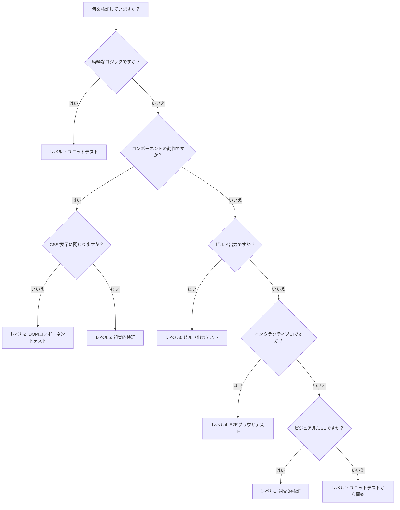

## クイック判断テーブル

このテーブルを使って、現在のタスクに必要な最小テストレベルを判断します：

| 変更内容 | 最小レベル | 理由 |
|---------|----------|------|
| 純粋なロジック/ユーティリティ関数 | レベル1 | DOMやCSSが関与しない |
| コンポーネントのprops/状態 | レベル2 | 出力を検証するためにシミュレートDOMが必要 |
| ビルド設定/テンプレート/SSG | レベル3 | ビルドされた出力ファイルを検査する必要がある |
| CSS/レイアウト/表示 | レベル5 | CSSは実際のレンダリングエンジンが必要 |
| インタラクティブなUIフロー | レベル4 | ユーザーインタラクションには実際のブラウザが必要 |
| ビジュアルバグの報告 | レベル5 | 算出スタイル + 視覚的結果を確認する必要がある |
| 「表示されない」 | レベル5 | 表示は視覚的な属性 |
| 「まだ壊れている」（テストがパスした後） | 1つ上のレベル | 現在のレベルはこのバグに対するブラインドスポットがある |

<Warning>
**「最小レベル」とは、バグを確実にキャッチできる最低のレベルを意味します。** より低いレベルを使用すると誤った確信を与えます -- テストはパスしますが、バグは残ります。
</Warning>

## 判断フローチャート

## 重要な原則: CSSは常にレベル5が必要

CSS、レイアウト、視覚的な外観に関わる変更はレベル5をデフォルトにすべきです。その理由：

1. **レベル1**（ユニットテスト）-- DOMがまったくなく、CSSを処理できない
2. **レベル2**（jsdom）-- DOMはあるがCSSエンジンがない；`getComputedStyle()`は空文字列を返す
3. **レベル3**（ビルド出力）-- ファイルの内容を検査するが、レンダリングは検査しない
4. **レベル4**（Playwright）-- 実際のブラウザで実行するが、通常は視覚的な外観ではなくDOMの状態をアサートする

レベル5（verify-ui + headless-browser）のみが、算出スタイルの値を決定論的にチェックし、結果を視覚的に確認できます。

## エスカレーションのトリガー

以下の場合に次のレベルに進みます：

- テストがパスしたがユーザーが問題の継続を報告した
- ロジックをテストしているがバグが視覚的な可能性がある
- 下位レベルのテストでデータの正しさが確認されたが出力が正しく見えない
- CSSまたはレイアウトの問題が疑われる
- 複数の下位レベルのテストがパスしたが機能がブラウザで動作しない
