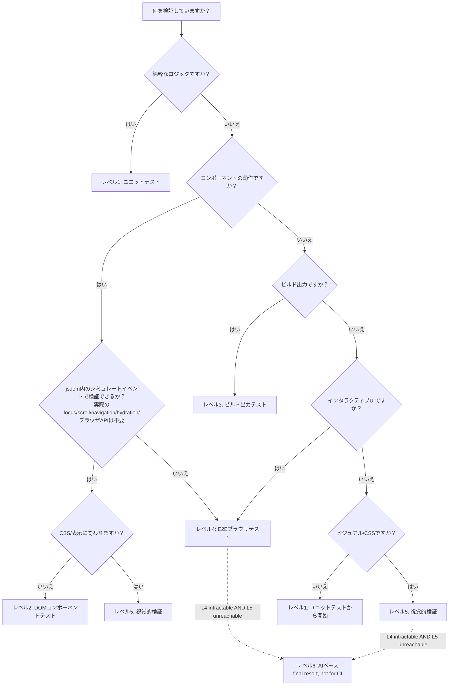

このテーブルを使って、現在のタスクに必要な最小テストレベルを判断します：

| 変更内容 | 最小レベル | 理由 |
|---------|----------|------|
| 純粋なロジック/ユーティリティ関数 | レベル1 | DOMやCSSが関与しない |
| コンポーネントのprops/状態 | レベル2 | 出力を検証するためにシミュレートDOMが必要 |
| ビルド設定/テンプレート/SSG | レベル3 | ビルドされた出力ファイルを検査する必要がある |
| CSS/レイアウト/表示 | レベル5 | CSSは実際のレンダリングエンジンが必要 |
| インタラクティブなUIフロー | レベル4 | ユーザーインタラクションには実際のブラウザが必要 |
| ビジュアルバグの報告 | レベル5 | 算出スタイル + 視覚的結果を確認する必要がある |
| 「表示されない」 | レベル5 | 表示は視覚的な属性 |
| 「まだ壊れている」（テストがパスした後） | 1つ上のレベル | 現在のレベルはこのバグに対するブラインドスポットがある |
| canvas／フォトエディタ／ズーム・リサイズなどで、L4が書けず、かつL5でも到達できない | レベル6（最終手段） | E2Eも決定論的視覚検証もアサーションを表現できない |
| リンク切れ／消えたページ／古くなったサイトマップ | [サイト整合性ゲート](../real-world-patterns/site-integrity-checks.mdx)（L3/L4ハイブリッド） | ユニットテストやコンポーネントテストには構造的に見えない -- ビルド出力／クロールチェックだけが検知できる |
| リファクタ全体にわたるビジュアルリグレッションのリスク | [コミット済みベースラインによるビジュアルリグレッション](../real-world-patterns/visual-regression-baselines.mdx) | 決定論的なピクセル差分ゲート -- 非公式なスクリーンショット確認では見逃す、ずれた／変色したビジュアルを捕まえる |

<Warning>

**「最小レベル」とは、バグを確実にキャッチできる最低のレベルを意味します。** より低いレベルを使用すると誤った確信を与えます -- テストはパスしますが、バグは残ります。

</Warning>

## 判断フローチャート

**L2とL4の判別基準：** 「コンポーネントの動作である」というだけではレベルは決まりません。その動作がjsdom内のシミュレートイベント -- 単なるイベントディスパッチであり、実際のfocus、scroll、navigation、hydration、その他のブラウザAPIを必要としないもの -- で検証できるならレベル2です。これらの実ブラウザのプリミティブのいずれかを必要とするなら、jsdomではパスするテストを信頼できるほど忠実にシミュレートできないため、レベル4になります。

## 重要な原則: CSSは常にレベル5が必要

CSS、レイアウト、視覚的な外観に関わる変更はレベル5をデフォルトにすべきです。その理由：

1. **レベル1**（ユニットテスト）-- DOMがまったくなく、CSSを処理できない
2. **レベル2**（jsdom）-- DOMはあるがCSSエンジンがない；`getComputedStyle()`はデフォルトのカスケードなしの値を返す -- レイアウトは実行されず、スタイルシートのカスケードも適用されないため、実際のCSSを検証できない
3. **レベル3**（ビルド出力）-- ファイルの内容を検査するが、レンダリングは検査しない
4. **レベル4**（Playwright）-- 実際のブラウザで実行するが、典型的な書き方のスペックは算出スタイルやピクセル出力ではなくDOMの状態をアサートする

これはアサーションが何をチェックするかの違いであって、ツールに何ができるかの違いではありません：Playwright自体も、算出スタイル（`toHaveCSS`）やスクリーンショット（`toHaveScreenshot`）を、レベル5のツールと同じくらい決定論的にアサートできます。DOMの状態をアサートするスペックはレベル4の仕事をしており、算出スタイルの値や視覚的な出力をアサートするスペックは、どのランナーが実行しようとレベル5の仕事をしています。ルールはそれでも変わりません：**CSSの変更にはレベル5相当の検証が必要です。**

## エスカレーションのトリガー

以下の場合に次のレベルに進みます：

- テストがパスしたがユーザーが問題の継続を報告した
- ロジックをテストしているがバグが視覚的な可能性がある
- 下位レベルのテストでデータの正しさが確認されたが出力が正しく見えない
- CSSまたはレイアウトの問題が疑われる
- 複数の下位レベルのテストがパスしたが機能がブラウザで動作しない

## L6へのエスカレーションルール

[レベル6（AIベース）](../testing-levels/level-6-ai-based-verification.mdx)へのエスカレーションは、通常の「次のレベル」進行の一部では**ありません**。同時に以下の**両方**が真である必要があります：

1. **L4が書けない。** 対象サーフェスに対してクリーンなE2Eを書くことが真に不可能 — canvasベース、多重のカメラ／ズーム、ステートフルなリサイズ変換など — 単に「いつもより難しい」ではない。
2. **L5がアサーションに届かない。** 安定したbounding rectを返すDOM要素がない、算出スタイルが適用できない（対象が `<canvas>`）、スクリーンショットのピクセル差分はノイズが多すぎる。

どちらか片方しか真でない場合、正しい答えはもう一方のレベルです。L6は最終手段であり、「L5が難しいときの次の試み」ではありません。

## レベルを選んだ後：実行場所を決める

適切なテストレベルを選ぶことで、テストが何を見るかが決まります。残る2つ目の決定は：**テストはどこで・いつ実行されるのか？** それが実行ティアです — 独立した別の軸です。

- [実行ティア](./execution-tiers.mdx) — T0（インナーループ）からT4（ローカルヘビーレーン）までを定義し、各ティアの適用条件とティア間の移行ルールを説明します。
- [重いテストの判断ルール](./heavy-test-decision.mdx) — PR CIに重すぎると感じるテストへの対処手順：レベルを下げるか、削除するか、「なぜ重いのか」を分類して適切なティアを割り当てます。
