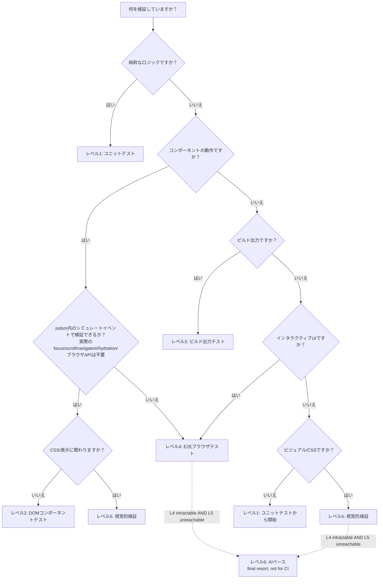

このテーブルを使って、現在のタスクに必要な最小テストレベルを判断します：

| 変更内容 | 最小レベル | 理由 |
|---------|----------|------|
| 純粋なロジック/ユーティリティ関数 | レベル1 | DOMやCSSが関与しない |
| コンポーネントのprops/状態 | レベル2 | 出力を検証するためにシミュレートDOMが必要 |
| ビルド設定/テンプレート/SSG | レベル3 | ビルドされた出力ファイルを検査する必要がある |
| CSS/レイアウト/表示 | レベル5 | CSSは実際のレンダリングエンジンが必要 |
| インタラクティブなUIフロー | レベル4 | ユーザーインタラクションには実際のブラウザが必要 |
| ビジュアルバグの報告 | レベル5 | 算出スタイル + 視覚的結果を確認する必要がある |
| 「表示されない」 | レベル5 | 表示は視覚的な属性 |
| 「まだ壊れている」（テストがパスした後） | 1つ上のレベル | 現在のレベルはこのバグに対するブラインドスポットがある |
| canvas／フォトエディタ／ズーム・リサイズなどで、L4が書けず、かつL5でも到達できない | レベル6（最終手段） | E2Eも決定論的視覚検証もアサーションを表現できない |
| リンク切れ／消えたページ／壊れた画像／古くなったサイトマップ | [サイト整合性ゲート](../project-recipes/site-integrity-checks.mdx)（L3/L4ハイブリッド） | ユニットテストやコンポーネントテストには構造的に見えない -- ビルド出力／クロールチェックだけが検知できる |
| デプロイ設定：ドメイン／ルート／バインディング id／証明書 | [デプロイ後のスモークテスト](../ci-operations/post-deploy-smoke-tests.mdx) | 失敗がリポジトリの中に無いので、リポジトリに対して走る何も見られない -- デプロイ先オリジンへのリクエストだけが検知できる |
| リファクタ全体にわたるビジュアルリグレッションのリスク | [コミット済みベースラインによるビジュアルリグレッション](../tool-patterns/visual-regression-baselines.mdx) | 決定論的なピクセル差分ゲート -- 非公式なスクリーンショット確認では見逃す、ずれた／変色したビジュアルを捕まえる |

<Warning>

**「最小レベル」とは、バグを確実にキャッチできる最低のレベルを意味します。** より低いレベルを使用すると誤った確信を与えます -- テストはパスしますが、バグは残ります。

</Warning>

## 判断フローチャート

```mermaid
flowchart TD
  A[何を検証していますか？] --> B{純粋なロジックですか？}
  B -->|はい| L1[レベル1: ユニットテスト]
  B -->|いいえ| C{コンポーネントの動作ですか？}
  C -->|はい| D2{jsdom内のシミュレートイベントで検証できるか？<br/>実際のfocus/scroll/navigation/hydration/ブラウザAPIは不要}
  D2 -->|いいえ| L4[レベル4: E2Eブラウザテスト]
  D2 -->|はい| D{CSS/表示に関わりますか？}
  D -->|いいえ| L2[レベル2: DOMコンポーネントテスト]
  D -->|はい| L5a[レベル5: 視覚的検証]
  C -->|いいえ| E{ビルド出力ですか？}
  E -->|はい| L3[レベル3: ビルド出力テスト]
  E -->|いいえ| F{インタラクティブUIですか？}
  F -->|はい| L4
  F -->|いいえ| G{ビジュアル/CSSですか？}
  G -->|はい| L5b[レベル5: 視覚的検証]
  G -->|いいえ| L1b[レベル1: ユニットテストから開始]
  L4 -. L4 intractable AND L5 unreachable .-> L6[レベル6: AIベース<br/>final resort, not for CI]
  L5b -. L4 intractable AND L5 unreachable .-> L6
```

**L2とL4の判別基準：** 「コンポーネントの動作である」というだけではレベルは決まりません。その動作がjsdom内のシミュレートイベント -- 単なるイベントディスパッチであり、実際のfocus、scroll、navigation、hydration、その他のブラウザAPIを必要としないもの -- で検証できるならレベル2です。これらの実ブラウザのプリミティブのいずれかを必要とするなら、jsdomではパスするテストを信頼できるほど忠実にシミュレートできないため、レベル4になります。

## 重要な原則: CSSは常にレベル5が必要

CSS、レイアウト、視覚的な外観に関わる変更はレベル5をデフォルトにすべきです。その理由：

1. **レベル1**（ユニットテスト）-- DOMがまったくなく、CSSを処理できない
2. **レベル2**（jsdom）-- DOMはあるがCSSエンジンがない；`getComputedStyle()`はデフォルトのカスケードなしの値を返す -- レイアウトは実行されず、スタイルシートのカスケードも適用されないため、実際のCSSを検証できない
3. **レベル3**（ビルド出力）-- ファイルの内容を検査するが、レンダリングは検査しない
4. **レベル4**（Playwright）-- 実際のブラウザで実行するが、典型的な書き方のスペックは算出スタイルやピクセル出力ではなくDOMの状態をアサートする

これはアサーションが何をチェックするかの違いであって、ツールに何ができるかの違いではありません：Playwright自体も、算出スタイル（`toHaveCSS`）やスクリーンショット（`toHaveScreenshot`）を、レベル5のツールと同じくらい決定論的にアサートできます。DOMの状態をアサートするスペックはレベル4の仕事をしており、算出スタイルの値や視覚的な出力をアサートするスペックは、どのランナーが実行しようとレベル5の仕事をしています。ルールはそれでも変わりません：**CSSの変更にはレベル5相当の検証が必要です。**

## エスカレーションのトリガー

以下の場合に次のレベルに進みます：

- テストがパスしたがユーザーが問題の継続を報告した
- ロジックをテストしているがバグが視覚的な可能性がある
- 下位レベルのテストでデータの正しさが確認されたが出力が正しく見えない
- CSSまたはレイアウトの問題が疑われる
- 複数の下位レベルのテストがパスしたが機能がブラウザで動作しない

## L6へのエスカレーションルール

[レベル6（AIベース）](../testing-levels/level-6-ai-based-verification.mdx)へのエスカレーションは、通常の「次のレベル」進行の一部では**ありません**。同時に以下の**両方**が真である必要があります：

1. **L4が書けない。** 対象サーフェスに対してクリーンなE2Eを書くことが真に不可能 — canvasベース、多重のカメラ／ズーム、ステートフルなリサイズ変換など — 単に「いつもより難しい」ではない。
2. **L5がアサーションに届かない。** 安定したbounding rectを返すDOM要素がない、算出スタイルが適用できない（対象が `<canvas>`）、スクリーンショットのピクセル差分はノイズが多すぎる。

どちらか片方しか真でない場合、正しい答えはもう一方のレベルです。L6は最終手段であり、「L5が難しいときの次の試み」ではありません。

## あなたの症状から始める

このページ冒頭のテーブルは「何を変更したか」から始まります -- その中の2行（リンク切れや古くなったサイトマップ、リファクタ全体にわたるビジュアルリグレッション）はすでに症状そのものの形をしているため、以下では重複させていません。そうではなく、いま目の前で起きている「実際に目にしている症状」から始めたいときは、こちらを使ってください。各行が、その症状を扱っているパターンのページを指しています。

| 症状 | ここから始める |
|---|---|
| フレイクなE2Eテスト -- ほとんどはパスするが、コード変更なしに失敗する | [フレイク根本原因カタログ & デフレイキングレシピ](../test-integrity/deflaking-recipe.mdx) |
| テストは緑を報告するが、実際には実行されていない | [Playwrightパターン § いずれのプロジェクトにも一致しないスペックを防ぐ](../tool-patterns/playwright-patterns.mdx#いずれのプロジェクトにも一致しないスペックを防ぐ) / [`test.skip`のpass-by-skipという罠](../tool-patterns/playwright-patterns.mdx#前提条件としての-test-skip-—-pass-by-skip-という罠) |
| 設定のどこにも書いていないポートで`EADDRINUSE` | [Playwrightパターン § 隠れた補助ソケットのポートレース](../tool-patterns/playwright-patterns.mdx#隠れた補助ソケットのポートレース) |
| 実物のD1でテストすべきかスタブでテストすべきか迷う | [バックエンド & Node.js テスト § ランタイムではなくバインディングをモックする](../project-recipes/backend-testing.mdx#ランタイムではなくバインディングをモックする) |
| CIは緑だが、公開されたアーティファクトは壊れている | [公開パイプライン検証](../ci-operations/publishing-pipeline.mdx) |
| マージは通って赤も出なかったが、ワークフローが1つも走っていない | [CI スキップマーカーとマージ衛生](../ci-operations/skip-markers-and-merge-hygiene.mdx) |
| 公開時にしか走らないチェックがある（`prepack`、`prepublishOnly`） | [公開パイプライン検証 § 公開時だけ走るゲートはどのティアも実行しないレーン](../ci-operations/publishing-pipeline.mdx#公開時だけ走るゲートはどのティアも実行しないレーン) |
| PRゲートは遅いのに、重いテストは1つもない | [スイート全体の予算](./aggregate-suite-budget.mdx) |
| 先月まで動いていたビルドが、自分の差分には何もないのに今日失敗する | [定期再試験 & 夜間試験 § T3を外部依存のドリフトネットとして使う](../ci-operations/scheduled-re-exam.mdx#t3を外部依存のドリフトネットとして使う) |
| 手元では動くのにプレビューや本番で壊れる | [デプロイ済みターゲットに対する環境ティア別テスト](../ci-operations/environment-tiered-testing.mdx) |
| 不在アサーションがCIでだけ失敗し、同じテストの肯定アサーションはすべて通過する | [不在アサーション vs 自分自身のフィクスチャデータ](../test-integrity/negative-assertion-fixtures.mdx) |

## レベルを選んだ後：実行場所を決める

適切なテストレベルを選ぶことで、テストが何を見るかが決まります。残る2つ目の決定は：**テストはどこで・いつ実行されるのか？** それが実行ティアです — 独立した別の軸です。

- [実行ティア](./execution-tiers.mdx) — T0（インナーループ）からT4（ローカルヘビーレーン）までを定義し、各ティアの適用条件とティア間の移行ルールを説明します。
- [重いテストの判断ルール](./heavy-test-decision.mdx) — PR CIに重すぎると感じるテストへの対処手順：レベルを下げるか、削除するか、「なぜ重いのか」を分類して適切なティアを割り当てます。
- [スイート全体の予算](./aggregate-suite-budget.mdx) — スイートレベルの片割れ：すべてのテストがテスト単位のルールを通過してもゲートが溺れるとき、テストを単価で値付けし、予算超過を刈り込みのトリガーにします。
