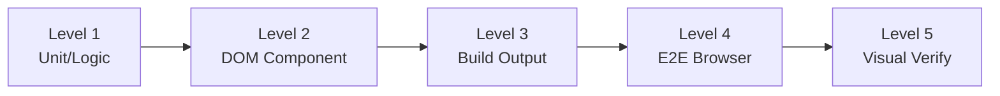

## 概要

フロントエンドテストは単一の活動ではなく、それぞれ異なる能力とブラインドスポットを持つ検証手法のスペクトラムです。このセクションでは、検証可能な範囲の順に5つのレベルを定義します。

## サマリーテーブル

| レベル | 名称 | ツール | 検証可能 | ブラインドスポット |
|-------|------|-------|---------|-----------------|
| 1 | ユニット/ロジック | vitest、jest | 純粋関数、データ変換、状態ロジック | DOM、CSS、レンダリング |
| 2 | DOMコンポーネント | vitest + jsdom、Testing Library | コンポーネント出力、props、DOM構造 | 視覚的レンダリング、CSS |
| 3 | ビルド出力 | vitest（ビルドファイル読み取り） | SSG出力、テンプレート、バンドラ設定 | ランタイム動作、視覚的表示 |
| 4 | E2Eブラウザ | Playwright、headless-browser | ユーザーインタラクション、ナビゲーション、ページ全体 | 微妙な視覚的詳細 |
| 5 | 決定論的 + 視覚的 | verify-ui + headless-browser | 算出スタイル、ピクセルレベルレンダリング | 最小限のブラインドスポット |

## エスカレーションルール

<Warning>
現在のレベルのテストがパスしたにもかかわらず、ユーザーが問題が解消していないと報告した場合、同じテストを再実行しないでください。次のレベルにエスカレーションしてください。
</Warning>

レベルはカバレッジの広さ順に並んでいます。各上位レベルは、下位レベルでは構造的に検出不可能なバグのカテゴリをキャッチします。たとえば、ユニットテストはCSSをまったく処理しないため、`overflow: hidden`で要素が隠されていることを検出できません。

## 適切なレベルの選択

すべてのタスクにレベル5が必要なわけではありません。目標は、テストレベルを変更の性質に合わせることです：

- **ロジックの変更** -- レベル1で十分
- **コンポーネントの動作** -- レベル2でカバー
- **ビルド設定** -- レベル3が対象
- **インタラクティブなフロー** -- レベル4が必要
- **視覚的/CSSのバグ** -- レベル5が必須

詳細なマッピングテーブルは[判断ガイド](/pj/zudo-test-wisdom/ja/docs/decision-guide)を参照してください。
