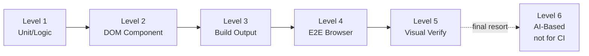

## 概要

フロントエンドテストは単一の活動ではなく、それぞれ異なる能力とブラインドスポットを持つ検証手法のスペクトラムです。このセクションでは、検証可能な範囲の順に6つのレベルを定義します。レベル1〜5は決定論的、レベル6は下位レベルが到達できないサーフェスのために用意されたAI判定の最終手段層です。

## サマリーテーブル

| レベル | 名称 | ツール | 検証可能 | ブラインドスポット |
|-------|------|-------|---------|-----------------|
| 1 | ユニット/ロジック | vitest、jest | 純粋関数、データ変換、状態ロジック | DOM、CSS、レンダリング |
| 2 | DOMコンポーネント | vitest + jsdom、Testing Library | コンポーネント出力、props、DOM構造 | 視覚的レンダリング、CSS |
| 3 | ビルド出力 | vitest（ビルドファイル読み取り） | SSG出力、テンプレート、バンドラ設定 | ランタイム動作、視覚的表示 |
| 4 | E2Eブラウザ | Playwright、headless-browser | ユーザーインタラクション、ナビゲーション、ページ全体 | 微妙な視覚的詳細 |
| 5 | 決定論的 + 視覚的 | verify-ui + headless-browser | 算出スタイル、ピクセルレベルレンダリング | 最小限のブラインドスポット |
| 6 | AIベース視覚検証（最終手段、**CIには使わない**） | verify-ui-ai + タスク別テストフロースキル + AIサブエージェント | L4でクリーンに操作できず、L5でアサーションも届かないサーフェス（canvas、フォトエディタ、ズーム／リサイズ） | 非決定論的、コストがかかる、再現不能 |

## エスカレーションルール

<Warning>

現在のレベルのテストがパスしたにもかかわらず、ユーザーが問題が解消していないと報告した場合、同じテストを再実行しないでください。次のレベルにエスカレーションしてください。

</Warning>

レベルはカバレッジの広さ順に並んでいます。各上位レベルは、下位レベルでは構造的に検出不可能なバグのカテゴリをキャッチします。たとえば、ユニットテストはCSSをまったく処理しないため、`overflow: hidden`で要素が隠されていることを検出できません。

## 適切なレベルの選択

すべてのタスクにレベル5が必要なわけではなく、レベル6は真のコーナーケース向けの最終手段です。目標は、テストレベルを変更の性質に合わせることです：

- **ロジックの変更** -- レベル1で十分
- **コンポーネントの動作** -- レベル2でカバー
- **ビルド設定** -- レベル3が対象
- **インタラクティブなフロー** -- レベル4が必要
- **視覚的/CSSのバグ** -- レベル5が必須
- **canvas／フォトエディタ／ズーム・リサイズなど、L4が書けず、かつL5でも到達できない場合** -- 単発の最終手段としてレベル6

詳細なマッピングテーブルは[クイック判断テーブル](../decision-guide/quick-decision.mdx)を参照してください。

## 2つの軸：レベルとティア

テストレベルが答えるのは1つの問いです：**テストは何を見ることができるか？** ユニットテストは純粋なロジックを見て、E2Eテストは実際のブラウザを見ます。しかし、直交するもう1つの問いがあります：**テストはどこで・いつ実行されるのか？** これに答えるのが**実行ティア**です — インナーループ、PR CIゲート、定期再試験、ローカルヘビーレーン。

すべてのテストは両方の軸上に位置を持ちます。「PR CIには重すぎる」はティアの問題であって、レベルの問題ではありません。あるテストがPRのたびに実行するには高コストな場合、答えは別のティアに割り当てることです — より低いレベルで書き直すことではありません。

検証アーティファクト（一度きりの「実施済み」証明）とリグレッションゲート（繰り返し実行できる決定論的なチェック）は、テストが担う2つの役割です。テストは検証からリグレッションへ**明示的に**昇格させます — デフォルトでの自動昇格はありません。

完全なティア定義と移行ルールについては[実行ティア](../decision-guide/execution-tiers.mdx)を参照してください。
