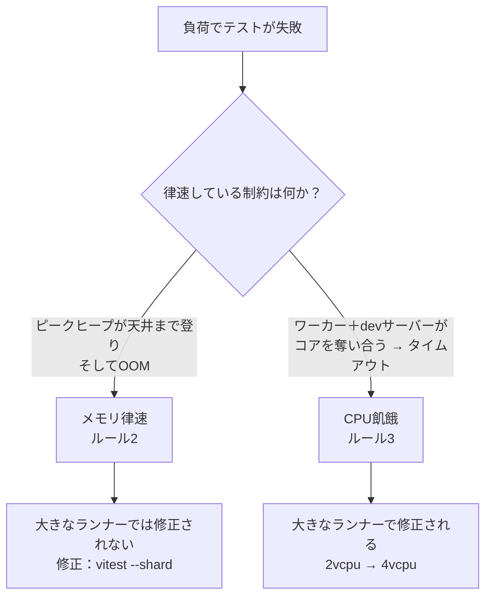

## このページが埋める空白

このガイドの他のページは、「CIランナー」を単一の固定された存在であるかのように扱っています。[実行ティア](../decision-guide/execution-tiers.mdx)はPRゲートが「10分未満」で走ることを前提とし、[重いテストの判断ルール](../decision-guide/heavy-test-decision.mdx)は環境的に実行不能なテストを「対応可能なハードウェア」へ送り、[定期再試験](../real-world-patterns/scheduled-re-exam.mdx)はプラットフォーム依存のスペックを「ホスト型のmacOS」に載せます。これらのページはどれも、2 vCPUのLinuxランナーが存在し、安価で、既定で手を伸ばす対象である、ということを暗黙のうちに前提にしています。

しかしそのどれもが、その下の層を文書化していません。**どんなランナーの形状が存在し、どう課金され、そして「大きい／別のランナーが本当に効くのはいつか」を判断するルールは何か。** その知識はたいてい、あるプロジェクトのワークフローファイル冒頭のコメントに書かれたまま、そこで死んでいきます — 次のプロジェクトが見つけられる場所には決して書き残されないのです。このページはその欠けた層であり、これらの戦略がチューニング対象としている[Blacksmith](https://www.blacksmith.sh/)というランナープロバイダーに対して書かれています。

<Note>

**このページの料金は、2026-07-05にBlacksmithのライブページ（[ランナー概要](https://docs.blacksmith.sh/blacksmith-runners/overview)、[料金](https://www.blacksmith.sh/pricing)）に対して再検証しました。** 従量課金のレートは変動します。すべての金額を「2026-07時点」のものとして扱い、予算に記載する前に必ず2つの出典ページを再確認してください。

</Note>

## Blacksmithを1分で

Blacksmithのランナーは、GitHubホスト型ランナーのドロップイン置き換えです。`runs-on` を変えるだけで、他は何も変わりません。価値の要点は、より高速なマシンをより低い分単価で、GitHubの「込みの分数」モデルではなく従量課金で使える、という点にあります。

### ランナーのラベル

ラベルは形状を直接エンコードしているので、ジョブのサイジングはトークン1つ分の編集で済みます。

```yaml
jobs:
  test:
    runs-on: blacksmith-4vcpu-ubuntu-2204
```

| 軸 | 値 |
|---|---|
| vCPU | `2vcpu`、`4vcpu`、`8vcpu`、`16vcpu`、`32vcpu` |
| OSイメージ | `ubuntu-2204`（安全な既定値）、`ubuntu-2404` |
| アーキテクチャ | x64（既定）、arm64には `-arm` サフィックス |

つまり `blacksmith-8vcpu-ubuntu-2404-arm` は、Ubuntu 24.04上の8 vCPU arm64ランナーです。既定のイメージには `ubuntu-2204` を選ぶのが無難です — GitHubの長年の `ubuntu-latest` の挙動に最も近いため、ワークフローを移行してもツールチェーンのバージョン差でつまずくことがめったにありません。`ubuntu-2404` へは、ジョブが実際に新しいベースを必要とするときに、意図的に移りましょう。

### 料金と無料枠

- **月3,000分の無料枠**。x64の2 vCPU相当分で計上されます。より大きい形状、arm、Windows、macOSの形状は、同じ予算をそれぞれの倍率で消費します（arm 2 vCPU分はx64より安く、Windows分は高く、macOS分ははるかに高い — 後述）。
- **x64 2 vCPUランナーで約 $0.004/分** — 標準的な2コアLinuxランナーに対するGitHubホスト型の定価 $0.008/分の、およそ半分です。Blacksmith自身の料金ページは、分単価と速度を組み合わせた優位性を「総コストでおよそ3分の2の削減」と表現しています。マシンが同じジョブをより速く走らせるためです。
- **料金はvCPU数にほぼ線形にスケールします。** 料金ページは2 vCPUのベースについて正確な数値を公開しており、そこから4 vCPUランナーは2 vCPUレートのおよそ2倍（約 $0.008/分）、8 vCPUはおよそ4倍（約 $0.016/分）……と課金されます。この線形性が、後述の**ルール1**を支える要の事実です — 覚えておいてください。

### 透過的な依存キャッシュ — そして、それを省くべきとき

Blacksmithは、標準的なキャッシュアクション（`actions/cache` や普及しているエコシステムのラッパー）が高スループットで透過的に利用するキャッシュをコロケーション（同一拠点配置）しています。恩恵を受けるのに特別な設定は要りません。

直感に反するのは、明示的なキャッシュを**まったく追加しないほうがよい**ことが多い、という点です。

<Warning>

**Blacksmithのインストール速度では、`actions/cache` の保存／復元ステップを追加することは、しばしば差し引きで損になります。** x64 2 vCPUランナー上で、`pnpm install --frozen-lockfile` はワークフローにキャッシュステップを一切置かずに約**2秒**で完了することが観測されています。保存／復元の往復 — キーのハッシュ化、tarballのアップロード、tarballのダウンロード、展開 — は、それが省こうとしていたインストールよりも、実測時間でもYAMLの記述量でも、日常的に高くつきます。

これは、より遅いランナーから持ち込まれる、あらゆるCIエンジニアが身につけている反射 — 「依存はキャッシュせよ」という無条件の助言 — に反します。ここではそれは条件付きです。**まずキャッシュなしのインストールを計測してください。** すでに2〜3秒なら、キャッシュは純粋なオーバーヘッドです。明示的なキャッシュは、本当に高コストなアーティファクト — コンパイル済みのRustのターゲットディレクトリ、Playwrightのブラウザダウンロード — にだけ手を伸ばし、高速なパッケージインストールには使わないでください。

</Warning>

## macOS（Apple Silicon）ランナー

macOSは別次元のコストであり、その違いの形が、あなたがそれをどう使ってよいかを決めます。

- **最小のmacOS形状は6 vCPUです。** 小さくて安価なMacランナーは存在しません — 入口の価格が6 vCPUマシン（`blacksmith-6vcpu-macos-latest` や、`blacksmith-6vcpu-macos-15` のようなピン留めバリアント）であり、その上に12 vCPUの選択肢があります。
- **課金はx64 2 vCPU分のおよそ20倍です。** 6 vCPUのmacOS分は約 **$0.08/分** — x64の約 $0.004/分レートの20倍です。設計で織り込むべきなのは、絶対額ではなくこの倍率です。

その帰結は、好みではなく、動かしがたいアーキテクチャ上のルールです。

<Danger>

**Macレーンは `schedule:` ＋ `workflow_dispatch:` のジョブとしてなら成立します — エージェント駆動のPR量で、PRごとに走らせることは決してありません。** 20倍の倍率は、すべてのプルリクエストで走らせた瞬間に、ありふれたMacジョブを4桁ドルの月次コスト項目に変えてしまいます。

具体例：夜間の45分Mac試験は `45 × $0.08 ≈ $3.6/晩 ≈ 約 $110/月` のコストです — 上限があり予測可能です。**同じ**ジョブを、月約400回のCI実行でPRごとに走らせるよう配線すると、`400 × 45 × $0.08 ≈ 約 $1,400/月` になります。同じ作業が、トリガーだけの違いで一桁分かけ離れるのです。

</Danger>

その計算には、隠れた好機があります。予測可能な約 $110/月 という数字こそ、Metal/WebGLのカバレッジが現在は開発者のローカルMacでしか走らないプロジェクトにとって、**スケジュール型の実GPU重量レーンを現実的にする**ものです。これはまさに、[重いテストの判断ルール](../decision-guide/heavy-test-decision.mdx#「なぜ重いのか」で分類する)の「環境的に実行不能」「プラットフォーム的に実行不能」のケースです。実GPUや実macOSを必要とするテストは、**対応可能なハードウェア上のスケジュール型T3ティア**へ移ります。ホスト型のApple Siliconランナーは、そのティアを「誰かがリリース前にローカルで走らせてくれることを祈る」ではなく、上限のある月次コストにするものです。スケジュール型のmacOSジョブそのものの配線については、[定期再試験 & 夜間試験](../real-world-patterns/scheduled-re-exam.mdx)を参照してください。

## ランナーサイジングの4つのルール

ラベルと料金は簡単な部分です。難しいのは、大きい／別のランナーが正しい道具となるのはいつかを見極めることです — なぜなら「とにかくコアを増やせばいい」という直感は、およそ半分は正しく、残り半分は積極的に間違っているからです。この4つのルールが、このページの核心となる知恵です。

### ルール1：大きなランナーはコスト削減ではなくレイテンシのレバー

**並列化可能な**ワークロードでは、大きくすることは速度を買うのであって、節約を買うのではありません。

Playwrightのワーカーはコアにスケールし、そして — 上の料金セクションのとおり — 料金もコアに線形にスケールします。この2つの線形の関係は相殺します。4から8 vCPUへ倍にすれば、実測時間はおよそ半分になる一方、総コストはほぼ据え置きです。分単価は2倍を払いますが、分数がおよそ半分になるからです。

```text
4vcpu:  ~10 min  ×  ~$0.008/min  ≈  $0.08
8vcpu:  ~5 min   ×  ~$0.016/min  ≈  $0.08   ← half the wait, same bill
```

したがって、この判断は純粋にフィードバックループの速度についてのものです。より速いPRゲートがエンジニアリングの注意を割く価値があるなら、並列化可能なジョブは**大きく**しましょう。待ち時間がすでに許容できるなら、小さいままにしておきます。請求額が縮むと期待して大きくしてはいけません — この種の作業では縮みません。

<Tip>

この相殺は、作業が実際に並列化される間だけ成り立ちます。1コアに張り付くジョブ — シングルスレッドのビルドステップ、直列のマイグレーション — は、vCPUを増やしても実測時間の恩恵を**まったく**得られないため、そのジョブにとって大きなランナーは純粋な追加コストです。ルール1は、あくまで並列化可能なワークロードに関するものです。

</Tip>

### ルール2：大きなランナーはメモリ律速の失敗を修正**しない**

これは最も高くつく間違いです。なぜなら、大きなマシンは効きそうに**見え**、しかもしばらくは効いているように見えることがあるからです。

JavaScriptヒープのOOMに当たっているvitest/jsdomレーンは、2から4 vCPUへ移しても**修正されませんでした**。大きなマシンはヒープの天井を上げますが、それは同じOOMを遅らせるだけです — プロセスは依然として新しい天井まで登りつめて死にます。失敗はメモリの*蓄積*に律速されており、天井が高くなっても登りの傾きは変わりません。

実際の修正は、シャード間でメモリが回収されるよう、**プロセスあたりのファイル数を制限する**ことです。

```bash
vitest --shard=1/4
```

シャーディングは、1つのワーカープロセスが新しいプロセスへロールオーバーするまでに読み込むテストファイルの数に上限をかけ、マシンの総RAMに関わらずピークヒープを天井以下に保ちます。（証拠：zudo-pattern-gen #1912 — 2→4 vCPUのアップグレードを生き延び、`--shard` がプロセスあたりのファイル数を制限してはじめてグリーンになったヒープOOMレーン。）周辺のワーカー・タイムアウト予算の設定については、[Vitestパターン](../real-world-patterns/vitest-patterns.mdx)を参照してください。

<Warning>

**「大きくしたら通った」は、サイズが原因だった証拠にはなりません。** 大きなランナーで解消したメモリ律速の失敗は、その日のファイル順序に対するノイズの閾値を下回っただけ、ということがよくあります — スイートが次に成長したときに再浮上します。修正をvCPUに帰する前に、メカニズム（ピークヒープが律速の制約なのか？）を確認してください。

</Warning>

### ルール3：サイズを変える前に失敗モードを診断する

ルール2は、大きなランナーがメモリ問題を修正しないと言います — しかしそれは、外から見ればほとんど同じに見える*別の*問題は、間違いなく修正**する**のです。

**CPU飢餓（starvation）：** 2 vCPUランナー上では、e2eワーカーとdevサーバーが同じ2コアを奪い合います。競合下では、スペックがタイミング予算を外し、タイムアウトとして失敗します — これは表面上、flakyな、あるいはリソース不足のテストとまったく同じように見えます。ここでは、4 vCPUへ移すことが**修正になります**。devサーバーとテストワーカーにそれぞれ専用のコアを与えれば、競合が消えるからです。（証拠：zudo-pattern-gen #3321 — 2コア競合下でのスペックタイムアウトが、4 vCPUで解消。）

つまり、どちらも「負荷で死ぬテスト」として現れる2つの失敗が、**正反対の**対処法を持つのです。



そこから導かれるルール：**サイズを変える前に律速の制約を診断し、各ジョブをそれ自身の失敗モードに合わせてサイジングする。** ワークフロー全体を一律にサイジングしてはいけません — 同じワークフロー内のメモリ律速のvitestレーンとCPU飢餓のe2eレーンは、それぞれ異なる扱いを望んでおり、「すべて8vcpuに」という一括対応は、メモリのバグを覆い隠しつつ、それを必要としなかったジョブに払い過ぎることになります。

### ルール4：コスト管理はランナー選びではなく、トリガー設計から生まれる

CIの請求額に対する最大のレバーは、どのランナーを選ぶかでは**ありません** — 高コストなレーンを**そもそもいつ走らせるか**です。

8 vCPUランナー上の重量レーンをすべてのトピックPRで発火させれば、同じレーンをスケジュールで走らせるよりもはるかに高くつき、その差の前ではランナーのサイズは端数の誤差です。上のmacOSの試算はその極端なケース — 分あたり20倍が、トリガーをすべての物語にします — ですが、この原則はどんな高コストなレーンにも当てはまります。

高コストなレーンは、次の2つでゲートしましょう。

1. **PRのベースブランチ。** 重いスイートは、リリース／ラウンドのPR — ベースが `main` のもの — でだけ走らせ、統合ブランチへ流し込むすべてのトピックブランチPRでは走らせません。エージェント駆動のフローでは大半がトピックPRであり、重量レーンをそこから外すだけでコストの大部分が消えます。
2. **夜間の `schedule:`。** ベースブランチのゲートを、スケジュール型のフル実行でバックアップし、トピックPRをスキップしたものが長く未検証のまま残らないようにします。これは、T3の[定期再試験](../real-world-patterns/scheduled-re-exam.mdx)ティアがその役目を果たしている姿です。

レーンを*速く*するには大きなランナーに手を伸ばし（ルール1）、レーンを*安く*するにはトリガー設計に手を伸ばす（ルール4）。この2つを混同すること — PRごとの重量レーンをPRごとから完全に外すのではなく、ダウンサイズして節約しようとすること — は、端数の誤差を最適化して請求額を無視することです。

## まとめ

| 症状 | 誤った直感 | 正しいレバー |
|---|---|---|
| PRゲートが遅く感じ、作業は並列化可能 | 放っておく。コアは金がかかる | レイテンシのために**大きく**（ルール1） — コストはほぼ据え置き |
| vitest/jsdomのヒープOOM | RAMを増やすため2→4 vCPU | `vitest --shard`（ルール2） — サイズでは直らない |
| e2eスペックが負荷でタイムアウト | flakyと決めつけてリトライを足す | CPU飢餓を診断 → 2→4 vCPU（ルール3） |
| 月次CI請求額が高すぎる | ランナーをダウンサイズ | ベースブランチ＋スケジュールでレーンをゲート（ルール4） |
| 実GPU／macOSカバレッジが必要 | Macランナーで、PRごとに走らせる | スケジュール型T3 macOSレーン（約 $110/月、約 $1,400/月ではなく） |

一貫する筋道：**ランナーのラベルはトークン2つ分の編集だが、それをうまく選ぶとは、まず律速の制約に名前を付けることを意味する。** レイテンシ、メモリ、CPU競合、総コストは4つの異なる問題であり、4つの異なるレバーを持ちます。そして大きなランナーは、そのうちちょうど1つに対する正しい答えなのです。

## 参考リンク

- [Blacksmith ランナー概要](https://docs.blacksmith.sh/blacksmith-runners/overview) — ラベルの全マトリクス、OSイメージ、無料枠／消費倍率の詳細（2026-07-05検証）。
- [Blacksmith 料金](https://www.blacksmith.sh/pricing) — 形状ごとの分単価（2026-07-05検証）。
- [実行ティア](../decision-guide/execution-tiers.mdx) — これらのサイジングルールが仕える T0–T4 モデル。
- [重いテストの判断ルール](../decision-guide/heavy-test-decision.mdx) — 環境／プラットフォーム的に実行不能なテストが、スケジュール型のmacOSティアへどう到達するか。
- [定期再試験 & 夜間試験](../real-world-patterns/scheduled-re-exam.mdx) — スケジュール型（T3）のmacOSジョブが実際にどう組まれるか。
