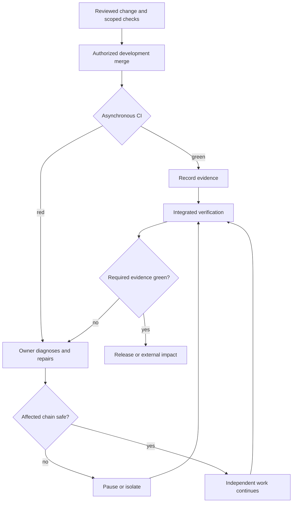

## Separate three decisions

**CI green can be a release/deploy/publish invariant without being a development-merge invariant.** This requires an explicit project policy, bounded repair, visible CI, failure ownership, and a protected external-impact boundary. The default remains green-before-merge unless that policy applies.

| Question | Meaning |
| --- | --- |
| Execution | Does this check run on this SHA? |
| Merge enforcement | Must it be green before this development merge? |
| External-impact enforcement | Must it be green before release, deploy, publish, or real-data migration? |

A T1 check remains authoritative integration evidence even when an authorized development merge does not synchronously wait for it. [Execution tiers](../decision-guide/execution-tiers.mdx) describe where/when; [test lifecycle](../decision-guide/test-lifecycle.mdx) describes retention; neither alone decides merge enforcement.

## Conditions for merging before green

Use **blast radius × reversibility × repair cost** as a decision lens, not confidence in AI correctness. All these conditions must hold:

- The target represents development/integration, not an irreversible external-impact boundary.
- Merging does not directly publish, deploy, or migrate real user state, or a separate protected boundary prevents that effect.
- CI still runs; throughput is not obtained by weakening assertions, skipping checks, or concealing results.
- Pending, red, cancelled, skipped, and deferred results are reported honestly.
- Each red has an owner, preserved evidence, and a concrete diagnosis/fix or revert action with a bounded follow-up checkpoint. A vague promise to fix later is insufficient.
- Dependent work can be paused or isolated, and repair/revert cost is acceptable.
- An authoritative green gate protects the chosen external-impact boundary, including the required evidence for the integrated release candidate.

Existing protections and approval requirements remain authoritative; this guide grants no bypass permission. Declare the policy and enforcement boundary before adopting it, rather than making an exception because today's check is inconvenient.

## Continue or pause mechanically

Continue independent work only when **all** are true: the failure is understood and localized, the next work does not depend on it, and a concrete repair is tracked with an owner and checkpoint.

Pause the affected chain if **any** is true: cause is unknown or cross-cutting; compiler/build/runtime foundations are broken; later work depends on failing behavior; further integration would obscure attribution; or security, data loss, migration, publication, or production is at risk. Diagnose, repair, and obtain the needed evidence before resuming. Unaffected work may continue only with an explicit independence rationale.

If a repair checkpoint expires, pause affected integration or revert/isolate the change. Repeated unowned red is normalized failure and invalidates this operating model.

## Asynchronous CI lifecycle

Record run URL, tested SHA, job/leg, status, owner, and next action in the existing PR/issue or manager record. A merge means integrated, not verified. [Rule 7](../decision-guide/required-behavior.mdx) keeps red owned after merge; the [gate operator's playbook](../test-integrity/deflaking-recipe.mdx) still requires bounded diagnosis, evidence preservation, and honest pass-on-retry reporting.

Cancelled or superseded runs are not passes. Green on an older SHA is evidence, not automatic proof of the newer integrated head. Batching verification is allowed; dropping unresolved alerts is not. Use [change-scoped verification](./change-scoped-verification.mdx) only when relevant input equivalence is established. Overall completion reconciles alerts and verifies the integrated state; release requires its declared candidate evidence.

## Branches and examples

A dedicated accumulation branch may be transiently red while main/release remains protected; [release rounds](./release-rounds-branch-strategy.mdx) provide one such topology. Main itself can be a rapid integration line only if main does not imply production/release and another protected publish/deploy boundary exists. The branch name is not the safety property; its external effect is.

| Situation | Decision |
| --- | --- |
| Pre-release library/framework, pending CI | Reviewed development merge may proceed under policy; later red is fixed; npm publication requires the full release gate |
| Production web app with main auto-deploy | Merge-before-green is unsafe unless deployment is separately decoupled/protected |
| Real-data/schema migration | Keep the stricter pre-impact verification boundary even in a permissive development project |
| Known localized test failure | Independent work may proceed with tracked repair and the three continue conditions |
| Unknown compiler/build failure | Pause the affected dependency chain and diagnose first |

### Concrete source: zudo-front-builder

The [zudo-front-builder CLAUDE.md](https://github.com/Takazudo/zudo-front-builder/blob/main/CLAUDE.md) section “Development strategy: integrate first, use CI to find regressions”, inspected on 2026-10-06, assigns integration and CI triage to a manager, permits reviewed development merges while CI runs, pauses affected chains for unclear/foundational failures, and keeps final integrated verification and package publication gates. It is a project-specific worked source, not a universal permission or a policy imported into this documentation repository.

## AI economics and actual cost

Improved implementation/review quality may lower failure probability; agent-assisted diagnosis and repair may lower recovery cost. The latter is the stronger rationale for this policy. Neither implies AI-generated code needs less testing.

Removing CI waiting from the development critical path is different from reducing CI runtime or billing. A 20-minute asynchronous job may impose near-zero merge latency while still costing 20 runner-minutes. Use [CI gate optimization](./ci-gate-optimization.mdx) for same-suite speedups and [AI suite audit](./ai-suite-audit.mdx) for measured cost/assurance decisions.
