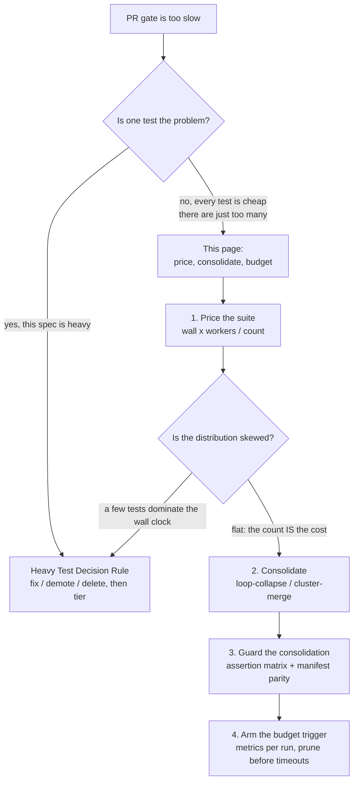

## The Failure Mode the Per-Test Rules Cannot Name

[Heavy Test Decision Rule](./heavy-test-decision.mdx) answers a question about **one** test: this spec is too heavy, so fix it, demote it, or delete it — and if it survives, give it a tier. Every rule on that page is per-test, and every one of them can be satisfied by every test in a suite that is nonetheless far too expensive to run.

The measured case: a PR gate had grown to 43–63 minutes, with a single 46-minute e2e step holding **566 CI-safe tests**. Not one of them was heavy. None read pixels, none needed a real keyboard, none came near the ~60-second threshold, none were flaky. Run all 566 through the mechanical classification rules and all 566 come back **untagged** — correctly. The gate still drowns.

That is the gap. "A new e2e test is untagged and CI-safe unless a rule forces a tag" is the right per-test default, and it has no suite-level counterweight. Nothing in the per-test rules ever says *the suite is now too big*, because at no point is any individual test at fault. Five hundred and sixty-six correct decisions add up to one wrong suite.

| The per-test question | The aggregate question |
|---|---|
| Is *this* test too heavy for the gate? | Can the gate afford *one more* cheap test? |
| Answered by classification rules and tags | Answered by a unit price and a suite budget |
| Verdicts: fix, demote, delete, tier | Verdicts: price, consolidate, prune, re-tier |
| Fires on an outlier | Fires on an accumulation |

The two pages compose rather than compete. Run the per-test rules on the outliers; run this page on what is left when there are no outliers.



## Price Every Test Before Arguing About Any of Them

Suite-size arguments go nowhere while the unit is "a test", because everyone agrees a test is cheap. Give the unit a price and the argument becomes arithmetic:

```
unit cost (worker-seconds per test) = wall-clock seconds x workers / test count
```

The measured case, priced:

```
46 min                  -> 2,760 wall-clock seconds
2,760 s x 2 workers     -> 5,520 worker-seconds
5,520 / 566 tests       -> ~9.8 worker-seconds per test
```

Worker-seconds, not wall-clock seconds, is what makes the number portable. Wall-clock silently folds in the parallelism of the machine that produced it, so a wall-clock-per-test figure changes when someone tunes `workers` without a single test changing. Worker-seconds is the work the suite actually asks for; divide by the worker count to get back to wall-clock on any given runner shape.

With a price, every suite decision is quotable in the currency the gate is actually spending:

- **Adding a spec file with 30 tests** costs ~294 worker-seconds — about 2.5 minutes of wall clock at two workers. That is a number a reviewer can weigh against the assertion.
- **The 566 → ~370 plan** removes 196 tests: ~1,920 worker-seconds, ~16 minutes of wall clock recovered at two workers. The plan stops being "let's clean up the e2e suite" and becomes a 16-minute line item.
- **A merge that folds 12 tests into 1** removes 11 tests' worth of per-test overhead — about 108 worker-seconds. If the merge takes an hour to do safely and the suite is nowhere near its budget, the price says do not bother.

<Warning>

**Unit cost is an average, and an average prices nothing when the distribution is skewed.** If the slowest 5% of specs own half the wall clock, ~9.8 worker-seconds describes no test in the suite: deleting cheap tests will not move the gate, and the real answer is the per-test page applied to the tail.

Check the shape before you trust the price. Playwright's JSON reporter carries per-test durations; sort them and look at the top decile. Prune or re-tier the tail first, then re-derive the unit cost from what is left. Only a roughly flat distribution licenses the conclusion this page is about — that the *count* is the cost.

</Warning>

## Consolidation: The Exit Branch 0 Does Not Have

Branch 0 offers fix, demote, and delete. All three are verdicts on one test's right to exist, and all three are the wrong tool here, because in an aggregate overflow the assertions are individually fine. Consolidation is a fourth exit and it is neither a demotion nor a deletion: **no assertion moves to a lower level and no assertion is removed.** What shrinks is the per-test overhead paid N times over — fixture setup, navigation, worker scheduling, per-test reporting.

That distinction is what makes consolidation safe to apply broadly and what makes it dangerous to apply carelessly: it is the one exit that promises to keep coverage intact, so nobody audits it the way they audit a deletion. The two patterns below are mechanical; the [assertion-matrix gate](#the-assertion-matrix-gate-matrix-first-deletion-second) further down is what keeps the promise honest.

### Loop-Collapse: Move the `for` Loop Inside `test()`

The signature is a loop *around* `test()` — a spec file that mints one test per item in a collection. The collapse moves the loop inside a single test, keeping every assertion:

```ts
// Before: the loop is AROUND test() -- N tests, N fixture setups
for (const pattern of PATTERNS) {
  test(`renders ${pattern.id}`, async ({ page }) => {
    await page.goto(`/preview/${pattern.id}`);
    await expect(page.locator("canvas")).toBeVisible();
  });
}

// After: the loop is INSIDE test() -- 1 test, 1 fixture setup, same assertions
test("renders every registered pattern", async ({ page }) => {
  test.setTimeout(PATTERNS.length * 4_000);
  for (const pattern of PATTERNS) {
    await page.goto(`/preview/${pattern.id}`);
    await expect(page.locator("canvas"), pattern.id).toBeVisible();
  }
});
```

Note the second argument to `expect`. Collapsing N test titles into one destroys the failure report's only identifier — "renders every registered pattern failed" names nothing. Every assertion inside a collapsed loop must carry the iteration key, or the saving is paid for in debugging time on the first red run.

### Cluster-Merge: One Fixture Walk, `expect.soft` for the Rest

The other signature is N single-assertion tests that each redo the *same* setup. Here the collection is implicit — the tests are siblings only because they share a fixture walk:

```ts
// Before: three tests, three identical navigations
test("header shows the project name", async ({ page }) => {
  await page.goto("/editor");
  await expect(page.getByRole("banner")).toContainText("zudo");
});
test("save button starts enabled", async ({ page }) => {
  await page.goto("/editor");
  await expect(page.getByRole("button", { name: "Save" })).toBeEnabled();
});
test("status line starts ready", async ({ page }) => {
  await page.goto("/editor");
  await expect(page.getByRole("status")).toHaveText("Ready");
});

// After: one navigation, three soft assertions -- all three still report
test("editor chrome is correct on load", async ({ page }) => {
  await page.goto("/editor");
  await expect.soft(page.getByRole("banner")).toContainText("zudo");
  await expect.soft(page.getByRole("button", { name: "Save" })).toBeEnabled();
  await expect.soft(page.getByRole("status")).toHaveText("Ready");
});
```

`expect.soft` is not a stylistic choice — it is what keeps the merge non-lossy. A hard `expect` aborts the test at the first failure, so merging three tests with hard assertions turns three independent failure reports into one: break all three and the run tells you about the banner, and you fix it, and the next run tells you about the button. Soft assertions let the merged test finish and report every failure it found, which is the information the three separate tests were providing.

### Mechanics: Timeout and Flake Cost

Both patterns move work from N tests into one, so two defaults sized for a single test stop being right.

**Set the timeout explicitly, derived from the collection.** A merged test inherits a per-test timeout chosen when tests held one iteration. Derive the new one from the iteration count — `test.setTimeout(PATTERNS.length * 4_000)` above — rather than hardcoding a bigger number, because a fixed value that was generous at 200 patterns is a wall at 500. A merged test that times out at iteration 400 of 500 has asserted nothing about iterations 401–500, and the report shows one timeout rather than 100 unrun contracts.

**A retry now re-runs everything.** Before the merge, retrying a flaky test cost one test's runtime; after, it costs the entire loop. A merged test that flakes 1% of the time bills the full merged runtime every time it does, and it drags the whole cluster's result with it. The order matters: consolidate a suite whose flakes are already fixed. Consolidation is not a way to make a flaky suite cheaper — it makes flakiness more expensive, which is an argument for [fixing the flakes first](../test-integrity/deflaking-recipe.mdx).

<Warning>

**Consolidation coarsens the blast radius.** One red test now means "something in this cluster broke", so the cluster's name has to be worth reading. Keep clusters semantically coherent — the editor chrome on load, every registered pattern — and the name still points at where to look. A cluster merged by cost alone, bundling whichever specs happened to be adjacent in the file, produces a test whose failure name means nothing and whose next maintainer splits it back apart.

</Warning>

## Registry-Driven Consolidation: Three Counterweights

The largest form of loop-collapse is registry-driven: instead of N template-copied files, one harness iterates a registry and asserts a contract per entry. It is also where the biggest numbers live, and where the advice "just loop the registry" quietly omits the constraints that make the change safe.

The evidence comes from a pattern-generator project's Test Diet. Two template families alone held **728 files / 118,571 LOC**:

| Family | Files | LOC | Outcome |
|---|---|---|---|
| `*-smoke.test.ts` | 208 | 22,602 | registry chunks retained 1,684/1,684 pattern parity |
| `*-animated.test.ts` | 520 | 95,969 | registry harness retained all 520 swept contracts |

The final pattern sweep was **13,428 tests across 79 files, with a 241 MB maximum observed heap** (validating lockfile: Vitest `3.2.4`, Playwright `1.59.1`). Read the shape carefully: 728 files became 79, while the test count stayed in the thousands. Registry consolidation collapses **files and per-file overhead**, not contracts — if your consolidation also collapses the contract count, you did a deletion and should be reading the [assertion-matrix gate](#the-assertion-matrix-gate-matrix-first-deletion-second) instead.

Three constraints made that sweep safe.

### Counterweight 1: File Count and Heap Are a Budget, Not a Free Variable

One giant registry file would change Vitest's shard tails and recreate the OOM risk that the accidental file split had been protecting against. `--shard` bounds per-process memory by bounding how many test files a worker loads before the run rolls to a fresh process; collapse 520 files into one and the sharding lever has nothing left to divide.

So the chunk count is a design parameter with a budget of its own: 79 files at a 241 MB observed peak, recorded and asserted like the runtime budget. And the ceiling is not purchasable — a bigger runner raises the heap limit without changing the slope of the climb, which is [Rule 2 of CI Runner Sizing](../ci-operations/ci-runner-sizing.mdx). Set a size/heap budget per chunk explicitly, or the next twenty registry entries land in whichever file was convenient.

### Counterweight 2: The Changed-File Lane Is Not Free After Consolidation

`--only-changed` (Playwright) and `--changed` (Vitest) select tests through the import graph. A registry-importing test imports, transitively, nearly everything — so it becomes selected whenever *any* source or registry edit lands. Moving hundreds of files into one importer does not make the fast lane free; it makes the fast lane run the entire consolidated suite on every PR that touches the product.

This is the counterweight most easily missed, because it is invisible in the number the consolidation was measured on. The full-suite duration drops, everyone celebrates, and the changed-file lane silently gets slower on every unrelated PR. The lane needs an intentional rule, decided at consolidation time and written down: either exclude the registry harness from the changed-file lane and let the full lane own it, or give the harness its own budget and hold it to that.

### Counterweight 3: Manifest Parity — A Per-Chunk Assertion Proves Only Chunks That Still Run

This is the sharpest of the three. A registry harness normally asserts, per chunk, that every pattern assigned to *this* chunk has a contract. That assertion lives inside the chunk file. Delete the whole chunk file and the assertion leaves with it: the suite is green, the chunk's patterns are unguarded, and nothing anywhere fails.

The guard is a separate **manifest** test that asserts the chunk set itself — chunk-file existence, chunk names, and that the union of assignments covers the registry exactly, with no duplicates and no omissions. It lives beside the chunks and it is the only thing in the suite that can fail when an entire chunk disappears:

```ts
// manifest.test.ts -- the guard that survives a deleted chunk file
import { existsSync } from "node:fs";

test("every registry entry is assigned to exactly one existing chunk", () => {
  const assigned = CHUNKS.flatMap((chunk) => chunk.patternIds);
  expect(new Set(assigned).size, "duplicate assignments").toBe(assigned.length);
  expect([...assigned].sort()).toEqual([...REGISTRY.keys()].sort());
  for (const chunk of CHUNKS) {
    expect(existsSync(chunk.file), `missing chunk file: ${chunk.name}`).toBe(true);
  }
});
```

This is the same contract shape as the [guard-manifest parity check](../ci-operations/scheduled-re-exam.mdx) between `b4push` and CI, and it fails for the same reason when it is missing: an inventory that can only speak for the entries still present will never notice a removal.

## The Assertion-Matrix Gate: Matrix First, Deletion Second

Registry consolidation ends in a deletion — the template-copied files go away. And the thing that makes the deletion feel safe is precisely the thing that does not prove it is: a harness that reproduces the *registry* is not evidence that it reproduces the *assertions*.

The worked case is unambiguous. The 520-file animated family looked replaceable by two existing GLSL confirm files, which already iterated the registry. Those files were **registry precedents, not assertion substitutes**. The template family also checked granularity semantics, exact phase uniforms, the *absence* of `u_timeSec`, the `u_modActive` gate, LFO integer rate, animation metadata, and performance fields. A generic registry harness would have retained registry presence in full and silently dropped every one of those assertion families.

The gate, in order:

1. **Enumerate every assertion and every variant class.** The animated family's assertion-shape classes were 7/12/13/14/15/16/17/19/20 assertions per file, summing to the 520 files. Variant counts matter as much as the total: a family with nine distinct shapes is nine contracts wearing one filename pattern, and the largest shape is not a superset of the others.
2. **Map every row to a disposition.** Each assertion either lands on a *named* place in the replacement harness, or gets a recorded dropped-with-reason row. There is no third option, and "the harness covers that generally" is not a landing point.
3. **Decide precedent overlap explicitly.** When an existing file looks like it already covers the family, state what it does and does not assert rather than inheriting the resemblance. The two confirm files were folded only after their stricter 80-pattern foreground/determinism assertions had named landing points of their own.
4. **Add the manifest guard before deleting anything**, per Counterweight 3 — otherwise the first accidental chunk deletion after the sweep is silent.
5. **Record the deltas as the acceptance record**: test count, file count, peak heap, and changed-file-lane impact. The sweep's record was 728 → 79 files, 13,428 tests, 241 MB peak heap, all 520 contracts retained, and no assertion dropped.

<Danger>

**This is the step an agent asked to "consolidate the pattern tests" will skip.** The harness is the satisfying artifact — it is clever, it is short, it turns 95,969 lines into a few hundred, and it goes green. The matrix is the actual work, and nothing about a green run demands it: a consolidated suite passing proves the harness runs, not that it asserts what the deleted files asserted.

Treat the deletion as irreversible even though git history is intact. Nobody re-derives a dropped assertion family from a diff that nobody reads. Matrix first, deletion second — and the matrix is a written artifact in the PR, not a claim in the description.

</Danger>

## The Budget-Drift Trigger

A budget nobody measures is a preference. The mechanism has two halves, and neither works alone.

**Emit the numbers on every run.** Push test count *and* step duration into the run's step summary — both, because duration alone cannot distinguish "the suite grew" from "the runner was slow that day", and count alone never shows what the growth costs. Add peak heap for a Vitest lane, where the memory ceiling is the constraint that bites first:

```yaml
- name: Record suite budget
  if: always()
  run: |
    tests=$(jq '[.stats.expected, .stats.unexpected, .stats.flaky, .stats.skipped] | add' results.json)
    {
      echo "| metric | value |"
      echo "|---|---|"
      echo "| e2e tests | ${tests} |"
      echo "| step seconds | ${SECONDS} |"
    } >> "$GITHUB_STEP_SUMMARY"
```

`SECONDS` restarts at zero in each `run:` block's shell, so it measures this step rather than the job. The point of putting it in the step summary rather than a log line is that drift is a trend: two numbers visible on every PR page make a slow climb legible without anyone running an analysis.

**Write the rule down, including the order of remedies.** Exceeding the budget triggers a prune or a consolidation — *never* a timeout increase first. Raising the timeout has to be named explicitly as forbidden-first, because it is available, silent, and it works: it converts a suite-size problem into a permanently more expensive gate and, worse, removes the only signal that would have prompted anyone to prune. It is the default move for a developer in a hurry and for an agent asked to make CI green.

When the budget is exceeded, in order:

1. **Prune** — apply [Branch 0](./heavy-test-decision.mdx) to the most expensive specs. Demote what belongs at a lower level; delete what has never caught anything and guards no critical journey.
2. **Consolidate** — loop-collapse and cluster-merge what survives, with the guards above.
3. **Re-tier** — move genuinely heavy or environment-bound specs out of T1, per [Execution Tiers](./execution-tiers.mdx).
4. **Tune execution** — workers, sharding, runner shape. This is last among the fixes because it buys wall clock without reducing work, and the work is what keeps growing.
5. **Revise the budget** — only after the four above have actually been applied, and only as a recorded decision with a new stated number. A budget revised by raising a timeout is not a revised budget; it is an abandoned one.

The number this drifts against is T1's ~10-minute gate budget from [Execution Tiers](./execution-tiers.mdx). Any number works as long as one exists and every run prints its own value beside it.

<Tip>

The budget's teeth are the trigger, not the threshold. A number written in a document that no run ever compares itself against is documentation. A number the run prints next to its own measurement is a gate — and it is what turns "the e2e suite feels slow lately" into a dated, priced, actionable line.

</Tip>

## Where to Go Next

- [Heavy Test Decision Rule](./heavy-test-decision.mdx) — the per-test half: fix, demote, delete, and the tag taxonomy that assigns tiers
- [Execution Tiers](./execution-tiers.mdx) — where T1's ~10 minute budget comes from and when T1 overflow justifies a T2 split
- [CI Runner Sizing](../ci-operations/ci-runner-sizing.mdx) — why a bigger runner fixes CPU starvation but never a memory-bounded suite
- [Scheduled Re-exam and Night Exam](../ci-operations/scheduled-re-exam.mdx) — the guard-manifest parity contract this page's manifest guard mirrors
- [Vitest Patterns](../tool-patterns/vitest-patterns.mdx) — per-project timeout budgets and worker caps for the lanes being consolidated
- [Flake Root-Cause Catalog & Deflaking Recipe](../test-integrity/deflaking-recipe.mdx) — fix the flakes before consolidation multiplies their cost
