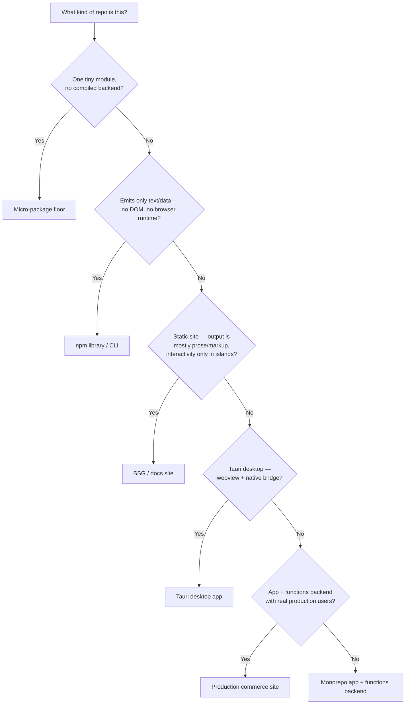

## The Second Journey

The rest of this guide answers one question well: **what changed → which level?** You made a change, and the [Quick Decision Table](./quick-decision.mdx) tells you the lowest level that can catch a regression in it. That is the per-change journey.

There is a second journey this guide has left implicit until now: **what suite does THIS repo need?** Not "which level for this diff," but "what is the complete, minimum set of tests a repo of this shape should have at all." Downstream repos answer it today by hand-writing a `TESTING.md` — one repo quotes the [execution tiers](./execution-tiers.mdx) verbatim, another embeds the level-by-tier framework in its `CLAUDE.md`, a third maps every level and records its deliberate deviations. Each one re-derives the same answer from scratch.

This page makes that journey first-class. It sorts repos into a small set of **archetypes**, and for each one gives a concrete, decidable starting suite. An agent landing on a fresh repo can pick its archetype and produce a real test suite without further judgment calls.

<Note>

This page decides **which tests should exist** for a repo. It sits on top of two axes defined elsewhere: the [testing levels](../testing-levels/index.mdx) (what a test can see) and the [execution tiers](./execution-tiers.mdx) (where and when it runs). Read those first if the L/T notation below is unfamiliar.

</Note>

## How to Use This Page

1. **Pick your archetype** from the matcher below — first match wins.
2. **Adopt its minimum viable suite** — the exact levels and tiers listed. Do not add more.
3. **Write the named first test.** Every archetype names one concrete test to start from.
4. **Skip what it tells you to skip** — and read *why*, so you do not re-add it out of habit.
5. **Watch for the escalation trigger.** Add the next layer only when its specific trigger fires — never speculatively.

Archetype is only half the picture; **project maturity** is the other half. A pre-release project defers its heaviest tier — see [Which Tiers Does a Project Need?](./execution-tiers.mdx#which-tiers-does-a-project-need) and its pre-release T3 deferral note. The suites below describe the shape at maturity; scale the opt-in tiers to where the project actually is.

## Picking Your Archetype

Answer top to bottom; take the first archetype that matches.



The archetypes are **additive, not exclusive**: a production commerce site is the monorepo app archetype plus extra layers, adopted at release maturity; an SSG that grows islands borrows the app archetype's L2/L4 tools for just those islands. Pick the tightest match, then add layers only when a trigger fires.

## At a Glance

| Archetype | Core gate | Tiers | Browser layer |
|---|---|---|---|
| [Micro-package floor](#archetype-micro-package-floor) | typecheck + a few L1 unit | T0–T1 | none |
| [npm library / CLI](#archetype-npm-library-cli) | L1 + L3 golden fixtures + pack/publish check | T0–T1 | none |
| [SSG / docs site](#archetype-ssg-docs-site) | L3 build + HTML-validate + link check | T0–T1 | islands only |
| [Monorepo app + functions backend](#archetype-monorepo-app-functions-backend) | L1 + API contract + `@smoke` L4 | T0–T2 | `@smoke` subset per PR |
| [Tauri desktop app](#archetype-tauri-desktop-app) | L1/L2 mocked-IPC + core-crate unit | T0–T1 + T3 + T4 | WebKit-first, scheduled |
| [Production commerce site](#archetype-production-commerce-site) | monorepo + env-tiered contract + site-integrity | T0–T3 | full E2E, scheduled sweeps |

## Archetype: SSG / Docs Site

*Grounded in: documentation sites, static marketing sites, this repo itself.*

The output is mostly prose and markup. The dangerous failures are not logic bugs — they are a build that breaks, HTML that is malformed, and links that rot. The suite targets exactly those.

**Minimum viable suite.** [Level 3 (build output)](../testing-levels/level-3-build-output.mdx) is the core. On every PR (**T1**): the build must succeed, the emitted HTML must validate, and internal links must resolve. Locally (**T0**): typecheck plus the build. Add [Level 2 (DOM tests)](../testing-levels/level-2-dom-tests.mdx) **only for interactive islands**, not for prose pages. Run the full site crawl / exhaustive link check on `main` rather than blocking every PR on it.

**First test to write.** The three-command core gate, wired into T1:

```sh
# The SSG core gate — runs in T1 on every PR
pnpm build                                # must succeed
pnpm exec html-validate "dist/**/*.html"  # emitted HTML is valid
pnpm exec linkinator ./dist --silent      # internal links resolve
```

If the build itself is the thing that historically breaks, back it with a Level 3 assertion that the expected pages exist in `dist` — see [SSG Output Verification](../testing-levels/level-3-build-output.mdx#example-ssg-output-verification).

**Skip — and why.**

- **L4 E2E on prose pages** — there is no user flow to drive on a static page; a passing build plus valid HTML already covers what can break.
- **L5 visual regression on content** — prose reflow is not a regression worth a screenshot gate; reserve L5 for a specific design-critical surface if one exists.
- **Component tests for non-interactive content** — a rendered heading has no behavior to assert.

**Escalation trigger.** The site gains an **interactive island** — a search box, tabs, a client router, view transitions. Add L2 DOM tests for that island's logic, and escalate to L4 **only if it needs real browser primitives** (hydration, focus, scroll, navigation). Islands specifically risk the [hydration mis-nesting variant](./common-failure-pattern.mdx#the-hydration-mis-nesting-variant), which every level below L4 passes — if you ship islands, that L4-with-hydration-wait test is the one to add first.

## Archetype: npm Library / CLI

*Grounded in: formatters, code generators, small published utilities.*

The package emits text or data. Correctness is fully expressible as input → output, so the suite is unit tests plus golden fixtures — and, critically, a check that the **published tarball** actually installs and runs. There is no browser layer at all.

**Minimum viable suite.** [Level 1 (unit)](../testing-levels/level-1-unit-tests.mdx) for pure logic, plus [Level 3 (golden fixtures)](../testing-levels/level-3-build-output.mdx) over the public API — run the tool on a committed fixture, compare to committed expected output. Add a **pack/publish pipeline check**: the artifact that ships is not the source tree. All in **T0–T1**; no T2–T4 unless a trigger below fires.

**First test to write.** A golden-fixture test over the public entry point:

```ts
// tests/format.test.ts — golden fixture over the public API
import { describe, it, expect } from "vitest";
import { readFileSync } from "fs";
import { format } from "../src/index";

it("matches the committed golden output", () => {
  const input = readFileSync("tests/fixtures/sample.in.md", "utf-8");
  const expected = readFileSync("tests/fixtures/sample.out.md", "utf-8");
  expect(format(input)).toBe(expected);
});
```

For a formatter or any idempotent transform, add the idempotency check (`format(format(x)) === format(x)`) — see [MDX Formatter Contract Testing](../testing-levels/level-3-build-output.mdx#example-mdx-formatter-contract-testing).

**Skip — and why.**

- **L2 / L4 / L5 / L6 entirely** — there is no DOM, no CSS, no browser. Every one of those levels needs a rendering surface this package does not have.
- **A heavy E2E harness** — a CLI's "end to end" is running the binary on a fixture, which is already the golden-fixture test.

**Escalation trigger.**

- Ships **platform-specific binaries or an exec bit** → add publish-time pack verification; the three failure modes a plain unit suite cannot see are in [Publishing-Pipeline Verification](../real-world-patterns/publishing-pipeline.mdx).
- **Consumed by pin across other repos** → add a scheduled registry drift net (**T3**) so a breaking publish is caught before consumers hit it — see [Scheduled Re-exam](../real-world-patterns/scheduled-re-exam.mdx).
- **Emits a browser runtime** (a generator that ships a client router, islands, view transitions) → it is no longer just a library. The test surface follows the *emitted artifact*: cover the runtime with L2 DOM tests, per [the CLI-shaped-generator note](./execution-tiers.mdx#which-tiers-does-a-project-need).

## Archetype: Monorepo App + Functions Backend

*Grounded in: web apps with a functions/serverless backend, auth services.*

Two codebases share a repo: a frontend and a functions backend. The breakages that matter per-PR are **contract breakages** — the shape the frontend depends on changing under it — not the full clickable surface. The suite front-loads contract tests and keeps only a thin critical-path E2E on every PR.

**Minimum viable suite.** [Level 1 (unit)](../testing-levels/level-1-unit-tests.mdx) for both frontend and backend logic. **API contract suites**, environment-parameterized, against a local runtime (Miniflare or a mocked binding). A **critical-path E2E subset** — tagged `@smoke` — on every PR, with the full E2E suite reserved for `main`. Tiers **T0 + T1** (unit + contract + `@smoke` E2E), escalating to **T2** when T1 overflows.

**First test to write.** A contract test for the single most critical endpoint — login, checkout-create, whatever the frontend cannot function without:

```ts
// tests/api/login.contract.test.ts — the shape the frontend depends on
import { describe, it, expect } from "vitest";

it("POST /api/login returns a session token", async () => {
  const res = await SELF.fetch("http://x/api/login", {
    method: "POST",
    body: JSON.stringify({ email: "a@b.c", password: "pw" }),
  });
  expect(res.status).toBe(200);
  expect(await res.json()).toMatchObject({ token: expect.any(String) });
});
```

Mock the binding, not the runtime — the setup patterns are in [Backend & Node.js Testing](../real-world-patterns/backend-testing.mdx#mock-the-binding-not-the-runtime).

**Skip — and why.**

- **Full E2E on every PR** — keep the per-PR browser layer to the `@smoke` subset; the full matrix belongs on `main` or in T2. A full clickable sweep on every PR blows the T1 ~10-minute budget for coverage the contract tests already provide.
- **L5 visual regression** unless there is a genuinely design-critical surface — most app UI is verified by behavior, not pixels.

**Escalation trigger.**

- **T1 exceeds its ~10-minute budget** → split the full E2E suite into **T2**, per [The Five Tiers](./execution-tiers.mdx#the-five-tiers).
- **The backend depends on a real external environment** (staging/prod services that drift) → add environment-tiered contract tests and a scheduled re-exam — which is the next archetype.

## Archetype: Tauri Desktop App

*Grounded in: Tauri v2 desktop apps — document viewers, editors, resource browsers.*

A webview frontend talks to a native Rust backend over an IPC bridge. Most of the suite runs CI-safe by **mocking that bridge**; only the thin slice that genuinely needs the real platform is pushed to a scheduled lane. Trusting CI's browser build for WebKit/macOS behavior is the trap this archetype avoids.

**Minimum viable suite.** Frontend L1/L2 logic against a **backend-bridge mock** (mocked IPC), which runs in browser-mode dev and stays CI-safe in **T1**. The **core crate's Rust unit tests** for backend logic. **WebKit-first E2E** for the webview, matching the production engine. **Manual native smoke** for the real desktop shell. Tiers **T0 + T1** (mocked-IPC + core-crate unit) + **T3** (scheduled WebKit/macOS) + **T4** (local heavy lane).

**First test to write.** A frontend test against the backend-bridge mock adapter — UI logic with the native call stubbed:

```ts
// tests/toolbar.test.ts — UI logic against the mocked native bridge
import { describe, it, expect, vi } from "vitest";
import { render, screen } from "@testing-library/react";

vi.mock("@tauri-apps/api/core", () => ({
  invoke: vi.fn(async () => ({ path: "/tmp/opened.txt" })),
}));

it("shows the opened file path from the bridge", async () => {
  render(<Toolbar />);
  await screen.findByText("/tmp/opened.txt");
});
```

The core-crate and backend-bridge-mock patterns are in [Tauri App Testing](../real-world-patterns/tauri-testing.mdx#backend-bridge-mock-adapter-pattern).

**Skip — and why.**

- **Driving the real native shell in CI** — CI cannot host the desktop app trustworthily; the mocked bridge covers the frontend logic without it.
- **Making platform-bound E2E a required PR check** — real keyboard delivery and native-webview behavior are not trustworthy on CI's browser build, so a green there proves nothing and a red blocks for the wrong reason.

**Escalation trigger.** A behavior is **only trustworthy on real WebKit/macOS** — keyboard shortcuts, native-webview quirks, OS-level event delivery. Tag it `@interactive` / `@macos-only` and move it to a **T3 scheduled macOS job** with on-demand dispatch, keeping the mocked-IPC layer in T1. This is the [platform-incapable](./heavy-test-decision.mdx#classify-by-why-it-is-heavy) branch of the heavy-test rule.

## Archetype: Production Commerce Site

*Grounded in: a production storefront with real users and revenue on the line.*

This is the **monorepo app archetype at release maturity** — everything above, plus the standing infrastructure a site with real users justifies. It is the additive ceiling: nothing from the lower archetypes is dropped.

**Minimum viable suite.** Everything in the [Monorepo App](#archetype-monorepo-app-functions-backend) archetype, **plus**: environment-tiered contract tests (the same suite, run against staging *and* prod), site-integrity sweeps (link check + critical-page availability across the live site), and a scheduled re-exam on a cron. Tiers **T0 + T1 + T2 + T3**.

**First test to write.** Start from the monorepo archetype's contract test, then make it environment-selected so one suite runs against local, staging, and prod:

```ts
// tests/e2e/config.ts — one suite, environment-selected target
const BASE = process.env.TARGET_URL ?? "http://localhost:8788";
export const url = (path: string) => new URL(path, BASE).toString();
```

Guard anything that mutates prod behind an explicit destructive-test guard — see the environment-based URL switching and destructive-test-guard patterns in [HTTP API Testing](../real-world-patterns/backend-testing.mdx#http-api-testing).

**Skip — and why.**

- **Nothing from the lower archetypes** — this is where the layers accumulate, not where they thin out.
- **Silent promotion of verification artifacts** — even here, a one-off proof spec must not drift into a permanent gate. Promotion stays an explicit, reviewed step; see Rule 6 in [Required Testing Behavior](./required-behavior.mdx#the-four-execution-rules).

**Escalation trigger.** This archetype *is* the escalation destination — the trigger to **adopt** it (from the monorepo archetype) is **cutover / release with real users**, which justifies the standing **T3** cost. Before release, run the reverse: defer T3 to a local exam lane, per [Which Tiers Does a Project Need?](./execution-tiers.mdx#which-tiers-does-a-project-need), and adopt the scheduled tier at cutover.

## Archetype: Micro-Package Floor

*Grounded in: single-purpose packages small enough that "enough is enough."*

One tiny module, one job. For a package this small, the honest minimum viable suite is genuinely tiny — and adding more is waste. This archetype exists to give **explicit permission to stop**.

**Minimum viable suite.** Typecheck (**T0**) plus a **handful of L1 unit tests** (**T1**). That is the complete suite. No fixture corpus, no publish-pipeline verification, no coverage threshold.

**First test to write.** One unit test over the single public function — and for many micro-packages, the whole suite:

```ts
// index.test.ts — the entire suite for a micro-package
import { expect, test } from "vitest";
import { slugify } from "./index";

test("slugifies a title", () => {
  expect(slugify("Hello World!")).toBe("hello-world");
});
```

**Skip — and why.**

- **Everything else** — a golden-fixture corpus, a pack/publish gate, any browser layer, a coverage bar. For a module this small, each of those costs more to build and maintain than the bug it would ever catch.

<Tip>

The trap for a micro-package is not under-testing — it is **over-building test infrastructure a five-line module will never justify.** If the whole package fits in a screenful, the whole test suite fits in a handful of `expect`s. Stopping there is the correct engineering call, not a shortcut.

</Tip>

**Escalation trigger.** The package **grows a second responsibility**, gains a **compiled/native backend**, or becomes **consumed by pin across repos**. Any of those graduates it to the [npm Library / CLI](#archetype-npm-library-cli) archetype — add golden fixtures and a pack/publish check at that point, not before.

## Deviations Are Fine — When Written Down

An archetype is a starting suite, not a straitjacket. A repo will have reasons to diverge — a docs site with one unusually stateful island, a library with an unavoidable integration test. **Divergence is fine when it is written down.** One repo in the portfolio maps every level it uses and records each deliberate deviation with its rationale; that documented-deviation practice is what keeps a divergence a decision rather than an accident.

The concrete artifact is a repo-local `TESTING.md` that:

1. **Cites its archetype** — "this is an SSG / docs site" — so a reader knows the baseline it started from.
2. **Lists its deltas** — every place the actual suite differs from the archetype's minimum viable suite, and why.

A `TESTING.md` that names its archetype and its deltas turns this page from a one-time decision into a durable record: the next agent reads the archetype for the baseline and the delta list for the local truth, and neither has to re-derive the suite from scratch.

## Related Pages

- [Quick Decision Table](./quick-decision.mdx) — the other journey: what changed → which level.
- [Execution Tiers](./execution-tiers.mdx) — the T0–T4 definitions and the project-maturity dimension every suite above scales along.
- [Heavy Test Decision Rule](./heavy-test-decision.mdx) — how a single test earns its tier once an archetype's escalation trigger fires.
- [Required Testing Behavior](./required-behavior.mdx) — the agent rules that govern the suites above, including verification-artifact promotion.
