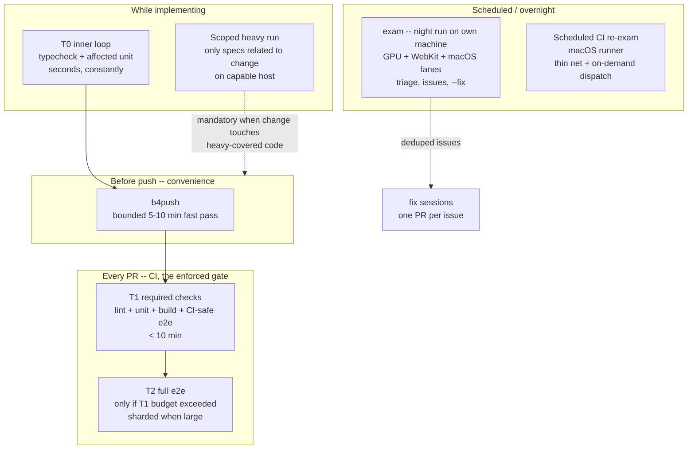

## The Second Axis

The rest of this guide is organized around the [6 testing levels](../testing-levels/index.mdx), which answer one question: **what can a test see?** A unit test sees pure logic; an E2E test sees a real browser. But the levels say nothing about a different question: **where and when does the test run?**

That question has its own axis: the **execution tier**.

- **Level** = what the test can see (logic, DOM, build output, browser, pixels)
- **Tier** = where and when it runs (inner loop, PR CI, a schedule, a local heavy lane)

Every test has a position on both axes. A pixel-level L5 spec can run on every PR if the runners can render it, or on a nightly schedule if it needs a real GPU. A plain L1 unit test almost always lives in the inner loop and the PR gate.

Keeping the axes separate dissolves a common escalation mistake: when an E2E test feels "too heavy for PR CI", that is not a reason to rewrite it at a lower level. **"Too heavy" is a tier question, not a level question.** The level is fixed by what the assertion needs to see; the tier is chosen by cost, hardware, and timing. When a specific test genuinely is too heavy, apply the [Heavy Test Decision Rule](./heavy-test-decision.mdx) -- it first asks whether the test should exist at its level at all, and only then moves it between tiers.

## Verification vs Regression

A test's tier follows from its job, and there are exactly two jobs. Conflating them is the root cause of most bloated CI pipelines.

- A **verification artifact** is a one-time **"it was done"** proof. It exists to show that a change worked when it landed. It may be manual, an L5 screenshot, even an L6 AI judgment -- determinism is not required, because it will never run again. It belongs to **no gate**.
- A **regression gate** is a repeatable, deterministic **"everything still works"** proof. Anyone must be able to run it, it must produce the same verdict every time, and it must live in a tier with a paper trail -- a required check, a CI run log, a scheduled job result.

Tests **graduate** from verification to regression **explicitly -- never by default**. The dangerous default is silent graduation: a one-off proof script lands in the test directory, the runner picks it up, and it becomes a permanent cost that nobody decided to pay. Graduation is a decision with three parts: the test is checked for determinism, assigned a tier, and weighed against that tier's time budget.

The enforceable agent rules around graduation -- verification specs are tagged and excluded from all gates, and an agent never promotes its own verification test -- live in [Required Testing Behavior](./required-behavior.mdx).

## The Five Tiers

| Tier | Name | Default? | Definition |
|------|------|----------|------------|
| T0 | Inner loop | default | typecheck, lint, single/affected unit tests; seconds; what the agent runs constantly; retries 0 |
| T1 | PR gate | default | required status checks: lint + typecheck + unit + build + CI-safe e2e; target < 10 min; **the authoritative gate**; e2e retries 1–2 with trace-on-first-retry |
| T2 | Full-e2e split | opt-in | only when T1 exceeds its time budget; prefer keeping it required on the PR; workers tuning before sharding (shard only at ~100+ tests AND 30+ min) |
| T3 | Scheduled re-exam | opt-in | heavy or environment/platform-bound tests on a schedule, on capable hardware (hosted macOS on Apple silicon; self-hosted runner only as escalation); `workflow_dispatch` for on-demand pre-merge runs; deduped issue filing on failure; also where quarantined `@flaky` tests run allowed-to-fail |
| T4 | Local heavy lane | opt-in | only for genuinely CI-impossible lanes; split into a bounded fast pre-push pass (`b4push`, 5–10 min) and an opt-in platform-gated heavy run (`exam`); convenience, not enforcement |

### T0 + T1: the defaults

Every project gets T0 and T1, no justification needed. T0 is feedback speed -- what the agent runs constantly while implementing. T1 is **the authoritative gate**: a PR is mergeable when its required checks are green, and nothing outside the required checks blocks a merge. Everything above T1 exists to serve it, not to replace it.

### T2: full-e2e split -- only when T1 overflows

The trigger is concrete: T1 exceeds its ~10 minute budget. Even then, prefer keeping the split e2e suite required on the PR. Tune the runner's worker count before reaching for sharding -- shard only at roughly 100+ tests **and** 30+ minutes of runtime.

### T3: scheduled re-exam -- for tests CI runners cannot judge on every PR

The trigger is a test that is heavy, or bound to an environment or platform that PR runners cannot provide. T3 runs on a schedule, on capable hardware: prefer hosted macOS on Apple silicon; a self-hosted runner is an escalation, not a starting point. A `workflow_dispatch` trigger makes the same job available on demand before merging a risky change. Failures file deduplicated issues instead of blocking PRs, and quarantined `@flaky` tests run here allowed-to-fail. The concrete implementation is described in [Scheduled Re-exam and Night Exam](../real-world-patterns/scheduled-re-exam.mdx).

### T4: local heavy lane -- convenience, not enforcement

T4 exists only for genuinely CI-impossible lanes. It splits into a bounded fast pre-push pass (`b4push`, 5–10 minutes) and an opt-in, platform-gated heavy run (`exam`). Because anything local can be bypassed -- by humans and by AI agents alike -- T4 is a convenience layer and never a substitute for T1 or T3.

## Execution Surfaces

The diagram shows the four surfaces a test can run on. The PR column is the only **enforced** gate; the implementing and pre-push surfaces are feedback loops, and the scheduled surfaces are a safety net for what CI runners cannot judge per-PR. Note the dotted edge: when a change touches code that is covered only by heavy-lane tests, a scoped heavy run on a capable host is mandatory before push -- the agent must not declare the work done on the strength of T0/T1 alone.

## Retry Budgets

| Where | Retry budget |
|-------|--------------|
| Local (T0, T4) | 0 |
| CI (T1–T3) | 1–2, with trace recording on the first retry |

Two rules keep retries honest:

- **Pass-on-retry is a triage signal, not a success.** The test is telling you it is nondeterministic; record it and schedule the fix.
- **More than 2 retries is a smell.** At that point you are paying compute for nondeterminism instead of fixing it.

## The Migration Rule

<Warning>
A test may leave the local heavy lane **only after** its T2/T3 destination has run it green at least once on the target hardware. **Never slim the local gate first.**
</Warning>

The ordering matters: if you slim the local gate first and the CI destination then turns out to be incapable of running the test, the test now runs nowhere -- and its coverage silently disappears.

## Which Tiers Does a Project Need?

The table below maps by archetype. But archetype is only half the picture -- **project maturity** is the other dimension.

| Project archetype | Tiers |
|-------------------|-------|
| Small CLI / library | T0–T1 only |
| Static docs site | T0–T1 |
| Canvas/GPU-heavy web app | T0–T3 + T4 |
| Tauri desktop app | T0–T1 + T3 + T4 |

<Note>
Most projects stop at T0+T1. The opt-in tiers exist for specific trigger conditions, not as aspirational infrastructure -- **do not scaffold unused tiers.**
</Note>

### Pre-release / WIP: T3 is deferrable

For a project that has not yet shipped to users, **T3 (scheduled rich CI) can be deferred**. Standing up T3 early is not cost-justified: hosted-macOS Actions minutes and self-hosted GPU runners cost real money for a project nobody uses yet, and the `cron exam.yml` + `file-exam-issue.sh` infrastructure is non-trivial to maintain while the product surface is churning daily.

The interim heavy-lane safety net is **T4 (local exam lane)**. Run the heavy specs locally on a capable machine; the nightly `exam` run surfaces regressions before they accumulate.

**Adopt T3 at or after cutover (release)**, when the project has users whose regressions justify the standing infrastructure cost.

<Warning>
The T3 deferral is time-boxed to release -- it is not a permanent arrangement. A human-remembered local lane will eventually fail. See [Scheduled Re-exam and Night Exam](../real-world-patterns/scheduled-re-exam.mdx) for why a local-only heavy lane cannot serve as a permanent safety net.
</Warning>

## Three Cases

### Case A: a CLI that never needed more than T1

A markdown formatter CLI keeps its entire regression surface in a shared fixture corpus that runs in seconds, so T0+T1 covers everything. That gate proved strong enough to enable a full TypeScript-to-Rust rewrite: the corpus, running on every PR, verified behavioral equivalence while the implementation was swapped underneath. No T2–T4 was ever scaffolded, because there was nothing heavy to put there.

### Case B: pixel specs no PR runner can judge

A canvas/GPU-heavy pattern-generation web app has pixel-level specs that fail on software-rendering CI runners. This is environment-incapability, not slowness -- and demotion does not help, because a component test would run in the same GPU-less environment. The specs live in the local heavy lane (T4) and a scheduled re-exam on capable hardware (T3), while T1 keeps everything that does not need a real GPU.

### Case C: keyboard specs only real macOS can be trusted with

A Tauri text-editor app has keyboard-shortcut e2e specs that are only trustworthy on real WebKit/macOS. The frontend keeps mocked-IPC tests in T1; the platform-bound specs run on a scheduled macOS job (T3) with on-demand dispatch, plus the local heavy lane (T4) on a capable machine.

## Related Pages

- [Heavy Test Decision Rule](./heavy-test-decision.mdx) -- the per-test procedure: demote, delete, or assign a tier by asking *why* it is heavy
- [Scheduled Re-exam and Night Exam](../real-world-patterns/scheduled-re-exam.mdx) -- the concrete T3/T4 implementation pattern
- [Required Testing Behavior](./required-behavior.mdx) -- the enforceable agent rules, including graduation and anti-gaming
