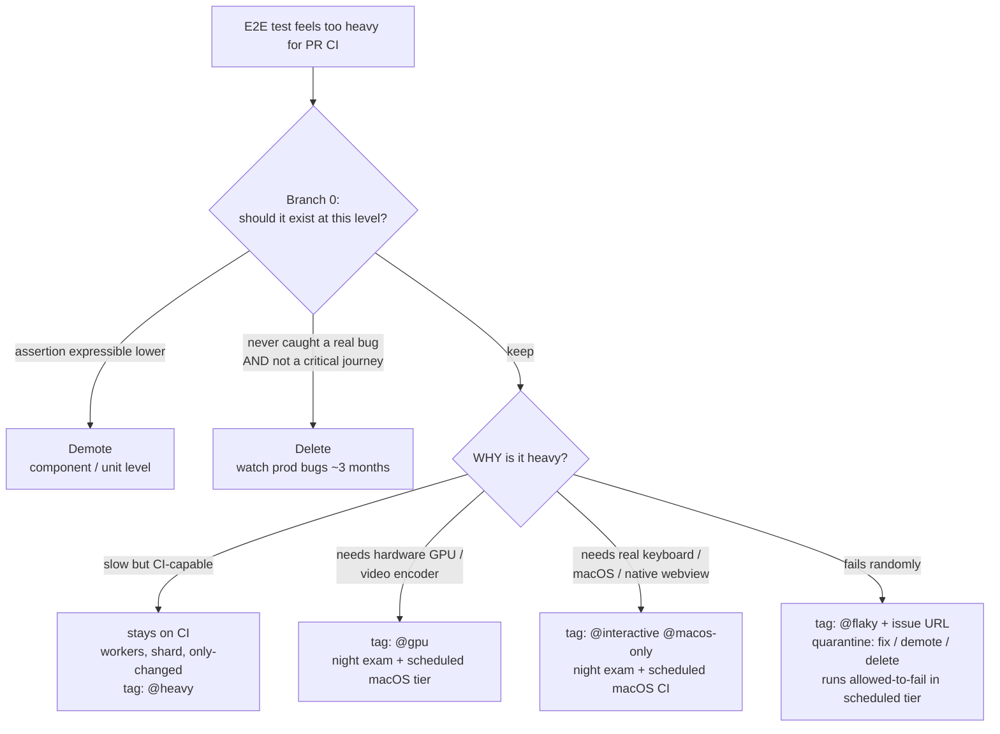

## The Question This Page Answers

Sooner or later, every project with E2E tests hits the same moment: a test looks valuable, but it is too slow, too hardware-dependent, or too unreliable for the PR gate. The instinctive question is "where else can this test run?" — but that is the *second* question. Where and when a test runs is a tier question, answered by [Execution Tiers](./execution-tiers.mdx). The *first* question is whether the test deserves a tier at all.

Every heavy test leaves this page through one of three exits:

- **Fix** — keep the test, classify *why* it is heavy, and assign it the matching tier (if the test is flaky, see [Flake Root-Cause Catalog & Deflaking Recipe](../real-world-patterns/deflaking-recipe.mdx))
- **Demote** — rewrite the assertion at a lower testing level
- **Delete** — remove the test and watch what happens

<Warning>

**A strategy that only finds homes for heavy tests will faithfully preserve tests that should die.** If the decision rule has no demote and delete branches, every slow, redundant, or worthless test gets carried into a scheduled tier and runs forever at real cost. Branch 0 exists to filter those tests out first.

</Warning>

## Branch 0: Before Assigning Any Tier

Before classifying a heavy test by its heaviness, ask two questions in order.

### (a) Is the assertion expressible at a lower level?

If what the test actually asserts can be expressed by a component test or a unit test, **demote it**. A 90-second browser flow that ends in "the computed total equals 42" is a unit test wearing an E2E costume. Demotion makes the assertion faster, more deterministic, and cheaper — with no loss of meaning.

### (b) Has it never caught a real regression, and is it not a critical user journey?

Establish "never caught a real regression" with evidence, not a guess: search CI failure history, linked issues, and commit messages that reference the spec by name. A spec less than roughly six months old has not accumulated enough history to answer this question either way — treat that as insufficient evidence, not as a "never caught" verdict.

**Safe default:** when the evidence cannot be established — too young, or no accessible failure history — treat the test as if it *has* caught something, and route it to the **Fix** branch, not deletion. A wrong "keep" costs a bit of CI time; a wrong "delete" costs silently lost coverage.

If both are true — an evidence-backed "never caught" **and** not a critical user journey — **delete it** — then watch the production bug rate for roughly three months. If nothing surfaces that the test would have caught, it was dead weight. If something does, you have learned exactly which assertion matters, and you can write a better, cheaper test for it.

Only survivors of Branch 0 get a tier.

## The Decision Flow



## Classify by Why It Is Heavy

"Too heavy" is not one condition. There are four distinct reasons a test can feel too heavy for PR CI, and each demands a different treatment. Conflating them is how projects end up with tests that are local-only (bypassable), deleted out of frustration, or scheduled when they could have stayed on the PR.

### 1. Slow but CI-capable

The test runs fine on CI runners — it just takes long. This category **stays on CI**:

- Tune test-runner **workers** first; parallelism is the cheapest win
- **Shard** across runners only past roughly 100 tests *and* 30 minutes of runtime
- Use `--only-changed` as a lossy PR prefilter, backstopped by a scheduled full run

Tag: `@heavy`. Never make this category local-only — slowness alone is not a reason to leave the enforced gate. For the underlying trade-offs of tuning workers, sharding, and sizing the runner itself, see [CI Runner Sizing](../tools-reference/ci-runner-sizing.mdx).

### 2. Environment-incapable

The test needs hardware the CI runner does not have: a real GPU, a hardware video encoder. Software rendering on a standard CI runner produces different pixels, so pixel-level assertions fail for environmental reasons, not product reasons. Case B — a canvas/GPU-heavy pattern-generation web app whose pixel-level specs fail on software-rendering CI runners — is the canonical example.

The treatment is the **scheduled tier (T3) on capable hardware**, plus the local heavy lane.

<Note>

**Demotion does not help here.** A component test runs in the same GPU-less environment as the E2E test — moving the assertion down a level changes nothing about the hardware it executes on. This is the one category where the lower-level rewrite, normally the cheapest exit, is structurally unavailable.

</Note>

### 3. Platform-incapable

The test is only trustworthy on a specific platform: real OS keyboard delivery, a native webview, macOS-only behavior. Case C — a Tauri text-editor app whose keyboard-shortcut e2e specs are only trustworthy on real WebKit/macOS — is the canonical example.

The treatment is a **layered split**, not one monolithic heavy suite:

1. **Mocked-IPC frontend tests** — the webview UI logic against a mocked native bridge; CI-safe, stays in the PR gate
2. **Native-side mock-runtime tests** — the native layer's logic against a mock runtime; also CI-safe
3. **A thin native-integration layer** — the few specs that genuinely need the real platform; tagged `@interactive` / `@macos-only`, run as a T3 scheduled macOS job with on-demand `workflow_dispatch` for pre-merge escalation

Most of the suite's protection moves into the CI-safe layers; only the thin remainder is scheduled. See [Scheduled Re-exam and Night Exam](../real-world-patterns/scheduled-re-exam.mdx) for how that scheduled job is built.

### 4. Flaky — Not a Heaviness Category at All

A test that fails randomly is not heavy — it is broken. Flakiness routinely gets misfiled as heaviness ("it needs retries, it slows the pipeline down") and shipped off to a scheduled tier, where it keeps flaking with even less visibility. Flaky tests go to the quarantine pipeline below — with a deadline, not a new home.

## Tag Taxonomy

The classification result is recorded as a tag on the test itself, so the tier mapping stays mechanical and grep-able:

| Tag | Meaning | Tier |
|---|---|---|
| (untagged) | CI-safe; the default for every new e2e test | T1/T2 |
| `@smoke` | critical-journey subset (optional) | T1 |
| `@heavy` | slow but CI-capable | T2/T3 |
| `@gpu` | needs hardware GPU / video encoder | T3 + local heavy |
| `@interactive` | needs real keyboard / shortcut engine | T3 (macOS) + local heavy (macOS) |
| `@macos-only` | trustworthy only on real macOS | T3 (macOS) |
| `@flaky` | quarantined; inline issue URL required | T3 allowed-to-fail |
| `@verification` | one-time proof artifact | no gate |

`@verification` marks one-time proof artifacts — specs written to prove a change worked once, not to guard it forever. They belong to no gate; see [Required Testing Behavior](./required-behavior.mdx) for how promotion from verification to regression must happen.

Whether a `@heavy`-tagged test's T2/T3 lane runs on every PR or only at release boundaries is a branch-topology decision, not a tagging one — see [Release Rounds: A develop→main Branch Strategy](../real-world-patterns/release-rounds-branch-strategy.mdx) for gating the lane by base branch and cost-controlling it that way.

## Classifying a New Test: Mechanical Rules

For a *new* test, classification must not require judgment. Apply the first rule that matches:

1. Reads pixels or depends on GPU timing → `@gpu`
2. Needs the OS to deliver real keyboard events → `@interactive`
3. Trustworthy only on a specific OS or native webview (behavior differs on CI's browser build) → `@macos-only`
4. Runtime over ~60 seconds, or a multi-minute flow → `@heavy`
5. Otherwise → **untagged**

The default matters most: **a new e2e test is untagged and CI-safe unless one of these rules forces a tag.** An agent (or a developer) never starts from "which special tier does my test deserve?" — it starts from "my test runs in the PR gate" and tags only when a rule fires.

`@smoke` is the one tag in the taxonomy these rules do not reach. It is assigned manually, after the fact, to curate a critical-journey subset out of the already-untagged pool — not by any mechanical trigger on a new test.

## Same Rules, Rust Syntax

The tag taxonomy above is Playwright's title-substring convention. A Rust/cargo project has no test titles to substring-match, but `#[ignore = "..."]` reason strings carry the same information, attached to the test itself instead of its name — a mechanical, greppable classification that mirrors the table above row by row:

| Playwright tag | Rust `#[ignore = "..."]` reason | Meaning | Tier |
|---|---|---|---|
| (untagged) | (no `#[ignore]`) | CI-safe; the default | T1/T2 |
| `@heavy` | `heavy: <why>` | slow but CI-capable, budget-exceeding | T2/T3 |
| `@gpu` / `@interactive` | `env-gate: <why>` | needs an env var, credential, or service the PR runner does not have | T3 + local heavy |
| `@macos-only` | `#[cfg(target_os = "macos")]` | trustworthy only on a specific OS | T3 (macOS) |
| `@flaky` | `flaky: <issue-url>` | quarantined; still runs allowed-to-fail in the exam lane | T3 allowed-to-fail |
| `@verification` | `verification: <why>` | one-time proof artifact | no gate |
| *(no Playwright tag)* | `pending-feature: <why>` | written ahead of a feature that does not exist yet | no gate until the feature ships |

```rust
#[test]
#[ignore = "env-gate: needs STRIPE_TEST_KEY, unavailable on PR runners"]
fn charges_a_test_card() { /* ... */ }

#[test]
#[ignore = "heavy: full fixture-corpus regen, ~4 min"]
fn regenerates_the_entire_fixture_corpus() { /* ... */ }

#[test]
#[ignore = "pending-feature: waiting on the export-to-pdf command"]
fn exports_the_document_as_pdf() { /* ... */ }
```

`env-gate:` generalizes `@gpu` / `@interactive` beyond hardware: a Rust integration test far more often needs a secret or a live external service than a GPU. `pending-feature:` has no Playwright counterpart above — it is the Rust-side answer to writing a test before the feature it asserts exists, so intent gets documented in the suite without ever going red on `main`.

`#[ignore]` skips execution, not compilation — a `pending-feature:`-ignored test still has to compile today. If the assertion needs a symbol or API that does not exist yet, the crate fails to build whether the test is ignored or not; write it as a black-box check (CLI invocation, HTTP call, file output) that compiles now and only fails at runtime until the feature ships.

### Same Classification Rules

Apply the first rule that matches — same sequencing as [Classifying a New Test: Mechanical Rules](#classifying-a-new-test-mechanical-rules) above:

1. Needs an env var, credential, or external service the PR runner cannot provide → `env-gate:`
2. Trustworthy only on a specific OS or native toolchain → `#[cfg(target_os = "...")]`, not `#[ignore]` (see below)
3. Runtime over budget → `heavy:`
4. Fails randomly, after confirming Step 0 of quarantine (below) → `flaky:<issue-url>`
5. One-time proof, not a permanent regression gate → `verification:`
6. Asserts a feature that does not exist in the codebase yet → `pending-feature:`
7. Otherwise → no `#[ignore]`; the test runs on every `cargo nextest run`

When a rule produces a `#[ignore]`d test and the scheduled exam selects its tests by **exact name** -- a cargo/nextest `-E 'test(=...)'` filterset is an allowlist -- tagging the test is not the last step: adding its fully-qualified name to that filterset is a second one, and only an [ignored-test-manifest parity check](../real-world-patterns/scheduled-re-exam.mdx#ignored-test-manifest-parity-a-sibling-inventory-contract) makes forgetting it impossible.

### Same Graveyard Warning

An `#[ignore = "..."]` reason string that names a lane but has no job that actually runs it is the same graveyard warned about for `@flaky` above. Two of the six reasons are graveyard-prone in a way `@flaky` is not: `env-gate:` and `pending-feature:` have no natural re-trigger — nothing fires when "the PR runner cannot provide this" or "the feature shipped" stops being true, the way a scheduled run keeps firing for `flaky:`. Both need a tracking issue exactly like `flaky:` does, or the ignore reason quietly outlives the condition it described.

### Platform-Boundness Is a Compile-Time Decision Here, Not a Runtime One

The `@macos-only` rule says "trustworthy only on real macOS, run in T3." Rust's mirror is `#[cfg(target_os = "macos")]`, not another `#[ignore]` reason string — and it is a stronger boundary. `#[ignore]` still compiles the test into every binary and only skips it at runtime, so a broad `--run-ignored` invocation can still schedule it on the wrong platform if a reason-string filter is loose or missing. `#[cfg(target_os = "macos")]` removes the test from non-macOS binaries at compile time — it cannot run on the wrong platform even by mistake. Combine both when a macOS-only test is also gated on something else:

```rust
#[cfg(target_os = "macos")]
#[test]
#[ignore = "env-gate: needs the macOS Keychain, unavailable on hosted Linux/Windows runners"]
fn reads_the_saved_credential_from_keychain() { /* ... */ }
```

See [Migrating a Rust Suite to cargo-nextest](../real-world-patterns/cargo-nextest-migration.mdx#executing-the-taxonomy) for how each reason string above turns into an actual nextest execution lane.

## The Quarantine Pipeline for `@flaky`

Quarantine is a pipeline with an exit, not a parking lot:

**Step 0 of quarantine:** verify the test has ever passed (not pass-by-skip) on some host; if it cannot pass, it is **broken, not flaky** — fix or delete immediately, no quarantine.

Before entering the pipeline, confirm there is at least one verifiable green run of the exact assertion on any CI host. Pass-by-skip does not count — Playwright reports skips as `-` rather than `✓`, so check the distinction carefully. A test that has never produced a genuine green run is not flaky; it is broken. Sending it to quarantine would suspend product coverage without any chance of recovery. Note that this step is distinct from Branch 0 (which asks whether the test deserves a tier at all): Step 0 asks whether the test can even pass anywhere. See [Playwright Patterns](../real-world-patterns/playwright-patterns.mdx) for notes on `test.skip` preconditions — a precondition that "should always hold" must be a hard assertion, not a conditional skip that can silently degrade into a permanent vacuous green.

**Step 0.5 of quarantine:** prove the nondeterminism is in the **test**, and not in the **product**. If the product is what varies, the test is not flaky — it is *correctly failing, intermittently*, and quarantining it buries a real bug.

Step 0 does **not** cover this: a test sampling a genuine product bug *does* pass sometimes, so "has it ever passed?" waves it straight through. The check is cheap — **log the product's input on a failing run and diff it against a passing one.** Identical inputs + different outcome → a real flake, proceed. **Different inputs → a product bug, stop and fix the product.** A failure that correlates with the *platform* (one OS, one filesystem, one watcher backend, one CPU architecture) rather than with load or ordering is a product-bug smell, not a timing smell. Full worked case and the diagnostic: [The impostor: when the "flake" is a real product bug](../real-world-patterns/deflaking-recipe.mdx#part-1-—-root-cause-catalog-the-impostor-when-the-flake-is-a-real-product-bug).

<Danger>

This is the step an autonomous agent skips. The quarantine pipeline is *designed* to feel responsible — inline issue URL, manifest row, scheduled allowed-to-fail lane — so an agent that follows it faithfully produces an immaculate paper trail around a live defect. In one real case the filed issue itself, written by an agent correctly following this pipeline, recommended `#[ignore]` as step 1; the bug it was hiding was a silent per-edit performance regression affecting every user on that OS. **The pipeline's own thoroughness is what makes this failure mode dangerous. Gate it here.**

</Danger>

1. **Tagging requires a paper trail.** `@flaky` is only valid with an inline issue URL right next to it:

   ```ts
   // quarantined: https://github.com/your-org/your-app/issues/123
   test("drag preview follows cursor @flaky", async ({ page }) => {
     // ...
   });
   ```

2. **Excluded from strict gates.** A quarantined test must not block a PR — otherwise quarantine means nothing.
3. **It still runs — allowed-to-fail — in the scheduled tier.** A `@flaky` tag that runs nowhere is a graveyard: results stop being collected and the test silently rots. Running allowed-to-fail in T3 keeps fresh failure data flowing into the tracking issue. On GitHub Actions, implement allowed-to-fail with an explicit exit-code capture, **not** `continue-on-error` (see [Scheduled Re-exam § Flake Telemetry Mechanics](../real-world-patterns/scheduled-re-exam.mdx#flake-telemetry-mechanics)).
4. **Fix, demote, or delete — with a deadline.** The exits are the same three as Branch 0. If nobody fixed it by the deadline, it was not worth fixing: demote it or delete it. For the **Fix** path, see [Flake Root-Cause Catalog & Deflaking Recipe](../real-world-patterns/deflaking-recipe.mdx) — it covers the seven causes of E2E flakiness and the mechanical steps to eliminate each one.

<Tip>

A test that only passes on retry belongs in this pipeline too — pass-on-retry is a triage signal, not a success.

</Tip>

<Note>

**Quarantining a Rust/cargo flake — the same pipeline, no test-title grep.** The pipeline above is described with Playwright's `@flaky`-title-substring convention, but the three mechanics are language-agnostic. On a Rust/cargo project, `#[ignore]` provides all three directly:

```rust
// quarantined: https://github.com/your-org/your-app/issues/123
#[test]
#[ignore = "flaky: https://github.com/your-org/your-app/issues/123"]
fn drag_preview_follows_cursor() {
    // ...
}
```

- **Paper trail.** The `#[ignore = "..."]` reason string keeps the mandatory inline issue URL right next to the test — the cargo analogue of the `@flaky`-title-substring convention.
- **Excluded from the strict gate.** `cargo test` skips `#[ignore]` tests by default, so a quarantined flake no longer blocks the gate — the analogue of `--grep-invert "@flaky"`.
- **It still runs somewhere, allowed-to-fail.** `cargo test -- --ignored` runs the ignored set and `cargo test -- --include-ignored` runs everything; schedule one as a T3 allowed-to-fail job so fresh failure data keeps flowing into the tracking issue. Caveat: `--ignored` matches *every* `#[ignore]` test, so if your suite also uses `#[ignore]` for slow or manual tests, narrow the run with a name filter (e.g. `cargo test flaky_ -- --ignored` over a naming convention) so unrelated ignored tests do not pollute the flake signal — `#[ignore]` is a broader marker than the flake-specific `@flaky` title substring. On GitHub Actions, implement allowed-to-fail with an explicit exit-code capture, **not** `continue-on-error` (see [Scheduled Re-exam § Flake Telemetry Mechanics](../real-world-patterns/scheduled-re-exam.mdx#flake-telemetry-mechanics)).

Once this suite also adopts the guide's retry budget and pass-on-retry telemetry, plain `cargo test` can no longer implement the policy — it has no retry mechanism, per-test timeout, or stable machine-readable output. See [Migrating a Rust Suite to cargo-nextest](../real-world-patterns/cargo-nextest-migration.mdx), whose checklist runs exactly this `#[ignore]` quarantine as `cargo nextest run --run-ignored ignored-only`.

</Note>

<Warning>

**Quarantine suspends product coverage, not just test coverage.** While a test is quarantined, the behavior it guards is unguarded — regressions in that behavior will not be caught until the test is fixed. Treat every quarantine fix as two verifications: first confirm the test mechanics are sound, then confirm the product behavior itself still holds. A fixed flake that immediately fails for a *different* reason is the pipeline working correctly, not a fix gone wrong.

Worked case: a drag-and-drop spec was quarantined because Playwright-WebKit never reliably commits native HTML5 drops — a mechanical flake. While it sat in quarantine, the asserted behavior had silently broken: the feature's backend was deleted in a refactor, and the regression shipped unnoticed for days.

</Warning>

### Verifying a Re-placement or Fix

Confirming the test mechanics are sound (the first of the two verifications above) has its own three traps — all of them surface specifically when deciding whether a quarantined test is ready to leave quarantine, or whether a re-placement into a different tier actually holds.

**Burn-in proves determinism, not CI-capability.** Running a test N times in a loop locally (`--repeat-each=N` in Playwright) proves the test is deterministic *on the machine that ran it*. It does not prove the test is CI-capable — CI is a different environment, with a different filesystem layout, different environment variables, and different resource limits. Treat burn-in and a real CI run as two separate, both-required signals:

- **Burn-in** (`--repeat-each=N`) — proves the test is not internally non-deterministic
- **A real CI run** — proves the test tolerates the CI environment itself

Worked case: during a quarantine-tag refactor, four tests passed a local burn-in N/N — genuinely deterministic — yet rendered deterministically-empty data the moment they ran inside the CI container. Local burn-in alone would have cleared them for un-quarantining; only the real CI run caught the gap.

<Warning>

**The simulated-environment fix trap.** Reproducing a CI-only failure locally by faking the suspected condition — an environment variable that simulates the CI-specific mechanism — can make a fix look confirmed when it actually validates a different mechanism than the real cause. Worked case: a fix was validated under a git-ownership simulation environment variable, then disproven by a real CI run — the simulation modeled a different mechanism than the one actually happening in CI. A fix validated only under a simulated environment condition must still be confirmed against the real environment before the test leaves quarantine.

</Warning>

**The un-ablated fix trap: a green burn-in does not tell you _which_ change fixed it.** Deflaking usually lands more than one edit at once — a test-harness change *and* a product change, or two harness changes. Run the suite afterwards, watch it go green N/N, and it is tempting to call the whole bundle load-bearing. It frequently is not: the cheap half fixed the symptom and the expensive half did nothing, or — far worse — the *test* half masked the failure while the real product bug shipped.

The check is mechanical: **turn each half off, one at a time, and re-run.** Whatever half you can disable while the suite stays green was not load-bearing.

```
fix A + fix B  -> 12/12 green   (tells you nothing about which half matters)
fix A only     -> 12/12 green   -> B was decoration
fix B only     ->  9/12 green   -> A is the real fix
```

Worked case: a macOS dev-server flake got two changes — a test-harness fix (stop creating files that trigger a full rebuild) and a product fix (handle an OS event shape the product mishandled). Burn-in went 12/12. Disabling *only the product fix* brought the flake straight back on the second run, with the original failure signature. Without that ablation the harness-only change would have shipped as "the fix", the suite would have been green, and the real product bug would have stayed live for every user on that OS — now invisible, because the test that caught it no longer failed.

Ablation is also the cheapest way to satisfy the second of the two verifications above (*confirm the product behavior itself still holds*): if disabling the product fix does **not** reproduce the failure, then the product fix was never what the test was testing.

### Dissolving an Overloaded Quarantine Tag

An overloaded tag — a catch-all conflating multiple, unrelated reasons a test doesn't run cleanly (non-determinism, slowness, environment-dependence), running in no scheduled tier, carrying no tracking issues — is the graveyard state warned about in Step 3 above, grown large across an entire tag. Dissolving one back into meaningful tags is mechanical:

1. **Split by meaning.** Replace the single catch-all with single-meaning tags: one for non-determinism (`@flaky`), one for slowness (`@heavy`), one for environment-dependence (`@gpu` / `@interactive` / `@macos-only`, per [Classify by Why It Is Heavy](#classify-by-why-it-is-heavy)).
2. **Require a tracking issue per surviving tag.** No tag survives the split without an inline issue URL — the same paper-trail rule as `@flaky` above.
3. **Clear determinism via burn-in.** For each test now tagged `@flaky`, run a local burn-in to confirm it is genuinely non-deterministic. A test that comes back deterministic was misfiled — it belongs under `@heavy` or an environment tag instead.
4. **Let a real CI run decide CI-capability.** Burn-in alone cannot clear a test for return to the PR gate — see [Verifying a Re-placement or Fix](#the-quarantine-pipeline-for-flaky-verifying-a-re-placement-or-fix) above.

## Where to Go Next

- [Execution Tiers](./execution-tiers.mdx) — the definitions of T0–T4 and when a project should adopt each one
- [Scheduled Re-exam and Night Exam](../real-world-patterns/scheduled-re-exam.mdx) — how the scheduled tier (T3) is actually built: cron, macOS runners, deduped issue filing, on-demand dispatch
- [CI Runner Sizing](../tools-reference/ci-runner-sizing.mdx) — runner shapes, pricing, and the four sizing rules that decide when a bigger or different runner actually helps
- [Release Rounds: A develop→main Branch Strategy](../real-world-patterns/release-rounds-branch-strategy.mdx) — gating heavy (T2/T3) lanes by base branch instead of running them on every PR
- [Required Testing Behavior](./required-behavior.mdx) — the agent-facing rules: never tag `@flaky` without a linked open issue, promote verification specs explicitly, and more
