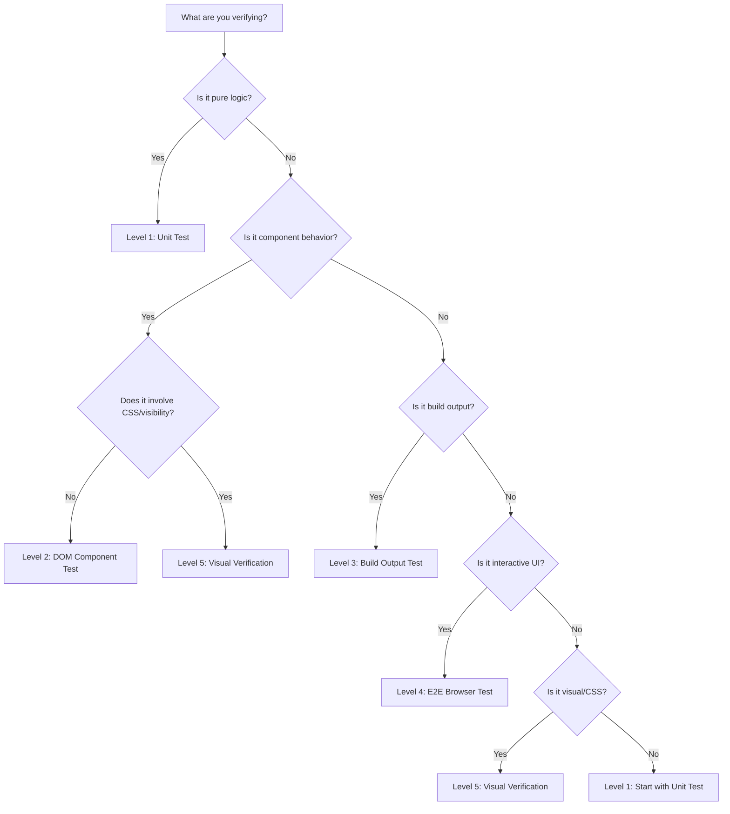

## Quick Decision Table

Use this table to determine the minimum testing level for your current task:

| What Changed | Minimum Level | Why |
|-------------|--------------|-----|
| Pure logic / utility function | Level 1 | No DOM or CSS involvement |
| Component props / state | Level 2 | Need simulated DOM to verify output |
| Build config / template / SSG | Level 3 | Need to inspect built output files |
| CSS / layout / visibility | Level 5 | CSS requires real rendering engine |
| Interactive UI flow | Level 4 | Need real browser for user interactions |
| Visual bug report | Level 5 | Must see computed styles + visual result |
| "It's not showing" | Level 5 | Visibility is a visual property |
| "It's still broken" (after test passed) | Next level up | Current level has blind spot for this bug |

<Warning>
**"Minimum level" means the lowest level that can reliably catch the bug.** Using a lower level gives false confidence -- the test passes, but the bug remains.
</Warning>

## Decision Flowchart

## Key Principle: CSS Always Needs Level 5

Any change involving CSS, layout, or visual appearance should default to Level 5. This is because:

1. **Level 1** (unit tests) -- has no DOM at all, cannot process CSS
2. **Level 2** (jsdom) -- has a DOM but no CSS engine; `getComputedStyle()` returns empty strings
3. **Level 3** (build output) -- checks file contents, not rendering
4. **Level 4** (Playwright) -- runs in a real browser but typically asserts on DOM state, not visual appearance

Only Level 5 (verify-ui + headless-browser) can deterministically check computed style values and visually confirm the result.

## Escalation Triggers

Move to the next level when:

- Test passes but user says problem persists
- You are testing logic but the bug might be visual
- Lower-level test confirms data is correct but output looks wrong
- You suspect a CSS or layout issue
- Multiple lower-level tests pass but the feature does not work in the browser
