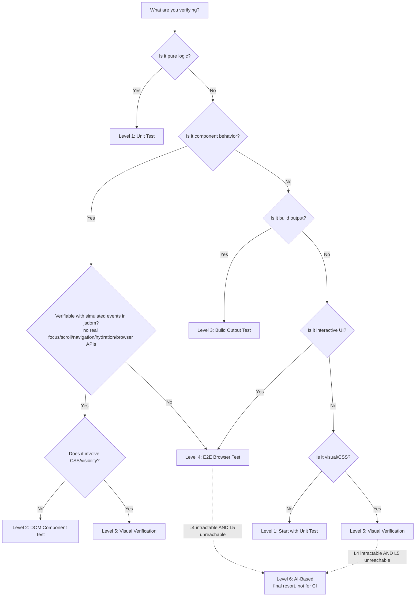

Use this table to determine the minimum testing level for your current task:

| What Changed | Minimum Level | Why |
|-------------|--------------|-----|
| Pure logic / utility function | Level 1 | No DOM or CSS involvement |
| Component props / state | Level 2 | Need simulated DOM to verify output |
| Build config / template / SSG | Level 3 | Need to inspect built output files |
| CSS / layout / visibility | Level 5 | CSS requires real rendering engine |
| Interactive UI flow | Level 4 | Need real browser for user interactions |
| Visual bug report | Level 5 | Must see computed styles + visual result |
| "It's not showing" | Level 5 | Visibility is a visual property |
| "It's still broken" (after test passed) | Next level up | Current level has blind spot for this bug |
| Canvas / photo-editor / zoom-resize surface where L4 is intractable AND L5 cannot reach | Level 6 (final resort) | Neither E2E nor mechanical visual can express the assertion |

<Warning>

**"Minimum level" means the lowest level that can reliably catch the bug.** Using a lower level gives false confidence -- the test passes, but the bug remains.

</Warning>

## Decision Flowchart

**The L2-vs-L4 discriminator:** "component behavior" alone does not decide the level. If the behavior can be verified with simulated events in jsdom -- a plain dispatched event, no real focus, scroll, navigation, hydration, or other browser API -- it is Level 2. If it needs any of those real browser primitives, jsdom cannot simulate it convincingly enough to trust a passing test, so it is Level 4.

## Key Principle: CSS Always Needs Level 5

Any change involving CSS, layout, or visual appearance should default to Level 5. This is because:

1. **Level 1** (unit tests) -- has no DOM at all, cannot process CSS
2. **Level 2** (jsdom) -- has a DOM but no CSS engine; `getComputedStyle()` returns default, cascade-less values -- no layout is performed and no stylesheet cascade is applied, so it cannot verify real CSS
3. **Level 3** (build output) -- checks file contents, not rendering
4. **Level 4** (Playwright) -- runs in a real browser, but a spec written the typical way asserts DOM state, not computed style or pixel output

This is a distinction about what the assertion checks, not what the tool can do: Playwright itself can assert computed styles (`toHaveCSS`) and take screenshots (`toHaveScreenshot`) just as deterministically as any Level 5 tool. A spec that asserts DOM state is doing Level 4 work; a spec that asserts computed style values or visual output is doing Level 5 work, whichever runner executes it. The rule stands regardless: **CSS changes need Level 5-type verification.**

## Escalation Triggers

Move to the next level when:

- Test passes but user says problem persists
- You are testing logic but the bug might be visual
- Lower-level test confirms data is correct but output looks wrong
- You suspect a CSS or layout issue
- Multiple lower-level tests pass but the feature does not work in the browser

## The L6 Escalation Rule

Escalation to [Level 6 (AI-based)](../testing-levels/level-6-ai-based-verification.mdx) is **not** part of the normal next-level progression. It requires **both** of these to be true at the same time:

1. **L4 is intractable.** Writing a clean E2E for this surface is genuinely infeasible — canvas-driven, multi-camera/zoom, stateful resize transforms, or similar — not just "harder than usual."
2. **L5 cannot reach the assertion.** There is no DOM element with a stable bounding rect, computed styles don't apply (the surface is `<canvas>`), and screenshot pixel-diff is too noisy.

If only one of the two is true, the right answer is the other level. L6 is the final resort, not "the next thing to try when L5 is hard."

## After Choosing a Level: Decide Where It Runs

Picking the right testing level answers what the test can see. A second decision remains: **where and when does the test run?** That is the execution tier — and it is a separate axis.

- [Execution Tiers](./execution-tiers.mdx) — defines T0 (inner loop) through T4 (local heavy lane), when each applies, and the migration rule for moving tests between tiers.
- [Heavy Test Decision Rule](./heavy-test-decision.mdx) — the per-test procedure for a test that feels too heavy for PR CI: demote, delete, or classify by *why* it is heavy and assign the matching tier.
