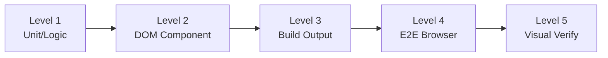

## Overview

Frontend testing is not a single activity -- it is a spectrum of verification methods, each with different capabilities and blind spots. This section defines five distinct levels, ordered by the scope of what they can verify.

## Summary Table

| Level | Name | Tools | Can Verify | Blind Spots |
|-------|------|-------|-----------|-------------|
| 1 | Unit/Logic | vitest, jest | Pure functions, data transforms, state logic | DOM, CSS, rendering |
| 2 | DOM Component | vitest + jsdom, Testing Library | Component output, props, DOM structure | Visual rendering, CSS |
| 3 | Build Output | vitest on built files | SSG output, templates, bundler config | Runtime behavior, visuals |
| 4 | E2E Browser | Playwright, headless-browser | User interactions, navigation, full page | Subtle visual details |
| 5 | Deterministic + Visual | verify-ui + headless-browser | Computed styles, pixel-level rendering | Minimal blind spots |

## The Escalation Rule

<Warning>
When a test at the current level passes but the user reports the problem persists, do **not** re-run the same test. Escalate to the next level.
</Warning>

The levels are ordered by coverage breadth. Each higher level catches categories of bugs that lower levels structurally cannot detect. For example, a unit test cannot catch `overflow: hidden` hiding an element, because unit tests do not process CSS at all.

## Choosing the Right Level

Not every task requires Level 5. The goal is to match the test level to the nature of the change:

- **Logic changes** -- Level 1 is sufficient
- **Component behavior** -- Level 2 covers it
- **Build configuration** -- Level 3 targets it
- **Interactive flows** -- Level 4 is needed
- **Visual/CSS bugs** -- Level 5 is required

See the [Decision Guide](/pj/zudo-test-wisdom/docs/decision-guide) for a detailed mapping table.
