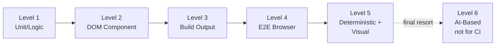

## Overview

Frontend testing is not a single activity -- it is a spectrum of verification methods, each with different capabilities and blind spots. This section defines six distinct levels, ordered by the scope of what they can verify. Levels 1–5 are deterministic; Level 6 is an AI-judged final-resort tier reserved for surfaces the lower levels cannot reach.

## Summary Table

| Level | Name | Tools | Can Verify | Blind Spots |
|-------|------|-------|-----------|-------------|
| 1 | Unit/Logic | vitest, jest | Pure functions, data transforms, state logic | DOM, CSS, rendering |
| 2 | DOM Component | vitest + jsdom, Testing Library | Component output, props, DOM structure | Visual rendering, CSS |
| 3 | Build Output | vitest on built files | SSG output, templates, bundler config | Browser runtime behavior, visuals |
| 4 | E2E Browser | Playwright, headless-browser | User interactions, navigation, full page | Subtle visual details |
| 5 | Deterministic + Visual | verify-ui + headless-browser | Computed styles, pixel-level rendering | Minimal blind spots |
| 6 | AI-Based Visual (final resort, **not for CI**) | verify-ui-ai + per-task test-flow skill + AI subagent | Surfaces L4 cannot drive cleanly and L5 cannot assert on (canvas, photo-editor, zoom/resize) | Non-deterministic; cost-bearing; not reproducible |

## The Escalation Rule

<Warning>

When a test at the current level passes but the user reports the problem persists, do **not** re-run the same test. Escalate to the next level.

</Warning>

The levels are ordered by coverage breadth. Each higher level catches categories of bugs that lower levels structurally cannot detect. For example, a unit test cannot catch `overflow: hidden` hiding an element, because unit tests do not process CSS at all.

## Choosing the Right Level

Not every task requires Level 5 — and Level 6 is reserved for genuine corner cases. The goal is to match the test level to the nature of the change:

- **Logic changes** -- Level 1 is sufficient
- **Component behavior** -- Level 2 covers it
- **Build configuration** -- Level 3 targets it
- **Interactive flows** -- Level 4 is needed
- **Visual/CSS bugs** -- Level 5 is required
- **Canvas / photo-editor / zoom-resize where L4 is intractable AND L5 cannot reach** -- Level 6, as a one-time final resort

See the [Quick Decision Table](../decision-guide/quick-decision.mdx) for a detailed mapping table.

## Two Axes: Level and Tier

Testing levels answer one question: **what can a test see?** A unit test sees pure logic; an E2E test sees a real browser. But there is a second, orthogonal question: **where and when does the test run?** That is answered by the **execution tier** — inner loop, PR CI gate, scheduled re-exam, or local heavy lane.

Every test has a position on both axes. "Too heavy for PR CI" is a tier question, not a level question. When a test is too expensive to run on every PR, the answer is to assign it a different tier — not to rewrite it at a lower level.

Verification artifacts (one-time "it was done" proofs) and regression gates (repeatable deterministic checks) are the two roles a test can play. Tests graduate from verification to regression explicitly — never by default.

See [Execution Tiers](../decision-guide/execution-tiers.mdx) for the full tier definitions and the migration rule.
