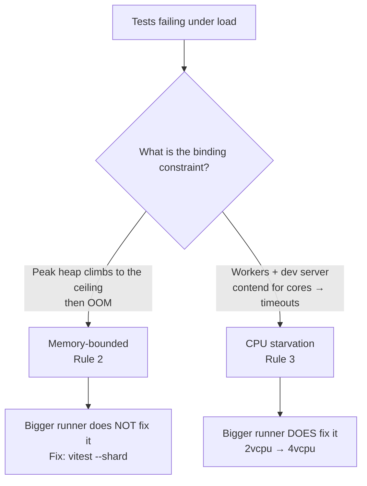

## The Gap This Page Fills

The rest of this guide talks about "CI runners" as if they were a single, fixed thing. [Execution Tiers](../decision-guide/execution-tiers.mdx) assumes a PR gate runs "under 10 minutes"; the [Heavy Test Decision Rule](../decision-guide/heavy-test-decision.mdx) sends environment-incapable tests to "capable hardware"; [Scheduled Re-exam](../real-world-patterns/scheduled-re-exam.mdx) puts platform-bound specs on "hosted macOS." Every one of those pages quietly assumes a two-vCPU Linux runner exists, is cheap, and is the thing you reach for by default.

None of them documents the layer underneath: **what runner shapes exist, how they are priced, and the decision rules for when a bigger or different runner actually helps.** That knowledge usually lives in a comment at the top of one project's workflow file and dies there — never written down where the next project can find it. This page is that missing layer, written against [Blacksmith](https://www.blacksmith.sh/), the runner provider these strategies are tuned for.

<Note>

**Prices on this page were re-verified against the live Blacksmith pages on 2026-07-05** ([runner overview](https://docs.blacksmith.sh/blacksmith-runners/overview), [pricing](https://www.blacksmith.sh/pricing)). Pay-as-you-go rates move; treat every dollar figure as "as of 2026-07" and re-check the two source pages before you quote them in a budget.

</Note>

## Provider Choice Comes Before Sizing

Every rule below assumes you are paying for CI minutes. Whether that assumption holds at all is decided by a question that comes before any label or sizing table: **is the repository public or private?**

- **Public repository → standard GitHub-hosted runners, full stop.** The biggest reason is the only one you need: they are free. GitHub's billing policy states it directly — "GitHub Actions usage is free for self-hosted runners and for public repositories that use standard GitHub-hosted runners" (verified 2026-07-05). No per-minute discount competes with a bill of zero, so for a public repo the provider question ends here. One caveat, and it previews this page's default stance: **larger runners are always charged, even on public repositories** — the moment a public repo's job leaves the standard shape, its bill starts existing.
- **Private repository → Blacksmith, and cost is the #1 reason.** A private repo draws down the plan's included minutes and then pays GitHub's list rate for every minute after. At agent-driven PR volume the included quota is gone within days, so the number that matters is the *marginal* minute — and Blacksmith's roughly half-price Linux minutes on faster machines win that comparison outright. That is why this guide's private-repo CI runs on Blacksmith, and why the rest of this page is written against it.

Visibility first, provider second, sizing last. The sections below only matter once this question has put you on a metered runner.

## Blacksmith in One Minute

Blacksmith runners are a drop-in replacement for GitHub-hosted runners: you change `runs-on` and nothing else. The value proposition is faster machines at a lower per-minute price, billed pay-as-you-go instead of GitHub's included-minutes model.

### Runner labels

The label encodes the shape directly, so sizing a job is a one-token edit:

```yaml
jobs:
  test:
    runs-on: blacksmith-4vcpu-ubuntu-2204
```

| Axis | Values |
|---|---|
| vCPU | `2vcpu`, `4vcpu`, `8vcpu`, `16vcpu`, `32vcpu` |
| OS image | `ubuntu-2204` (safe default), `ubuntu-2404` |
| Architecture | x64 (default), `-arm` suffix for arm64 |

So `blacksmith-8vcpu-ubuntu-2404-arm` is an eight-vCPU arm64 runner on Ubuntu 24.04. Prefer `ubuntu-2204` as the default image — it is the closest match to GitHub's long-standing `ubuntu-latest` behavior, so migrating a workflow rarely trips over a toolchain-version difference. Move to `ubuntu-2404` deliberately, when a job actually needs the newer base.

### Pricing and the free tier

- **3,000 free minutes per month**, denominated in x64 two-vCPU-equivalent minutes. Bigger, arm, Windows, and macOS shapes draw down that same budget at their own multipliers (an arm two-vCPU minute costs less than an x64 one; a Windows minute costs more; macOS costs much more — see below).
- **~$0.004/min for a two-vCPU x64 runner** — roughly half GitHub-hosted's $0.008/min list rate for a standard two-core Linux runner. Blacksmith's own pricing page frames the combined per-minute-plus-speed advantage as roughly a two-thirds total cost saving, because its machines also run the same job faster.
- **Price scales approximately linearly with vCPU count.** The pricing page publishes the exact figure for the two-vCPU base; from there a four-vCPU runner bills at roughly twice the two-vCPU rate (~$0.008/min), an eight-vCPU at roughly four times (~$0.016/min), and so on. This linearity is the load-bearing fact behind **Rule 1** below — hold onto it.

### Transparent dependency caching — and when to skip it

Blacksmith co-locates a cache that the standard cache actions (`actions/cache` and the popular ecosystem wrappers) hit transparently at high throughput. You do not configure anything special to benefit.

The counterintuitive part is that you often should not add explicit caching at all:

<Warning>

**At Blacksmith's install speeds, adding `actions/cache` save/restore steps is frequently a net loss.** On a two-vCPU x64 runner, `pnpm install --frozen-lockfile` has been observed completing in about **2 seconds** with no cache steps in the workflow. A save/restore round-trip — key hashing, tarball upload, tarball download, extraction — routinely costs more wall-clock and more YAML surface than the install it was meant to skip.

This contradicts the reflex every CI engineer carries in from slower runners, where "cache your dependencies" is unconditional advice. Here it is conditional: **measure the uncached install first.** If it is already a couple of seconds, the cache is pure overhead. Reach for explicit caching only for genuinely expensive artifacts — a compiled Rust target dir, a Playwright browser download — not for a fast package install.

</Warning>

## macOS (Apple Silicon) Runners

macOS is a different cost universe, and the shape of that difference decides how you are allowed to use it.

- **The smallest macOS shape is six vCPU.** There is no small, cheap Mac runner — the entry price is a six-vCPU machine (`blacksmith-6vcpu-macos-latest` and pinned variants such as `blacksmith-6vcpu-macos-15`), with a twelve-vCPU option above it.
- **Billing is roughly 20× a two-vCPU x64 minute.** A six-vCPU macOS minute runs about **$0.08/min** — twenty times the ~$0.004/min x64 rate. That multiplier, not the absolute number, is what you have to design around.

The consequence is a hard architectural rule, not a preference:

<Danger>

**Mac lanes are viable as `schedule:` + `workflow_dispatch:` jobs — never per-PR at agent-driven PR volume.** The 20× multiplier turns a routine Mac job into a four-figure monthly line item the moment it runs on every pull request.

Worked example: a nightly 45-minute Mac exam costs `45 × $0.08 ≈ $3.6/night ≈ ~$110/month` — bounded and predictable. The *same* job wired to run per-PR at ~400 CI runs/month would cost `400 × 45 × $0.08 ≈ ~$1,400/month`. Same work, an order of magnitude apart, purely because of the trigger.

</Danger>

There is an upside hiding in that math. The predictable ~$110/month figure is what finally makes a **scheduled real-GPU heavy lane feasible** for a project whose Metal/WebGL coverage currently runs only on a developer's local Mac. This is exactly the "environment-incapable" and "platform-incapable" case from the [Heavy Test Decision Rule](../decision-guide/heavy-test-decision.mdx#classify-by-why-it-is-heavy): tests that need a real GPU or real macOS move to a **scheduled T3 tier on capable hardware**. Hosted Apple-silicon runners are what make that tier a bounded monthly cost instead of "hope someone runs it locally before release." See [Scheduled Re-exam and Night Exam](../real-world-patterns/scheduled-re-exam.mdx) for how the scheduled macOS job itself is wired.

## The Four Runner-Sizing Rules

The labels and prices are the easy part. The hard part is knowing when a bigger or different runner is the right tool — because the instinct to "just throw more cores at it" is right about half the time and actively wrong the other half. These four rules are the core wisdom of this page.

### The default: the smallest shape that works

Before the four rules earn their keep, hold the default: **every lane runs on the smallest, cheapest shape that completes reliably** — `2vcpu` until something below names a reason otherwise.

The justification is an AI-dev-era observation about whose time CI latency actually spends. When implementation is agent-driven, a slower lane's wall-clock lands between agent turns, not in a human's foreground wait — the agents produce work faster than any human reviews it, so a PR gate that takes a few extra minutes still finishes comfortably inside human review cadence. Latency nobody is waiting on is not worth paying for.

So a bigger or more exotic runner needs an **explicitly named reason**, not a vibe. Legitimate ones look like: a preview deploy the team genuinely sits and waits on, an OS-specific build environment (macOS, Windows), or a failure mode diagnosed under Rule 2 or Rule 3. Rule 1 tells you what a bigger runner buys when you choose to buy it — the default is still not to buy it until the latency has a named owner.

### Rule 1: A bigger runner is a latency lever, not a cost lever

For a **parallelizable** workload, going bigger buys you speed, not savings.

Playwright workers scale with cores, and — from the pricing section above — price scales linearly with cores. Those two linear relationships cancel: doubling from four to eight vCPU roughly halves the wall-clock while total cost stays about the same, because you pay twice the per-minute rate for about half as many minutes.

```text
4vcpu:  ~10 min  ×  ~$0.008/min  ≈  $0.08
8vcpu:  ~5 min   ×  ~$0.016/min  ≈  $0.08   ← half the wait, same bill
```

So the decision is purely about feedback-loop speed. Size a parallelizable job **up** when a faster PR gate is worth engineering attention; leave it small when the wait is already tolerable. Do not size up expecting the bill to shrink — for this class of work it will not.

<Tip>

The cancellation only holds while the work actually parallelizes. A job that pins one core — a single-threaded build step, a serial migration — gets **no** wall-clock benefit from more vCPU, so for that job a bigger runner is pure added cost. Rule 1 is about parallelizable workloads specifically.

</Tip>

### Rule 2: A bigger runner does NOT fix memory-bounded failures

This is the most expensive mistake, because a bigger machine *looks* like it should help and sometimes appears to for a while.

A vitest/jsdom lane hitting a JavaScript heap OOM was **not** fixed by moving from two to four vCPU. A larger machine raises the heap ceiling, which only delays the same OOM — the process still climbs to the new ceiling and dies. The failure is bounded by memory *accumulation*, and a taller ceiling does not change the slope of the climb.

The actual fix is to **bound the per-process file count** so memory is reclaimed between shards:

```bash
vitest --shard=1/4
```

Sharding caps how many test files a single worker process loads before the run rolls to a fresh process, which keeps peak heap under the ceiling regardless of the machine's total RAM. Note that `--shard=1/4` runs only the *first* of four shards — a CI lane must run all four (`1/4` through `4/4`, in a matrix or in sequence) or three-quarters of the suite silently goes unrun. The flag bounds per-process memory; it does not by itself execute the whole suite. (Evidence: zudo-pattern-gen #1912 — a heap-OOM lane that survived the 2→4vCPU upgrade and only went green once `--shard` bounded the per-process file count.) See [Vitest Patterns](../real-world-patterns/vitest-patterns.mdx) for the surrounding worker- and timeout-budget configuration.

<Warning>

**"It passed after I upsized" is not proof the size was the cause.** A memory-bounded failure that clears on a bigger runner has often just moved below the noise threshold for that day's file ordering — it will resurface the next time the suite grows. Confirm the mechanism (is peak heap the binding constraint?) before you attribute the fix to vCPU.

</Warning>

### Rule 3: Diagnose the failure mode before resizing

Rule 2 says a bigger runner does not fix memory problems — but it genuinely *does* fix a different problem that looks almost identical from the outside.

**CPU starvation:** on a two-vCPU runner, e2e workers and the dev server contend for the same two cores. Under contention, specs miss their timing budgets and fail as timeouts — which reads, on the surface, exactly like a flaky or under-resourced test. Here, moving to four vCPU **is** the fix: giving the dev server and the test workers their own cores removes the contention. (Evidence: zudo-pattern-gen #3321 — spec timeouts under two-core contention, resolved by four vCPU.)

So two failures that both present as "tests dying under load" have **opposite** remedies:



The rule that follows: **diagnose the binding constraint before you resize, and size each job to its own failure mode.** Do not uniform-size a whole workflow — a memory-bound vitest lane and a CPU-starved e2e lane in the same workflow want different treatments, and a blanket "everything to 8vcpu" masks the memory bug while overpaying for the jobs that never needed it.

### Rule 4: Cost control comes from trigger design, not runner choice

The single largest lever on your CI bill is **not** which runner you pick — it is **when the expensive lanes run at all.**

A heavy lane on an eight-vCPU runner that fires on every topic PR costs far more than the same lane on a schedule, and the runner size is a rounding error next to that difference. The macOS math above is the extreme case — 20× per minute makes the trigger the whole story — but the principle holds for any expensive lane.

Gate expensive lanes by two things:

1. **PR base branch.** Run the heavy suite only on release/round PRs — those whose base is `main` — not on every topic-branch PR feeding into an integration branch. Most PRs in an agent-driven flow are topic PRs; keeping the heavy lane off them removes the bulk of the cost. See [Release Rounds § Gating Heavy CI by Base Branch](../real-world-patterns/release-rounds-branch-strategy.mdx#gating-heavy-ci-by-base-branch) for the concrete branch topology and CI workflow this rule assumes.
2. **A nightly `schedule:`.** Back the base-branch gate with a scheduled full run so nothing that skipped the topic PRs goes unverified for long. This is the T3 [scheduled re-exam](../real-world-patterns/scheduled-re-exam.mdx) tier doing its job.

Reach for a bigger runner to make a lane *faster* (Rule 1); reach for trigger design to make a lane *cheaper* (Rule 4). Conflating the two — trying to save money by downsizing a per-PR heavy lane instead of moving it off per-PR entirely — optimizes the rounding error and ignores the bill.

## Putting It Together

| Symptom | Wrong instinct | Right lever |
|---|---|---|
| Picking where CI runs at all | One provider fits every repo | Public → free standard GitHub-hosted; private → Blacksmith on marginal-minute cost (provider choice comes first) |
| Public repo's standard runners feel slow | Move to a paid provider or a larger runner | Stay on the free standard shape unless you are deliberately buying speed — larger runners are charged even on public repos |
| PR gate feels slow, work parallelizes | Leave it; cores cost money | Size **up** for latency (Rule 1) — cost is ~flat, but only with a named reason (the default is the smallest shape) |
| vitest/jsdom heap OOM | Bump 2→4vCPU for more RAM | `vitest --shard` (Rule 2) — size does not fix it |
| e2e specs time out under load | Assume flaky, add retries | Diagnose CPU starvation → 2→4vCPU (Rule 3) |
| Monthly CI bill too high | Downsize the runners | Gate lanes by base branch + schedule (Rule 4) |
| Need real GPU / macOS coverage | Run it per-PR on a Mac runner | Scheduled T3 macOS lane (~$110/mo, not ~$1,400/mo) |

The through-line: **a runner label is a two-token edit, but choosing it well means naming the binding constraint first.** Latency, memory, CPU contention, and total cost are four different problems with four different levers, and a bigger runner is the correct answer to exactly one of them.

## References

- [About billing for GitHub Actions](https://docs.github.com/en/billing/managing-billing-for-your-products/managing-billing-for-github-actions/about-billing-for-github-actions) — the free-for-public-repos policy on standard runners, and the larger-runners-are-always-charged caveat (verified 2026-07-05).
- [Blacksmith runner overview](https://docs.blacksmith.sh/blacksmith-runners/overview) — the full label matrix, OS images, and free-tier / consumption-multiplier details (verified 2026-07-05).
- [Blacksmith pricing](https://www.blacksmith.sh/pricing) — per-minute rates by shape (verified 2026-07-05).
- [Execution Tiers](../decision-guide/execution-tiers.mdx) — the T0–T4 model these sizing rules serve.
- [Heavy Test Decision Rule](../decision-guide/heavy-test-decision.mdx) — how environment- and platform-incapable tests reach the scheduled macOS tier.
- [Scheduled Re-exam and Night Exam](../real-world-patterns/scheduled-re-exam.mdx) — how the scheduled (T3) macOS job is actually built.
